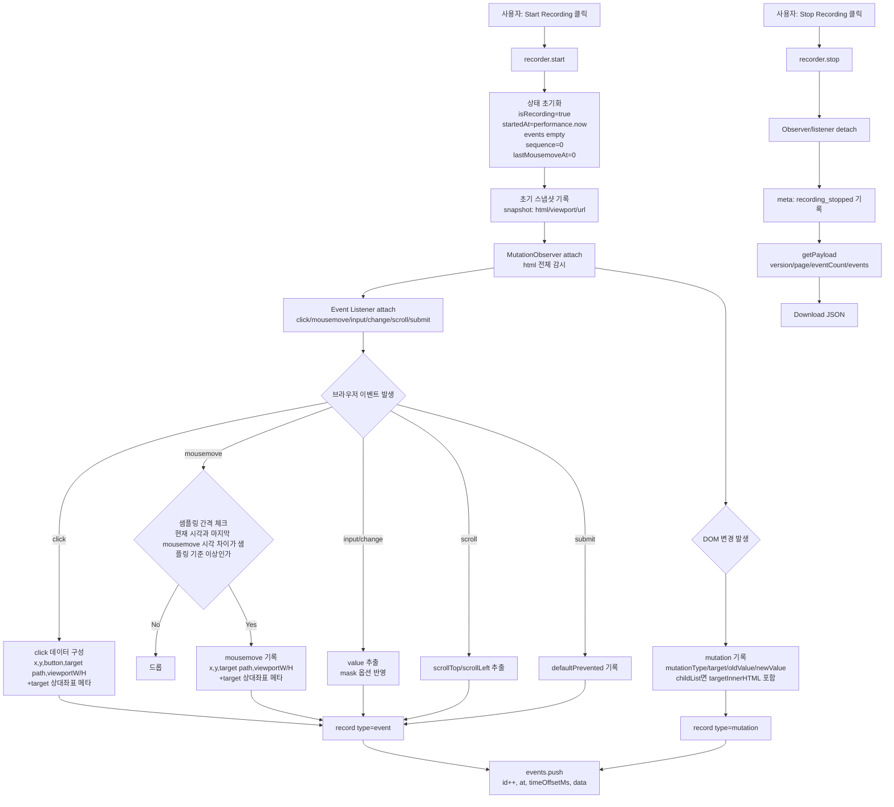
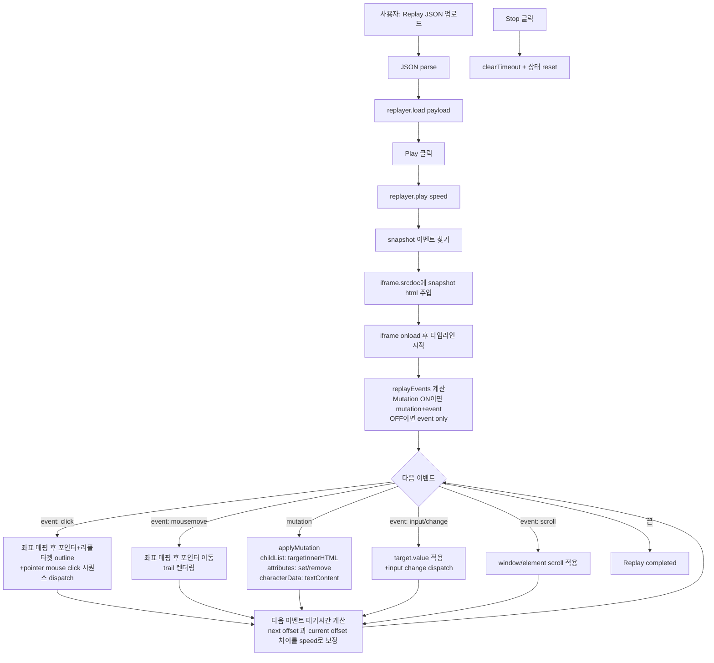
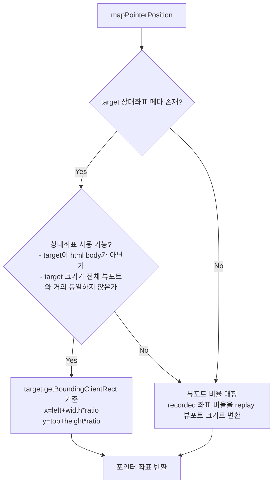

# Session Replay MVP (Browser)

웹 브라우저에서 동작하는 Session Replay Recorder + Replayer 최소 구현입니다.

## 현재 상태 (2026-02-18)
- 실험용 스니펫은 `Test/`에서 버전별(`v1~v4`) 관리
- 최종 적용 코드(앱 실행용)는 `src/`에서 관리
- 서버 파일은 `src/server.js`로 통합
- v4 핵심 반영:
  - 실제 이벤트 시퀀스 클릭 재생(`pointerdown/mousedown/pointerup/mouseup/click`)
  - Replay `Mutation ON/OFF` 토글
  - 기록 viewport 기반 스케일 재생
  - sandbox 제약 완화 기반 재현성 개선
- 버전 이력 문서: `history/`
- 구현 개념 문서: `work_concept/session-replay-v4-work-concepts.md`

## 1) Node.js 설치 (macOS)
아래 중 한 가지 방법만 선택하면 됩니다.

### 방법 A: Homebrew
```bash
brew install node
node -v
npm -v
```

### 방법 B: nvm (여러 버전 관리 권장)
```bash
brew install nvm
mkdir -p ~/.nvm
export NVM_DIR="$HOME/.nvm"
source "$(brew --prefix nvm)/nvm.sh"
nvm install --lts
nvm use --lts
node -v
npm -v
```

권장 버전: Node.js LTS (v20 이상)

## 2) 실행 방법
LLM 분석(OpenAI + LangChain/LangGraph)을 사용하려면 Node 서버로 실행해야 합니다.

### 의존성 설치
```bash
npm install
```

### 환경 변수 설정
```bash
cp .env.example .env
```
`.env`의 `OPENAI_API_KEY`를 실제 키로 변경합니다.

### 서버 실행
```bash
npm start
```
브라우저에서 `http://localhost:4173` 접속

## 3) Recorder 사용
1. `Start Recording` 클릭
2. 입력/클릭/스크롤/DOM 변경(예: `Append Item`) 수행
3. `Stop Recording` 클릭
4. `Download JSON` 클릭

## 4) Replayer 사용
1. `Replay JSON`에서 방금 저장한 파일 선택
2. 속도(`0.5x/1x/2x/4x`) 선택
3. 필요 시 `Mutation OFF/ON` 버튼으로 DOM mutation 적용 여부 전환
4. `Play Replay` 클릭
5. `Stop Replay`로 중단 가능

## 5) LLM 행동 유형 분석
1. 녹화를 종료하거나(`Stop Recording`) Replay JSON을 로드합니다.
2. `Analyze Behavior`를 클릭합니다.
3. 하단 로그에서 행동 요약(`labels`, `signals`, 이벤트 통계)을 확인합니다.
4. `Copy LLM Prompt`를 눌러 분석용 프롬프트를 LLM에 붙여 넣습니다.
5. `Analyze with LLM`을 눌러 OpenAI 모델 분석 결과를 화면에서 바로 확인합니다.
6. 결과 상단의 `고객 유형 요약(KR)`에서 2차 체인 요약 문장을 확인합니다.
7. 2차 체인은 `previous_result_ko`, `session_summary_ko`, `final_result_ko` 구조의 한국어 JSON으로 반환합니다.

## 구현 범위
- DOM 변화 기록: `MutationObserver`
- 이벤트 기록: `click`, `mousemove`, `input`, `change`, `scroll`, `submit`
- 네비게이션 흐름 기록: `hashchange`, `popstate`, `beforeunload`, `pagehide`, `pageshow`, `visibilitychange`, `history_pushstate`, `history_replacestate`, `navigation_intent`
- 저장 방식: 로컬 JSON 다운로드
- 재생 방식: `snapshot` 복원 후 `mutation/event` 타임라인 적용
- 클릭 재생: 기록된 `x/y` 좌표 시각화 + 실제 클릭 이벤트 시퀀스 디스패치
- 이동 경로 재생: `mousemove` 좌표를 샘플링 기록해 포인터 trail 표시
- 입력 재생: `value` 반영 + `input/change` 이벤트 디스패치
- 재생 안정성: `Mutation ON/OFF` 토글 지원
- 좌표 정합: 기록 시점 `viewportWidth/viewportHeight`를 함께 저장하고, replay 화면 크기에 맞춰 좌표 스케일링
- 좌표 정합(강화): 가능하면 `targetOffsetX/Y + targetWidth/Height`를 이용해 타겟 요소 기준 상대좌표로 우선 매핑
- viewport 정합: 녹화 시점 viewport 기준으로 replay iframe 스케일링

## 이벤트 데이터 구조
```json
{
  "version": 1,
  "createdAt": "2026-02-17T16:00:00.000Z",
  "page": { "href": "...", "userAgent": "..." },
  "eventCount": 123,
  "events": [
    {
      "id": 1,
      "type": "snapshot | mutation | event | meta",
      "at": 1234.56,
      "timeOffsetMs": 12.34,
      "data": {}
    }
  ]
}
```

## 파일 구조
- `index.html`: 테스트 UI + Recorder/Replayer 제어
- `src/recorder.js`: 기록 로직
- `src/replayer.js`: 재생 로직
- `src/main.js`: UI 이벤트 연결, JSON 입출력
- `src/behavior-analyzer.js`: 행동 피처 추출 + LLM 프롬프트 생성
- `src/server.js`: Express API + LangChain/LangGraph + OpenAI 연동
- `Test/session-replay-snippet*.js`: DevTools Snippet 실험/버전업 파일
- `history/`: 스니펫 버전별 변경 이력
- `work_concept/`: 구현 개념/적용 이유 문서

## DevTools Snippet 버전
브라우저 개발자도구 `Sources > Snippets`에서 바로 실행할 수 있는 단일 파일 버전입니다.

### 버전 요약
- `Test/session-replay-snippet.js` (`1.0.0-snippet`)
  - 기본 실행 파일
  - Recorder + Replayer + Behavior Analyzer + 스니펫 패널 포함
  - 페이지 이동 이벤트 추적 포함: `hashchange`, `popstate`, `beforeunload`, `pagehide`, `pageshow`, `visibilitychange`, `history_pushstate`, `history_replacestate`, `navigation_intent`
  - Replay 창은 가독성을 위해 대형 모달 크기(`95vw x 92vh`) 적용
- `Test/session-replay-snippet-v2.js` (`2.0.0-snippet`)
  - `v1`과 동일 기능을 버전 태깅한 파일
  - 팀/실험용으로 버전 분리 관리할 때 사용
- `Test/session-replay-snippet-v3.js` (`3.0.0-snippet`)
  - Replay `Mutation ON/OFF` 토글 추가
  - 기록 viewport 기반 스케일 재생 추가
  - 한국어 구조화 결과(`customerResultKo`) 표시 강화
- `Test/session-replay-snippet-v4.js` (`4.0.0-snippet`)
  - 실제 클릭/입력 이벤트 디스패치로 동적 UI 반응 강화
  - 클릭 시각화 중심에서 실제 상호작용 재생 중심으로 확장

### 운영 원칙
- `Test/`: 스니펫 실험 및 버전 업그레이드
- `src/`: 최종 업그레이드 결과 반영

### 스니펫 빠른 사용
1. 파일 내용을 복사해 DevTools Snippet으로 실행
2. `Start` -> 사용자 행동 -> `Stop` -> `Download`
3. 필요 시 `Analyze`, `Copy Prompt`, `Play Replay`
4. 콘솔에서 `window.SessionReplaySnippet.help()`로 API 확인

## 동작 플로우 (Mermaid)

### Recorder 상세 플로우


### Replayer 플로우


### 포인터 좌표 매핑 플로우

