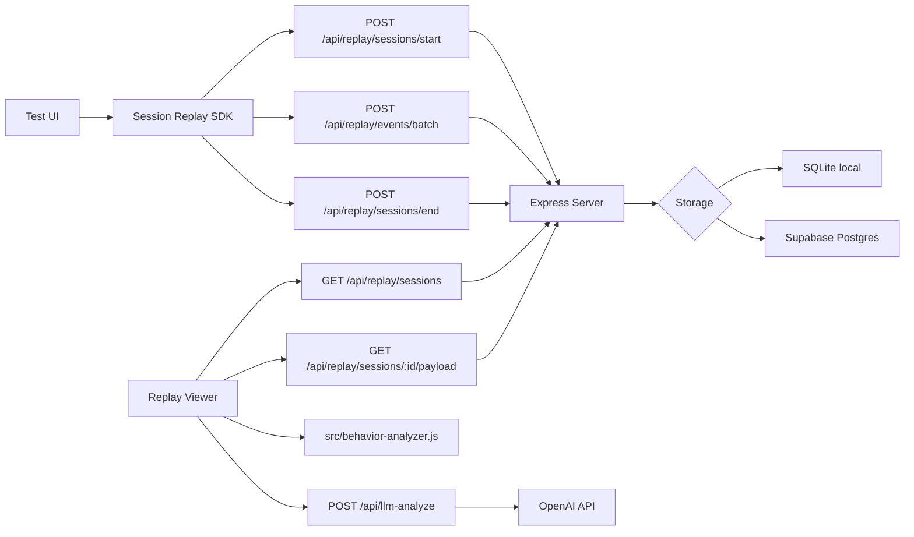

# Session Replay POC

금융권 모바일 앱 형태의 테스트 UI에 태깅 SDK를 심고, 사용자의 세션 이벤트를 서버/DB에 저장한 뒤 viewer에서 세션 리플레이와 고객 행동 분석을 확인하는 POC입니다.

현재 버전은 로컬 SQLite와 Supabase Postgres 저장소를 모두 지원하며, Vercel 배포 환경에서는 Supabase를 사용해 휴대폰과 데스크톱에서 같은 세션 데이터를 볼 수 있습니다.

## 주요 기능

- 금융 앱 스타일 테스트 UI
  - 홈, 계좌, 이체, 상품몰, 상품목록, 혜택몰, 이벤트 상세, 자산/소비, 카드, 환전, 고객센터
- 태깅 SDK
  - `sdk/session-replay-sdk.js`
  - 원하는 순간부터 `Start`, `Stop`, `Save`
  - click/input/change/submit/scroll/navigation/mutation 이벤트 선택 수집
- 세션 저장 API
  - Express WAS 서버
  - SQLite 로컬 저장
  - Supabase Postgres 영구 저장
- Replay viewer
  - 저장된 세션 목록 조회/삭제/전체 삭제
  - iframe 기반 리플레이 재생
  - Mutation ON/OFF
  - 모바일 viewer 스크롤 대응
- 고객 행동 분석
  - LLM 분석 전 로컬 정량 지표
  - OpenAI API 기반 고객 유형 정의
  - 분석 기준을 추가로 입력하는 LLM prompt popup
- 개인정보 보호
  - input 기본 마스킹
  - selector 기반 block/mask
  - `redactionStats` 저장

## 빠른 시작

```bash
npm install
cp .env.example .env
npm run dev
```

기본 포트는 `4173`입니다.

- `http://127.0.0.1:4173/test-ui`
- `http://127.0.0.1:4173/viewer`

## 환경 변수

`.env.example`을 복사해 `.env`를 만듭니다.

```bash
OPENAI_API_KEY=
OPENAI_MODEL=gpt-4o-mini

SESSION_REPLAY_DB_PATH=

DATABASE_URL=
DATABASE_SSL=true
DATABASE_POOL_MAX=3
```

### 로컬 개발

`DATABASE_URL`이 없으면 SQLite를 사용합니다.

기본 DB 경로:

```text
data/session-replay.sqlite
```

### Vercel / 모바일 테스트

Vercel serverless 환경에서 SQLite `/tmp`는 영구 저장소가 아니므로, 휴대폰에서 저장한 세션을 데스크톱 viewer에서 보려면 Supabase Postgres 연결이 필요합니다.

Supabase의 Shared Pooler / Transaction mode 연결 문자열을 `DATABASE_URL`로 등록합니다.

```bash
DATABASE_URL=postgresql://...
DATABASE_SSL=true
DATABASE_POOL_MAX=3
```

OpenAI LLM 분석을 사용하려면 Vercel에도 아래 값을 등록합니다.

```bash
OPENAI_API_KEY=...
OPENAI_MODEL=gpt-4o-mini
```

## 사용 흐름

1. `/test-ui` 접속
2. 우측 `Session` 버튼 클릭
3. 추적할 이벤트 선택
4. `Start`
5. 테스트 UI에서 화면 이동/입력/스크롤/submit 수행
6. `Stop`
7. `Save`
8. `/viewer` 접속
9. `세션 목록`에서 저장된 세션 선택
10. `Play`
11. `Local summary` 또는 `Analyze with LLM`

## 아키텍처


```mermaid
flowchart LR
  UI[Test UI] --> SDK[Session Replay SDK]
  SDK --> Start[POST /api/replay/sessions/start]
  SDK --> Batch[POST /api/replay/events/batch]
  SDK --> End[POST /api/replay/sessions/end]

  Start --> Server[Express Server]
  Batch --> Server
  End --> Server

  Server --> Store{Storage}
  Store --> SQLite[SQLite local]
  Store --> Supabase[Supabase Postgres]

  Viewer[Replay Viewer] --> Sessions[GET /api/replay/sessions]
  Viewer --> Payload[GET /api/replay/sessions/:id/payload]
  Sessions --> Server
  Payload --> Server

  Viewer --> Analyzer[src/behavior-analyzer.js]
  Viewer --> LLM[POST /api/llm-analyze]
  LLM --> OpenAI[OpenAI API]
```

## API

### 화면

- `GET /test-ui`
- `GET /viewer`

### Replay 저장/조회

- `POST /api/replay/sessions/start`
- `POST /api/replay/events/batch`
- `POST /api/replay/sessions/end`
- `GET /api/replay/sessions`
- `GET /api/replay/sessions/:sessionId`
- `GET /api/replay/sessions/:sessionId/events`
- `GET /api/replay/sessions/:sessionId/payload`

### 삭제

- `DELETE /api/replay/sessions/:sessionId`
- `DELETE /api/replay/sessions`
- `POST /api/replay/sessions/delete-all`

### 분석

- `POST /api/llm-analyze`

## 프로젝트 구조

```text
sdk/
  session-replay-sdk.js

src/
  server.js
  replay-db.js
  replay-postgres-db.js
  replayer.js
  recorder.js
  behavior-analyzer.js

web/
  test-page/
    index.html
    styles.css
    app.js
  replay-viewer/
    index.html
    styles.css
    viewer.js

history/
  session-replay-test-environment-v1.md

work_concept/
  local-behavior-analysis-before-llm.md
  masking-policy/README.md
  session-replay-v4-work-concepts.md

workflow/
  session-replay-runtime-mermaid.md
  session-replay-test-environment-workflow.md
  supabase-session-replay-storage.md
  vercel-deployment-guide.md
```

## 로컬 행동 분석

LLM 분석 전 viewer는 `src/behavior-analyzer.js`로 세션 이벤트를 정량화합니다.

주요 지표:

- Engagement
- Exploration
- Goal intent
- Friction
- Form intent
- Conversion
- Bounce risk

금융 앱 맥락을 반영해 이체 화면에서 계좌번호 입력 후 submit한 경우는 `구매 의도 높은 고객`이 아니라 `거래 실행형 고객`으로 분류합니다.

자세한 기준:

- [LLM 분석 전 로컬 행동 분석 기준](./work_concept/local-behavior-analysis-before-llm.md)

## LLM 분석

viewer의 `Analyze with LLM`은 로컬 행동 요약과 추가 분석 기준을 서버로 보냅니다.

서버는 OpenAI API를 호출해 다음 형태의 고객 유형을 반환합니다.

- 고객 유형명
- 고객 유형 설명
- 보조 특성
- confidence
- 왜 이 유형인지
- 근거

LLM API key가 없으면 서버는 실행되지만 `/api/llm-analyze` 호출 시 오류를 반환합니다.

## 마스킹 정책

현재 기본 정책:

- `maskAllInputs: true`
- `.sr-block`, `[data-sr-block="true"]`, `[data-private="true"]`, `[data-sensitive="true"]` 영역 block
- `.sr-mask`, `[data-sr-mask="true"]`, `[data-clarity-mask="true"]`, `[data-rr-mask="true"]` 영역 text mask
- 세션 제어 팝업은 `data-sr-block="true"`로 기록 제외

자세한 기준:

- [Session Replay Masking Policy](./work_concept/masking-policy/README.md)

## 배포

Vercel 배포 설정:

- `vercel.json`
- Node.js `22.x`
- Express server entry: `src/server.js`
- 필요한 정적 파일은 `includeFiles`에 포함

자세한 가이드:

- [Vercel Deployment Guide](./workflow/vercel-deployment-guide.md)
- [Supabase Session Replay Storage](./workflow/supabase-session-replay-storage.md)

## Git / 보안 주의

커밋 제외 대상:

- `.env`
- `.env.*`
- `.vercel/`
- `node_modules/`
- `data/*.sqlite*`
- `샘플/`
- 스크린샷 이미지
- `Reference/image/`

`.env.example`만 공유용으로 커밋합니다.

## 참고 문서

- [작업 이력](./history/session-replay-test-environment-v1.md)
- [런타임 Mermaid](./workflow/session-replay-runtime-mermaid.md)
- [테스트 환경 Workflow](./workflow/session-replay-test-environment-workflow.md)
- [Microsoft Clarity UI 관찰](./Reference/microsoft-clarity-ui-observations.md)
