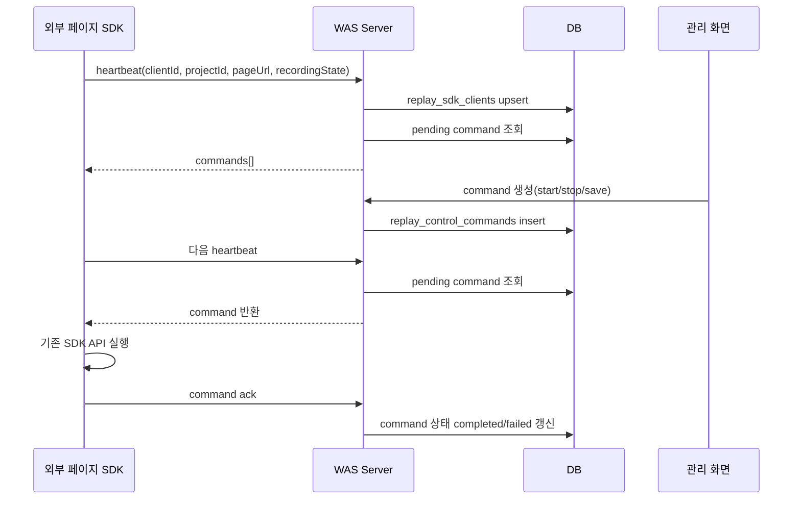
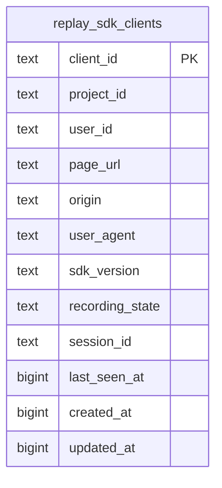
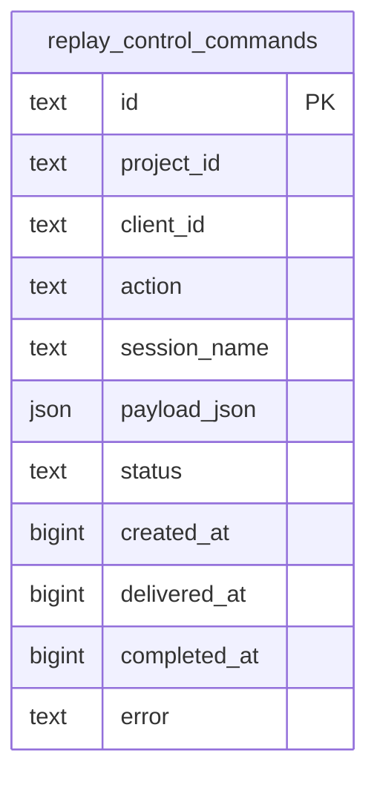

# 2026-06-29 작업 기록: 배포용 SDK 분리 및 원격 제어 화면 구성

## 작업 목적

이번 작업의 목적은 현재 테스트 UI에서 사용 중인 SDK를 그대로 유지하면서, 외부 사이트에 심을 수 있는 별도의 배포용 SDK 구조를 만드는 것이다.

기존 테스트용 SDK는 `test_ui` 화면과 직접 연결되어 있고, 화면 안의 Start/Stop/Save 버튼으로 녹화 상태를 제어한다.  
하지만 실제 외부 사이트에 SDK를 삽입하는 상황에서는 해당 사이트 UI 안에 녹화 제어 버튼을 마음대로 둘 수 없다.

따라서 아래 두 가지가 필요했다.

1. 테스트용 SDK를 건드리지 않는 별도 배포용 SDK
2. 외부 사이트에 심긴 SDK를 원격으로 제어하는 관리 화면

## 폴더 이용 기준

이번 작업은 오류 해결 기록이 아니라 기능/구조 변경 업무 기록이다.

따라서 `history/lession learned/`가 아니라 `history/` 바로 아래에 문서화한다.

```text
history/
  업무 히스토리 이력
  기능 추가, 구조 변경, 배포 준비, 운영 구조 변경 기록

history/lession learned/
  오류 해결 방식 정리
  문제 원인, 해결 방향, 재발 방지 개념 정리
```

## 핵심 결정

### 기존 테스트용 SDK는 유지

기존 테스트 UI에서 사용하는 파일은 아래와 같다.

```text
sdk/session-replay-sdk.js
```

이 파일은 테스트 UI와 이미 연결되어 있으므로, 외부 배포용 구조를 만들기 위해 직접 수정하지 않는 방향으로 결정했다.

### 배포용 SDK는 별도 파일로 분리

외부 사이트 삽입용 SDK는 아래 새 파일로 분리했다.

```text
sdk/session-replay-deploy-sdk.js
```

이 파일은 외부 페이지에 삽입되는 진입점 역할을 한다.  
내부적으로 기존 SDK를 로드하고, 관리 화면에서 내려온 원격 명령을 받아 기존 SDK의 `start`, `pause`, `save` API를 호출한다.

## 전체 동작 구조

```mermaid
flowchart LR
  A[외부 사이트] --> B[session-replay-deploy-sdk.js 삽입]
  B --> C[기존 session-replay-sdk.js 로드]
  B --> D[Heartbeat 전송]
  D --> E[/api/sdk-control/clients/heartbeat]
  E --> F[replay_sdk_clients upsert]
  E --> G[대기 중인 제어 명령 조회]
  G --> B
  B --> H[start / stop / save 실행]
  H --> I[/api/replay/* 저장 API]
  I --> J[replay_sessions / replay_events 저장]
  B --> K[명령 처리 결과 ack]
  K --> L[replay_control_commands 상태 갱신]
```

## 관리 화면 구조

새 관리 화면은 아래 경로로 추가했다.

```text
web/sdk-control/index.html
web/sdk-control/control.js
web/sdk-control/styles.css
```

로컬 접속 주소:

```text
http://localhost:4173/sdk-control
```

관리 화면 역할:

- 외부 사이트에 심을 SDK 스니펫 제공
- 현재 연결된 SDK 클라이언트 목록 조회
- 클라이언트별 녹화 상태 표시
- 클라이언트별 명령 전송
  - 녹화 시작
  - 중지
  - 저장
- 저장할 세션 이름 입력

## 외부 사이트 삽입 코드

관리 화면에서 제공하는 기본 삽입 코드는 아래 형태다.

```html
<script
  src="http://localhost:4173/sdk/session-replay-deploy-sdk.js"
  data-project-id="external-demo"
  data-user-id="tester-001"
  data-endpoint-base="http://localhost:4173">
</script>
```

운영 배포 후에는 `src`와 `data-endpoint-base`를 운영 URL로 변경한다.

```html
<script
  src="https://session-replay-poc.vercel.app/sdk/session-replay-deploy-sdk.js"
  data-project-id="external-demo"
  data-user-id="tester-001"
  data-endpoint-base="https://session-replay-poc.vercel.app">
</script>
```

## 서버 API 추가

`src/server.js`에 SDK 원격 제어 API를 추가했다.

```text
GET  /sdk-control
POST /api/sdk-control/clients/heartbeat
GET  /api/sdk-control/clients
GET  /api/sdk-control/commands
POST /api/sdk-control/commands
POST /api/sdk-control/commands/:commandId/ack
```

### API 흐름



## DB 구조 추가

SQLite와 Supabase/Postgres 저장소에 동일한 제어 구조를 추가했다.

### replay_sdk_clients

외부 사이트에 심긴 SDK 클라이언트의 현재 상태를 저장한다.



주요 용도:

- 어떤 외부 페이지가 현재 SDK를 로드했는지 확인
- 마지막 접속 시점 확인
- 현재 녹화 상태 확인
- 특정 클라이언트에 명령을 보낼 대상 식별

### replay_control_commands

관리 화면에서 보낸 녹화 제어 명령을 저장한다.



지원하는 명령:

- `start`: 녹화 시작
- `pause`: 일시 중지
- `stop`: 중지
- `save`: 저장
- `configure`: 설정 변경

## CORS 정책

외부 사이트에서 SDK가 API를 호출하려면 CORS 허용이 필요하다.

이번 작업에서는 모든 API를 열지 않고, SDK가 실제로 사용하는 API만 CORS 대상에 포함했다.

```text
/api/replay/*
/api/sdk-control/*
```

LLM 분석 API 같은 내부 기능은 외부 브라우저에서 직접 호출되지 않도록 CORS 대상에서 제외했다.

환경변수 예시는 `.env.example`에 추가했다.

```text
SDK_ALLOWED_ORIGINS=*
```

PoC에서는 `*`를 사용할 수 있지만, 실제 운영 범위가 넓어지면 아래처럼 특정 origin만 허용하는 방식이 안전하다.

```text
SDK_ALLOWED_ORIGINS=https://example.com,https://service.example.com
```

## 변경 파일

새로 추가한 파일:

- `sdk/session-replay-deploy-sdk.js`
- `web/sdk-control/index.html`
- `web/sdk-control/control.js`
- `web/sdk-control/styles.css`
- `history/2026-06-29-deploy-sdk-and-control-console.md`

수정한 파일:

- `src/server.js`
  - `/sdk-control` 라우트 추가
  - SDK 제어 API 추가
  - SDK API 범위 CORS 추가
- `src/replay-db.js`
  - SQLite용 SDK 클라이언트/제어 명령 테이블 추가
  - SDK 제어 관련 store method 추가
- `src/replay-postgres-db.js`
  - Supabase/Postgres용 SDK 클라이언트/제어 명령 테이블 추가
  - SDK 제어 관련 async store method 추가
- `.env.example`
  - `SDK_ALLOWED_ORIGINS` 예시 추가
- `history/README.md`
  - `history/`와 `history/lession learned/` 이용 규칙 정리

## 검증 내용

문법 검사:

```text
node --check src/server.js
node --check src/replay-db.js
node --check src/replay-postgres-db.js
node --check sdk/session-replay-deploy-sdk.js
node --check web/sdk-control/control.js
```

결과:

```text
모두 통과
```

SQLite 제어 흐름 검증:

```text
client upsert
command create
pending command 조회
command ack completed
```

결과:

```json
{
  "client": "local-client-1",
  "pending": 1,
  "ack": "completed"
}
```

Supabase/Postgres 제어 흐름 검증:

```text
client upsert
command create
pending command 조회
command ack completed
```

결과:

```json
{
  "client": "deploy-sdk-check-mqyzn8fe",
  "pending": 1,
  "ack": "completed"
}
```

로컬 서버 확인:

```text
http://localhost:4173/sdk-control
```

확인 결과:

- `/sdk-control` HTTP 200
- `/sdk/session-replay-deploy-sdk.js` HTTP 200
- `/web/sdk-control/styles.css` HTTP 200
- heartbeat API 정상
- command 생성 정상
- heartbeat로 command 수신 정상
- command ack 정상

CORS 확인:

```text
/api/sdk-control/clients/heartbeat
```

결과:

```text
Access-Control-Allow-Origin: https://example.com
Access-Control-Allow-Methods: GET,POST,DELETE,OPTIONS
Access-Control-Allow-Headers: Content-Type
```

LLM 분석 API는 외부 CORS 헤더가 붙지 않음을 확인했다.

```text
/api/llm-analyze
```

## 현재 상태

로컬 서버는 새 코드 기준으로 실행 중이다.

```text
Server running at http://localhost:4173
```

관리 화면:

```text
http://localhost:4173/sdk-control
```

아직 Vercel production 배포는 수행하지 않았다.

## 다음 작업 후보

- Vercel production 배포
- 운영 URL 기준 SDK 스니펫 확인
- `SDK_ALLOWED_ORIGINS`를 실제 테스트 대상 사이트 origin으로 제한
- 관리 화면에 project별 필터/검색 강화
- command 이력 조회 화면 추가
- 외부 사이트에서 실제 삽입 테스트 후 모바일/데스크톱 동작 확인
