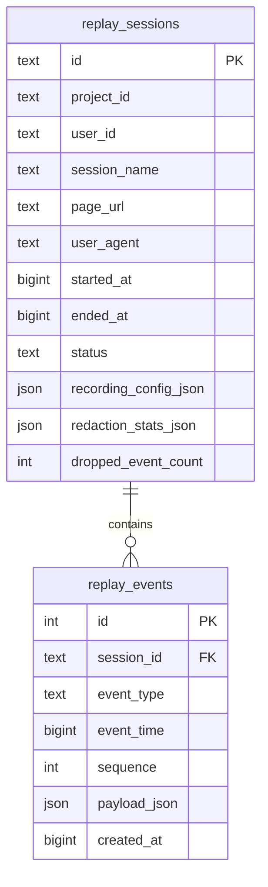
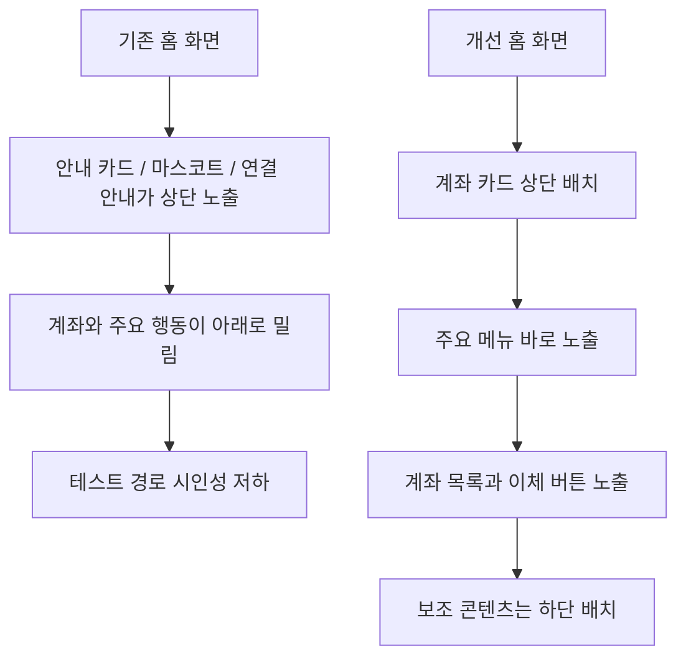
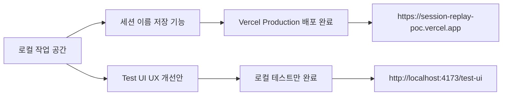

# 2026-06-29 작업 기록: 세션 이름 저장 및 Test UI 시인성 개선

## 작업 목적

오늘 작업은 크게 두 가지 흐름으로 진행했다.

1. 세션을 저장할 때 사용자가 직접 이름을 입력할 수 있게 만들기
2. 금융권 앱 형태의 `test_ui` 화면을 더 부드럽고 시인성 있게 개선하기

세션 이름 저장 기능은 운영 배포까지 완료했다.  
`test_ui` UX 개선은 로컬 테스트 환경에만 반영했고, 아직 Vercel 운영 배포는 하지 않았다.

## 1. 세션 이름 저장 기능

### 문제 배경

기존 viewer의 세션 목록은 세션 ID, 상태, 날짜 위주로 표시되어 있었다.  
테스트 세션이 여러 개 쌓이면 어떤 세션이 어떤 테스트였는지 구분하기 어려웠다.

예를 들어 아래처럼 테스트를 수행하더라도 viewer 목록에서는 사람이 읽기 좋은 이름이 없었다.

- 이체 화면 계좌번호 입력 테스트
- 상품몰 팝업 테스트
- 혜택몰 이벤트 상세 진입 테스트
- 모바일 스크롤 후 Save 테스트

### 해결 방향

세션 이름은 개별 이벤트가 아니라 저장된 세션의 메타데이터이므로 `replay_sessions` 테이블에 `session_name` 컬럼을 추가했다.

기존 세션 데이터와 충돌하지 않도록 nullable 컬럼으로 추가했다.

```mermaid
flowchart LR
  A[Test UI 세션 이름 입력] --> B[SDK save({ sessionName })]
  B --> C[/api/replay/sessions/end]
  C --> D[replay_sessions.session_name 저장]
  D --> E[viewer 세션 목록]
  E --> F[세션 이름 우선 표시]
```

### 변경 파일

- `web/test-page/index.html`
  - 세션 팝업에 `세션 이름` 입력칸 추가
- `web/test-page/app.js`
  - Save 버튼 클릭 시 `sdk.save({ sessionName })` 호출
  - Start 시점에도 `sdk.configure({ sessionName })` 반영
- `web/test-page/styles.css`
  - 세션 이름 입력 UI 스타일 추가
- `sdk/session-replay-sdk.js`
  - `sessionName` config 추가
  - `save(options)`에서 `sessionName` 수신
  - start/end/event batch payload에 `sessionName` 포함
- `src/replay-db.js`
  - SQLite `replay_sessions.session_name` 컬럼 추가
  - 기존 DB에는 `PRAGMA table_info` 기반으로 컬럼 없을 때 `ALTER TABLE` 수행
- `src/replay-postgres-db.js`
  - Postgres/Supabase `session_name` 컬럼 추가
  - `ALTER TABLE replay_sessions ADD COLUMN IF NOT EXISTS session_name TEXT`
  - list/get/payload 응답에 `sessionName` 포함
- `web/replay-viewer/viewer.js`
  - 세션 목록과 선택된 세션 제목에 `sessionName` 우선 표시
  - 이름이 없으면 짧은 session id로 fallback

### 저장 구조



### 검증 내용

로컬 SQLite 저장소에서 아래 흐름을 확인했다.

- session insert 시 `sessionName` 저장
- endSession 시 최종 저장 이름으로 갱신
- getSession 결과에 `sessionName` 포함
- getPayload 결과의 `payload.session.name`에 이름 포함

Supabase/Postgres 연결에서도 동일하게 확인했다.

```json
{
  "ok": true,
  "sessionName": "저장 시 입력한 이름",
  "payloadName": "저장 시 입력한 이름"
}
```

문법 검사는 아래 파일 대상으로 통과했다.

- `src/replay-db.js`
- `src/replay-postgres-db.js`
- `sdk/session-replay-sdk.js`
- `web/test-page/app.js`
- `web/replay-viewer/viewer.js`

### 운영 배포

세션 이름 저장 기능은 Vercel production에 배포했다.

- Production URL: `https://session-replay-poc.vercel.app`
- 배포 후 확인:
  - `/test-ui`에 `세션 이름` 입력칸 반영
  - `/web/test-page/app.js`에 `sdk.save({ sessionName })` 반영
  - `/sdk/session-replay-sdk.js`에 `sessionName` 저장 요청 반영
  - `/web/replay-viewer/viewer.js`에 세션 이름 우선 표시 로직 반영

## 2. Test UI 시인성 개선

### 문제 배경

금융권 앱 형태의 테스트 화면은 기능은 많아졌지만, 첫 화면에서 사용자가 어떤 행동을 테스트하면 되는지 한눈에 들어오지 않았다.

특히 홈 화면 상단에 안내성 영역과 장식성 영역이 먼저 보여서 아래 핵심 테스트 경로가 밀려 있었다.

### 개선 방향

첫 화면의 정보 우선순위를 아래 순서로 재배치했다.

1. 메인 계좌 및 금액
2. 주요 이동 메뉴
3. 계좌 목록 및 이체 행동
4. 프로모션/안내
5. 보조 연결/설정/추천 영역



### 변경 내용

`web/test-page/index.html`

- 홈 화면에서 `account-hero`를 최상단으로 이동
- `quick-menu-strip`을 계좌 카드 바로 아래로 이동
- 주요 메뉴를 아래처럼 테스트 행동 중심으로 변경
  - 전체 계좌
  - 빠른 송금
  - 상품몰
  - 이벤트
  - 소비 분석
- 기존 상단 안내 카드, 연결 카드, 마스코트 영역은 하단 보조 영역으로 이동

`web/test-page/styles.css`

- 전체 배경을 더 밝고 부드러운 회색 톤으로 조정
- 앱 표면의 radius와 shadow를 조정해 모바일 앱 프레임처럼 보이게 정리
- 계좌 카드에 더 강한 시각적 계층을 부여
- 주요 메뉴 버튼을 컬러별로 구분해 빠르게 스캔 가능하도록 개선
- 카드/리스트/폼의 radius를 통일해 부드러운 금융 앱 느낌 강화
- 하단 메뉴를 5분할로 수정
- Session 플로팅 버튼을 우측 하단으로 이동해 상단 메뉴와 충돌을 줄임

### 현재 상태

이 개선안은 로컬 테스트 환경에만 반영했다.  
아직 Vercel production에는 배포하지 않았다.

로컬 서버 주소:

```text
http://localhost:4173/test-ui
```

서버 실행 상태:

```text
Server running at http://localhost:4173
```

로컬 확인 내용:

- `/test-ui` HTTP 200 응답 확인
- `/web/test-page/styles.css` 갱신 확인
- `web/test-page/index.html`에 새 홈 배치 반영 확인
- `web/test-page/app.js` 문법 검사 통과

브라우저 자동 스크린샷 검증은 현재 로컬 환경에 Playwright/Puppeteer 패키지가 없어 수행하지 못했다.

## 오늘 기준 운영/로컬 상태



## 다음에 이어서 볼 포인트

- `test_ui` 개선안은 실제 모바일 브라우저에서 한 번 보고 배포 여부를 결정해야 한다.
- Session 버튼이 우측 하단으로 내려가면서 하단 메뉴와 겹치지 않는지 실제 기기에서 확인이 필요하다.
- 홈 화면 주요 메뉴에서 빠진 `카드`, `환전`, `고객센터` 진입성은 상단 nav와 하단 nav에서 충분한지 확인이 필요하다.
- UX 개선안을 확정하면 Vercel production에 별도 배포하면 된다.
