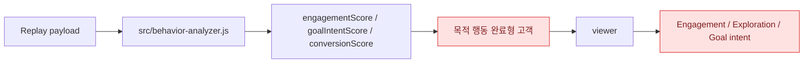
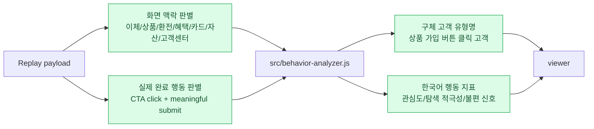
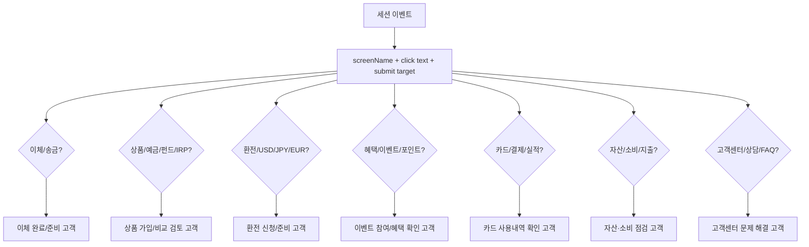
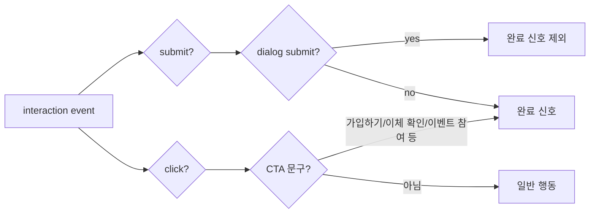
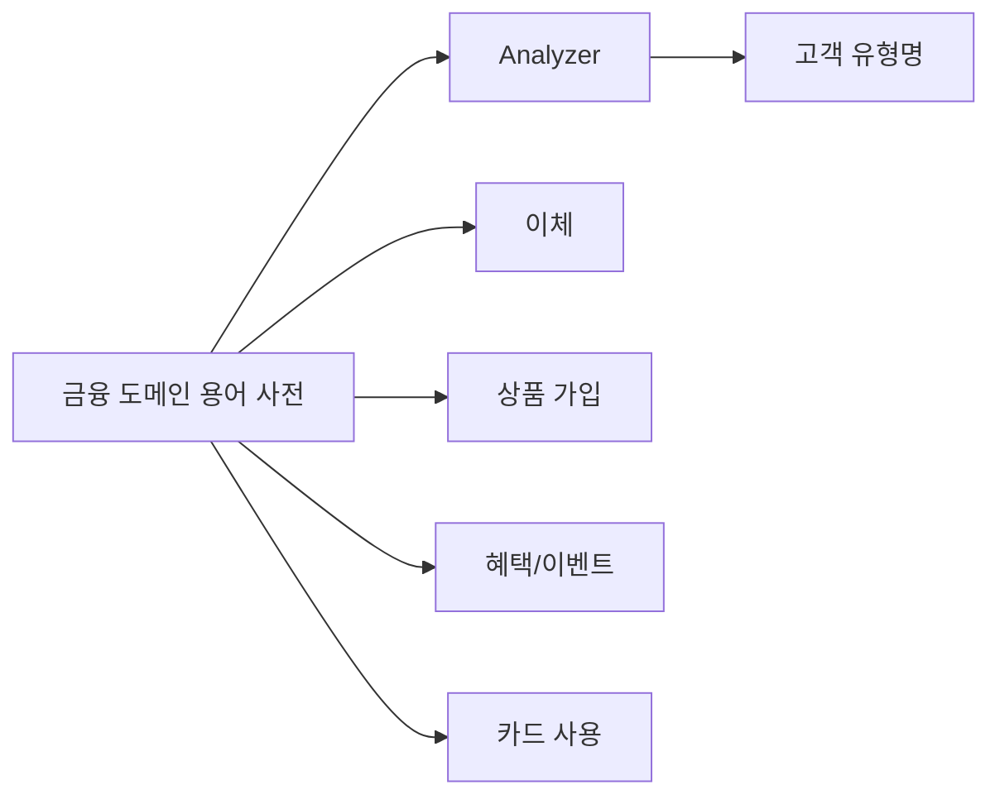

# Customer Behavior Labeling Improvement Lesson Learned

작성일: 2026-06-29

## 1. 이슈가 된 원인

### 증상

viewer의 고객 행동 분석 결과가 개발자에게는 이해 가능하지만, 마케터나 기획자가 바로 해석하기에는 추상적이거나 영어 표현이 많았다.

대표 문제:

- 고객 유형명이 추상적이었다.
  - 예: `목적 행동 완료형 고객`
  - 문제: "목적 행동"이 무엇인지 알 수 없음
- 행동 지표 제목이 영어였다.
  - `Engagement`
  - `Exploration`
  - `Goal intent`
  - `Friction`
  - `Form intent`
  - `Conversion`
- 일부 완료 판단이 부정확했다.
  - `<dialog method="dialog">` 닫기 버튼 클릭이 submit 이벤트로 잡히면서 완료 행동처럼 해석될 수 있었다.

### 직접 원인

1. 로컬 행동 분석의 fallback 고객 유형명이 `목적 행동`처럼 범용 개념 중심이었다.
2. viewer 화면의 지표 라벨이 내부 분석 지표명을 거의 그대로 노출했다.
3. `submit` 이벤트를 모두 완료 신호로 보면서 dialog 닫기 submit과 실제 CTA 완료를 구분하지 않았다.
4. LLM 프롬프트에도 "구체적인 한국어 목표명"을 강하게 요구하는 지시가 부족했다.

## 2. 해결 방향

### 기존 흐름



### 원인이 된 포인트

| 포인트 | 기존 상태 | 문제 |
| --- | --- | --- |
| 고객 유형명 | 목적 행동 완료형 고객 | 어떤 목적을 완료했는지 불명확 |
| 목표 판단 | submit 중심 | dialog 닫기 submit도 완료로 해석 가능 |
| 지표 라벨 | 영어 분석 용어 | 마케터가 바로 해석하기 어려움 |
| LLM 프롬프트 | precise type 요청 | 한국어 구체 목표명 강제력이 약함 |
| 후보 목록 | 같은 label 중복 가능 | viewer에서 분석 결과가 어수선함 |

### 개선 후 흐름



## 3. 실제 해결 내용

### 수정된 파일

- `src/behavior-analyzer.js`
- `web/replay-viewer/index.html`
- `web/replay-viewer/viewer.js`

### 고객 유형명 구체화

기존:

```text
목적 행동 완료형 고객
목적 행동 의도 고객
문제 해결 탐색 고객
거래 실행형 고객
```

개선:

```text
상품 가입 버튼 클릭 고객
금융상품 비교 검토 고객
이체 완료 고객
이체 준비 고객
환전 신청 완료 고객
환전 준비 고객
혜택 이벤트 확인 고객
이벤트 참여 고객
카드 사용내역 확인 고객
자산·소비 점검 고객
고객센터 문제 해결 고객
```

### 화면 맥락 확장

기존에는 주로 아래 흐름만 맥락으로 봤다.

- 이체
- 상품
- 환전
- 고객센터

개선 후 추가:

- 혜택/이벤트
- 카드
- 자산·소비



### 완료 행동 기준 개선

기존:

```text
submit 이벤트가 있으면 완료 행동으로 판단
```

문제:

`<dialog method="dialog">`의 닫기 버튼도 submit으로 잡힐 수 있어, 실제 상품 가입 완료가 아닌데 완료로 판단될 수 있었다.

개선:

```text
meaningful submit + 실제 CTA click을 완료 신호로 판단
```

제외:

- dialog 닫기용 submit

완료 신호로 반영:

- `가입하기`
- `이체 확인`
- `이벤트 참여`
- `예상 금액 보기`
- `검색`
- `신청`
- `확인`



### viewer 지표 라벨 한국어화

| 기존 | 개선 |
| --- | --- |
| Primary type | 대표 고객 유형 |
| Confidence | 판단 신뢰도 |
| Behavior metrics | 행동 지표 |
| LLM-defined customer type | LLM이 정의한 고객 유형 |
| Evidence | 판단 근거 |
| Customer definition | 고객 해석 |
| Local summary | 간단 분석 |
| Analyze with LLM | LLM 정밀 분석 |

행동 지표:

| 기존 | 개선 |
| --- | --- |
| Engagement | 관심도 |
| Exploration | 탐색 적극성 |
| Goal intent | 이체·가입 등 실행 의지 |
| Friction | 불편 신호 |
| Form intent | 입력 진행도 |
| Conversion | 완료 가능성 |

상세 지표:

| 기존 | 개선 |
| --- | --- |
| Unique targets | 방문한 화면 요소 |
| Max scroll | 가장 깊게 본 위치 |
| Rapid bursts | 빠른 반복 클릭 |
| Reason codes | 판단 근거 |

### 내부 이벤트/근거 표현 한국어화

viewer에서 이벤트 타입과 reason code도 한국어로 표시하도록 바꿨다.

예:

```text
click -> 클릭
submit -> 제출
scroll -> 스크롤
dialog_open -> 팝업 열림
dialog_close -> 팝업 닫힘
mutation_childList -> 화면 요소 변경
goal_completed -> 완료 행동 있음
product_flow -> 상품 화면 이용
friction_detected -> 불편 신호 있음
```

### LLM 프롬프트 강화

LLM에게 아래 방향을 명시했다.

- 한국어 고객 유형명으로 정의
- `목적 행동 완료형 고객` 같은 추상 표현 금지
- 실제 목표를 고객 유형명에 포함
  - 이체 완료 고객
  - 금융상품 가입 검토 고객
  - 환전 준비 고객
  - 혜택 이벤트 확인 고객
  - 카드 사용내역 확인 고객
  - 고객센터 문제 해결 고객
- 마케터가 이해할 수 있는 표현 사용
- 개발 용어는 근거 필드에서만 제한적으로 사용

## 4. 검증 결과

최신 상품 세션 payload로 로컬 분석을 실행했다.

개선 전에는 아래처럼 나올 수 있었다.

```text
금융상품 가입 검토 완료 고객
목적 행동 완료형 고객
```

개선 후:

```text
상품 가입 버튼 클릭 고객
```

후보 목록:

```text
상품 가입 버튼 클릭 고객
서비스 비교 탐색 고객
마찰을 겪는 고객
입력 후 망설이는 고객
```

중복 후보도 제거했다.

검증 명령 기준:

```text
node --check src/behavior-analyzer.js
node --check web/replay-viewer/viewer.js
```

둘 다 통과했다.

Production 반영 확인:

- viewer HTML에 한국어 분석 문구 반영 확인
- viewer JS에 한국어 지표 라벨 반영 확인
- behavior-analyzer에 구체 고객 유형명 로직 반영 확인

## 5. 앞으로 더 개선할 부분

### 1. 업종별 용어 사전 분리

현재는 금융 앱 맥락이 코드에 직접 들어가 있다.

향후에는 아래처럼 별도 사전으로 분리할 수 있다.



### 2. CTA 문구 기반 완료 신호 확장

현재 CTA 완료 신호는 문자열 기반이다.

향후에는 버튼에 명시 속성을 붙이는 방식이 더 안전하다.

```html
<button data-goal-action="product-apply">가입하기</button>
```

이렇게 하면 문구가 바뀌어도 분석 기준이 흔들리지 않는다.

### 3. 마케터용 설명 문구 추가

각 지표에 tooltip 또는 짧은 설명을 추가할 수 있다.

예:

```text
관심도: 머문 시간, 클릭, 스크롤, 화면 변화량을 종합해 본 점수
불편 신호: 빠른 반복 클릭이나 완료 전 장시간 체류 등 막힘 가능성
```

## 결론

이번 개선의 핵심은 분석 결과를 개발자 중심의 이벤트/지표 언어에서 마케터가 바로 이해할 수 있는 고객 행동 언어로 바꾼 것이다.

고객 유형명은 더 이상 `목적 행동`처럼 추상적인 표현을 쓰지 않고, 실제 세션에서 보인 목표를 포함한다.

viewer도 영어 지표 대신 한국어 업무 용어를 사용해, 고객 행동 결과를 회의나 리포트에서 바로 설명할 수 있도록 개선했다.
