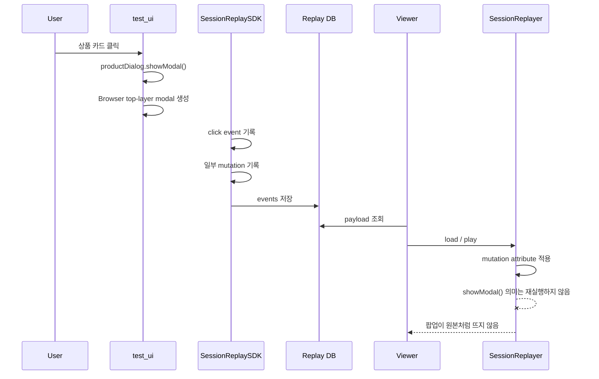
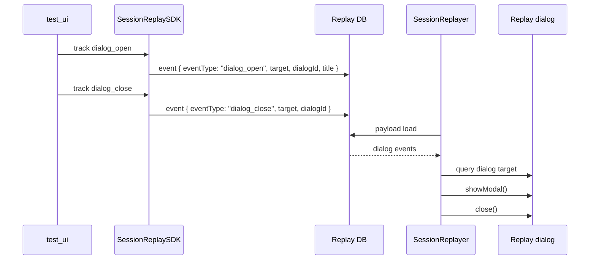
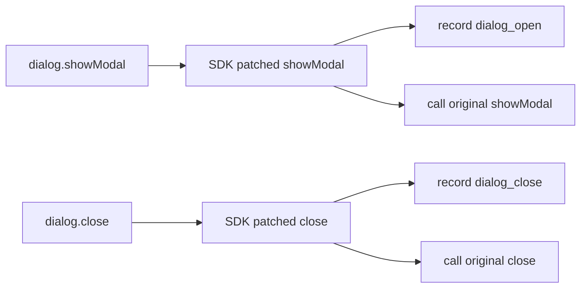
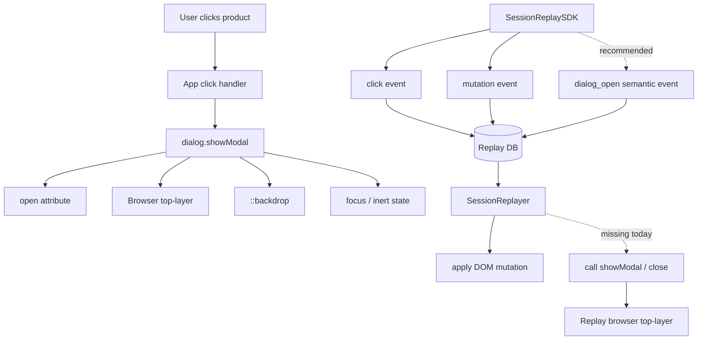
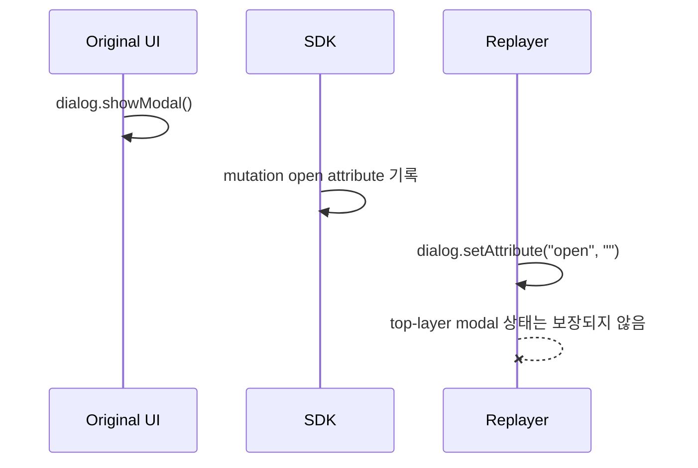
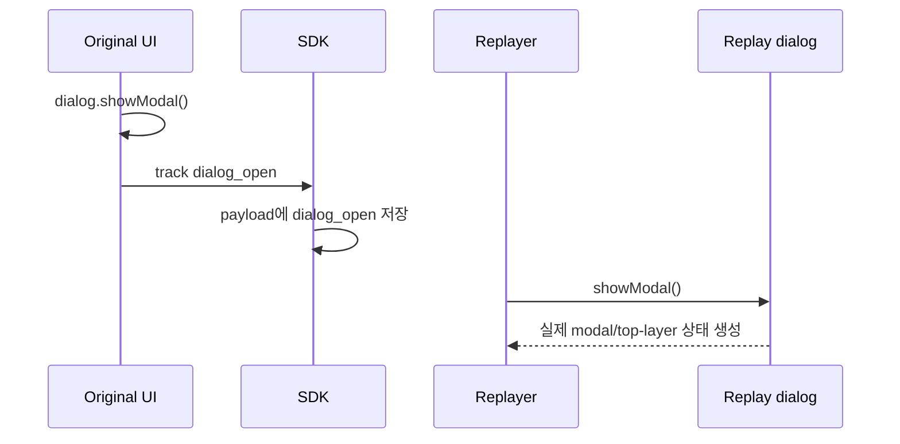
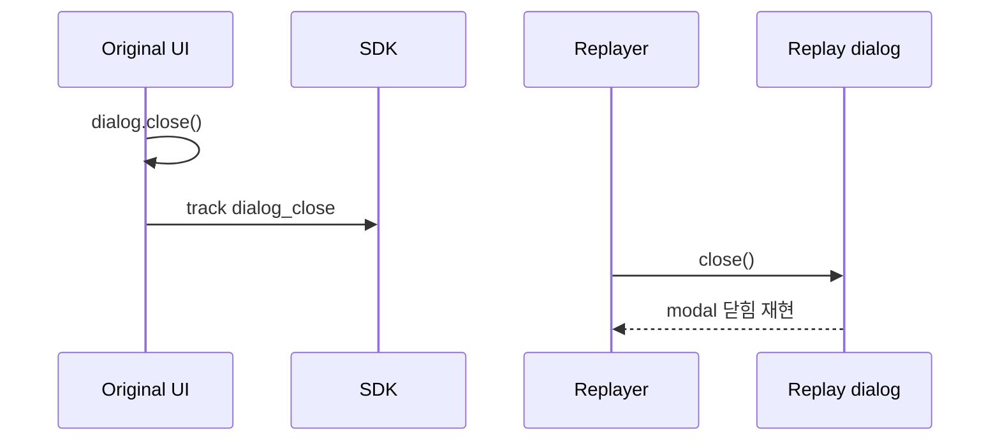
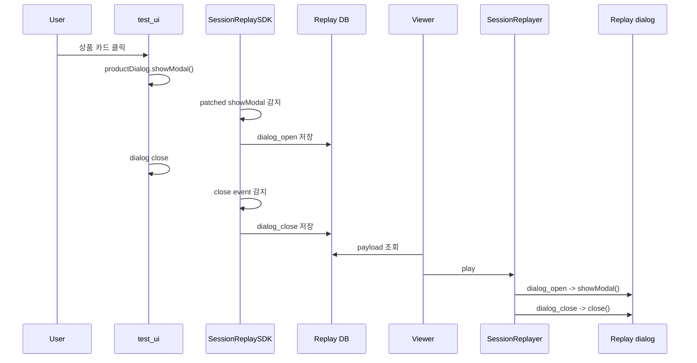
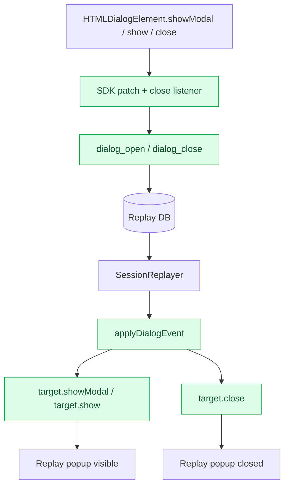

# Dialog Popup Replay Tracking Gap Lesson Learned

작성일: 2026-06-29

## 1. 이슈가 된 원인

### 증상

`test_ui`에서 상품 상세 팝업처럼 화면 위에 뜨는 UI가 viewer replay에서 제대로 재현되지 않는다.

예상:

- 사용자가 상품을 클릭한다.
- 상품 상세 팝업이 열린다.
- viewer replay에서도 같은 시점에 팝업이 열린 상태로 보여야 한다.

실제:

- 클릭 포인터나 일부 텍스트 변경은 보일 수 있다.
- 하지만 `<dialog>` 기반 팝업이 원본처럼 modal/top-layer 상태로 뜨지 않거나, 닫힘 상태가 정확히 재현되지 않는다.

### 직접 원인

현재 테스트 UI의 상품 상세 팝업은 HTML `<dialog>`와 `showModal()`로 열린다.

관련 코드:

- `web/test-page/index.html`
  - `<dialog id="product-dialog" class="detail-dialog">`
  - `<dialog id="card-sheet" class="detail-dialog">`
- `web/test-page/app.js`
  - `productDialog.showModal()`

`showModal()`은 단순히 DOM 노드를 추가하는 동작이 아니다. 브라우저가 dialog를 top layer로 올리고, modal backdrop/focus/inert 처리 같은 브라우저 내부 UI 상태를 만든다.

현재 SDK/replayer 구조는 이 브라우저 내부 modal 상태를 명시적인 replay event로 기록하지 않는다.

### 원인이 된 포인트

| 포인트 | 현재 동작 | 문제 |
| --- | --- | --- |
| 팝업 구현 | `<dialog>.showModal()` 사용 | top-layer/modal 상태는 단순 DOM mutation만으로 완전 복원하기 어려움 |
| SDK 이벤트 수집 | click/input/submit/scroll/navigation/mutation 중심 | `dialog_open`, `dialog_close` 같은 의미 이벤트가 없음 |
| Mutation 수집 | attributes/childList/characterData 기록 | `showModal()`의 브라우저 내부 상태를 완전히 표현하지 못함 |
| Replayer | mutation이면 DOM patch만 수행 | `target.showModal()`을 다시 호출하지 않음 |
| Mutation ON | native click 재실행을 끔 | click으로 원래 JS handler를 다시 실행하지 않음 |
| Snapshot sanitize | script 제거 | replay iframe에서 원본 app.js handler가 그대로 재실행되지 않음 |
| Session control popover | `data-sr-block="true"` | 의도적으로 기록 제외됨 |

### 코드 기준 원인 위치

팝업을 여는 원본 코드:

```js
dialogProductTitle.textContent = product.name;
dialogProductDescription.textContent = product.summary;
dialogProductTags.innerHTML = product.tags.map((tag) => `<span>${escapeHtml(tag)}</span>`).join("");
productDialog.showModal();
```

SDK가 수집하는 이벤트:

```js
add(document, "click", handleClick, true);
add(document, "input", handleInputLike, true);
add(document, "change", handleInputLike, true);
add(document, "submit", handleSubmit, true);
add(document, "scroll", handleScroll, true);
```

SDK mutation 수집:

```js
record("mutation", {
  mutationType: mutation.type,
  target: getNodePath(mutation.target),
  attributeName: mutation.attributeName,
  newValue: getMutationNewValue(mutation),
  targetInnerHTML: getSafeInnerHTML(mutation.target)
});
```

Replayer mutation 적용:

```js
if (data.mutationType === "attributes") {
  target.setAttribute(data.attributeName, String(data.newValue));
}
```

Mutation ON일 때 click 재실행이 꺼지는 지점:

```js
applyInteractionEvent(doc, event.data, {
  replayNativeClicks: !this.applyMutationEvents
});
```

즉, viewer는 `open` 속성 mutation이나 dialog 내부 텍스트 변경은 어느 정도 따라갈 수 있지만, 브라우저의 modal top-layer 상태를 `showModal()` 호출처럼 복원하지는 않는다.

## 2. 해결방향

### 기존 흐름



### 해결해야 하는 위치 표시

```mermaid
flowchart TD
  UI[test_ui dialog popup] --> Open[productDialog.showModal()]
  Open --> BrowserState[Browser top-layer / backdrop / focus state]

  UI --> SDK[SessionReplaySDK]
  SDK --> Click[click event]
  SDK --> Mutation[mutation event]
  SDK -. missing .-> DialogEvent[dialog_open / dialog_close semantic event]

  Click --> DB[(Replay DB)]
  Mutation --> DB
  DialogEvent --> DB

  DB --> Replayer[SessionReplayer]
  Replayer --> DomPatch[DOM patch]
  Replayer -. missing .-> ShowModalReplay[target.showModal()]
  ShowModalReplay --> ReplayPopup[Replay popup visible]

  classDef missing fill:#fee2e2,stroke:#dc2626,color:#7f1d1d;
  classDef fix fill:#dcfce7,stroke:#16a34a,color:#14532d;
  class DialogEvent,ShowModalReplay missing;
  class ReplayPopup fix;
```

### 어느 포인트가 원인인가

핵심 원인은 `dialog popup`을 일반 DOM mutation으로만 재현하려고 한 것이다.

`<dialog>.showModal()`은 다음 상태를 함께 만든다.

- `open` attribute
- top-layer 배치
- `::backdrop`
- focus 이동
- 주변 요소 inert 처리
- ESC/close 동작

현재 replayer는 attribute 변경과 innerHTML patch는 하지만, `HTMLDialogElement.showModal()` 또는 `close()`를 의미적으로 호출하지 않는다.

### 개선 후 권장 흐름



### 구현 방향 후보

#### 방향 A. SDK에서 dialog 이벤트를 의미적으로 추적

SDK가 다음 이벤트를 별도로 기록한다.

```json
{
  "type": "event",
  "data": {
    "eventType": "dialog_open",
    "target": "#product-dialog",
    "dialogId": "product-dialog",
    "open": true
  }
}
```

닫힘:

```json
{
  "type": "event",
  "data": {
    "eventType": "dialog_close",
    "target": "#product-dialog",
    "dialogId": "product-dialog",
    "open": false
  }
}
```

Replayer는 이 이벤트를 만나면 다음처럼 처리한다.

```js
if (eventType === "dialog_open" && target.showModal) {
  target.showModal();
}

if (eventType === "dialog_close" && target.close) {
  target.close();
}
```

#### 방향 B. App 코드에서 `sdk.track()` 호출

현재 테스트 UI에서 팝업을 여는 코드 바로 뒤에 명시 이벤트를 남긴다.

```js
productDialog.showModal();
window.SessionReplaySDK?.track("dialog_open", {
  dialogId: "product-dialog",
  target: "#product-dialog",
  title: product.name
});
```

닫힘은 `close` 이벤트에 연결한다.

```js
productDialog.addEventListener("close", () => {
  window.SessionReplaySDK?.track("dialog_close", {
    dialogId: "product-dialog",
    target: "#product-dialog"
  });
});
```

#### 방향 C. SDK가 전역 dialog API를 patch

SDK가 `HTMLDialogElement.prototype.showModal`과 `close`를 감싸서 자동 기록한다.



장점:

- 앱 코드마다 `sdk.track()`을 넣지 않아도 된다.
- 모든 `<dialog>`에 일관적으로 적용 가능하다.

주의:

- prototype patch는 SDK 전역 영향이 크다.
- 브라우저 호환성과 중복 patch 방어가 필요하다.

#### 방향 D. 팝업을 `<dialog>` 대신 DOM class 토글 구조로 구현

예:

```html
<section id="product-dialog" class="modal is-open"></section>
```

장점:

- class mutation만으로 replay가 쉬워진다.

단점:

- 실제 서비스에서 `<dialog>`를 쓰는 경우를 검증하지 못한다.
- 접근성/focus/backdrop 처리를 직접 구현해야 한다.

현재 목적이 세션 리플레이 SDK 검증이라면 방향 A 또는 C가 더 적합하다.

## 3. 문제 원인 및 해결방향을 찾기 위해 필요한 개념 설명

### 개념 1. DOM Mutation

정의:

DOM 노드 추가/삭제, attribute 변경, text 변경 같은 문서 구조 변화를 의미한다.

사용되는 용어:

- `MutationObserver`
- `childList`
- `attributes`
- `characterData`
- `target`
- `addedNodes`
- `removedNodes`

예시:

```js
element.setAttribute("open", "");
element.textContent = "상품 상세";
```

이번 이슈와의 연결:

현재 SDK는 mutation을 기록하지만, dialog modal 상태는 단순 DOM mutation 이상의 브라우저 상태를 포함한다.

### 개념 2. HTML Dialog Element

정의:

브라우저가 제공하는 기본 modal/dialog UI 요소다.

사용되는 용어:

- `<dialog>`
- `show()`
- `showModal()`
- `close()`
- `open`
- `::backdrop`
- top layer
- focus trap

예시:

```js
const dialog = document.querySelector("dialog");
dialog.showModal();
dialog.close();
```

이번 이슈와의 연결:

`showModal()`은 `open` attribute뿐 아니라 top-layer와 backdrop 같은 브라우저 내부 표현을 만든다. replayer가 attribute만 맞춘다고 해서 원본과 같은 modal 상태가 보장되지 않는다.

### 개념 3. Browser Top Layer

정의:

브라우저가 dialog, popover, fullscreen 요소 등을 일반 DOM stacking context보다 위에 표시하기 위해 관리하는 특별한 렌더링 계층이다.

사용되는 용어:

- top layer
- stacking context
- backdrop
- modal
- focus management

예시:

`dialog.showModal()`을 호출하면 dialog는 일반 DOM 위치와 별개로 top layer에 올라간다.

이번 이슈와의 연결:

top layer는 DOM tree 안에 별도 노드로 보이는 단순 구조가 아니므로, 현재 replay 방식처럼 `innerHTML`과 attribute patch만으로는 상태를 완전히 재현하기 어렵다.

### 개념 4. Semantic Replay Event

정의:

DOM 변경 결과만 기록하는 대신, 사용자가 수행한 의미 있는 UI 상태 변화를 별도 이벤트로 기록하는 방식이다.

사용되는 용어:

- semantic event
- custom event
- `dialog_open`
- `dialog_close`
- `view_state`
- replay command

예시:

현재 프로젝트에는 화면 전환 재현을 위해 `view_state` 이벤트가 있다.

```json
{
  "eventType": "view_state",
  "screenName": "transfer"
}
```

dialog도 같은 방식으로 기록할 수 있다.

```json
{
  "eventType": "dialog_open",
  "target": "#product-dialog"
}
```

이번 이슈와의 연결:

팝업은 mutation만 보고 추론하기보다 `dialog_open`이라는 의미 이벤트를 기록하고 replayer가 그 이벤트를 실행하는 편이 안정적이다.

### 개념 5. Native Click Replay

정의:

replay 중 원본 target에 click 이벤트를 다시 dispatch해서 원래 UI handler가 실행되게 하는 방식이다.

사용되는 용어:

- native click
- event dispatch
- click simulation
- default action
- event handler

예시:

```js
target.dispatchEvent(new MouseEvent("click", { bubbles: true }));
```

이번 이슈와의 연결:

현재 replayer는 Mutation ON일 때 native click replay를 끈다.

```js
replayNativeClicks: !this.applyMutationEvents
```

이 설정은 mutation과 native click이 중복 적용되어 화면이 깨지는 것을 막기 위한 선택이다. 하지만 dialog처럼 원본 JS handler가 중요한 UI에서는 native click이 꺼져 있으면 `showModal()`이 재실행되지 않는다.

또한 snapshot sanitize 과정에서 script가 제거되므로, replay iframe 안에 원본 app handler가 그대로 남아 있다고 가정할 수 없다.

## 개념 흐름도



## 개념 예시

### 예시 1. mutation만 기록한 경우



### 예시 2. semantic event를 기록한 경우



### 예시 3. 닫힘 이벤트까지 기록한 경우



## 결론

viewer가 팝업 뜨는 현상을 제대로 추적하지 못하는 핵심 원인은 `<dialog>.showModal()` 기반 팝업을 일반 click/mutation만으로 재현하려고 했기 때문이다.

현재 구조에서는 화면 전환은 `view_state`라는 의미 이벤트로 보강했지만, dialog popup에는 동일한 의미 이벤트가 없다.

해결 방향은 다음 중 하나다.

1. `dialog_open`, `dialog_close` 이벤트를 SDK 또는 앱 코드에서 명시적으로 기록한다.
2. replayer가 해당 이벤트를 만나면 `showModal()` / `close()`를 직접 호출한다.
3. 더 범용적으로 가려면 SDK가 `HTMLDialogElement.prototype.showModal/close`를 patch해 자동 기록한다.

단기적으로는 테스트 UI의 `openProductDetail()`과 dialog `close` 이벤트에 `sdk.track("dialog_open")`, `sdk.track("dialog_close")`를 넣고, replayer에 해당 이벤트 처리기를 추가하는 방식이 가장 예측 가능하다.

## 4. 실제 해결 내용

해결일: 2026-06-29

### 적용한 해결 방식

이번 수정에서는 앱 코드에 개별 `sdk.track()`을 넣는 대신, SDK가 HTML dialog API를 직접 감지하도록 만들었다.

적용 방식:

1. SDK가 녹화 중 `HTMLDialogElement.prototype.show()`를 patch한다.
2. SDK가 녹화 중 `HTMLDialogElement.prototype.showModal()`을 patch한다.
3. `show()` 또는 `showModal()` 호출이 성공하면 `dialog_open` 이벤트를 기록한다.
4. `<dialog>`의 `close` 이벤트를 capture 단계에서 감지해 `dialog_close` 이벤트를 기록한다.
5. Replayer는 `dialog_open` 이벤트를 만나면 replay iframe 안의 target에 `showModal()` 또는 `show()`를 호출한다.
6. Replayer는 `dialog_close` 이벤트를 만나면 replay iframe 안의 target에 `close()`를 호출한다.
7. dialog API 호출이 실패하면 fallback으로 `open` attribute를 직접 조정한다.

### 수정된 파일

- `sdk/session-replay-sdk.js`
  - `DEFAULT_ENABLED_EVENTS.dialog = true` 추가
  - 기본 `enabledEvents`에 `dialog` 추가
  - 녹화 중 dialog method patch/unpatch 추가
  - `dialog_open`, `dialog_close` semantic event 기록 추가
  - `dialog_open`, `dialog_close`를 replay 대상 이벤트로 인정
- `src/replayer.js`
  - `dialog_open`, `dialog_close` 처리 추가
  - `showModal()` / `show()` / `close()` 호출
  - 실패 시 `open` attribute fallback 적용
- `web/test-page/index.html`
  - 추적 이벤트 선택 UI에 `팝업` 체크박스 추가
- `web/test-page/app.js`
  - 기본 추적 이벤트에 `dialog` 포함

### 개선 후 현재 흐름



### 해결 지점 표시



### 왜 이 방식으로 해결했는가

앱 코드마다 `sdk.track("dialog_open")`을 직접 넣는 방식은 단기적으로 쉽지만, 다른 화면에서 `<dialog>`를 추가할 때마다 누락될 수 있다.

SDK에서 `show()`/`showModal()`을 감지하면 다음 장점이 있다.

- 테스트 UI의 상품 상세 dialog와 이후 추가될 dialog를 함께 추적할 수 있다.
- 앱 코드 변경 없이 dialog semantic event를 확보할 수 있다.
- replayer가 mutation 추론에 의존하지 않고 명확한 `dialog_open`/`dialog_close` 명령을 수행할 수 있다.

### 현재 한계

- Session control popover는 `<dialog>`가 아니라 `hidden` toggle 기반 `<aside>`이며 `data-sr-block="true"`가 있어 의도적으로 기록 제외된다.
- 브라우저가 `showModal()` 호출을 막는 특수 상황에서는 replayer가 `open` attribute fallback으로 표시한다.
- `<dialog>` 외의 커스텀 modal은 별도 semantic event 또는 class mutation replay 정책이 필요하다.

### 검증 관점

팝업 추적이 정상화되었는지 보려면 다음 순서로 확인한다.

1. `/test-ui` 접속
2. Session `Start`
3. 상품몰 진입
4. 상품 유형 선택
5. 상품 카드 클릭
6. 상품 상세 dialog가 열린 상태 확인
7. dialog 닫기
8. `Stop`
9. `Save`
10. `/viewer`에서 해당 세션 선택
11. `Mutation ON` 상태로 replay
12. 상품 클릭 시점에 dialog가 열리고, 닫힘 시점에 dialog가 닫히는지 확인

payload에서 기대하는 이벤트:

```json
{
  "eventType": "dialog_open",
  "target": "#product-dialog",
  "dialogId": "product-dialog",
  "modal": true,
  "open": true
}
```

```json
{
  "eventType": "dialog_close",
  "target": "#product-dialog",
  "dialogId": "product-dialog",
  "modal": false,
  "open": false
}
```
