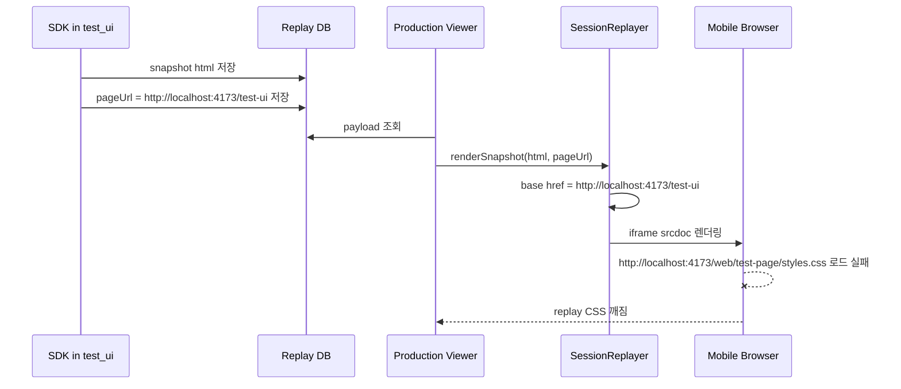
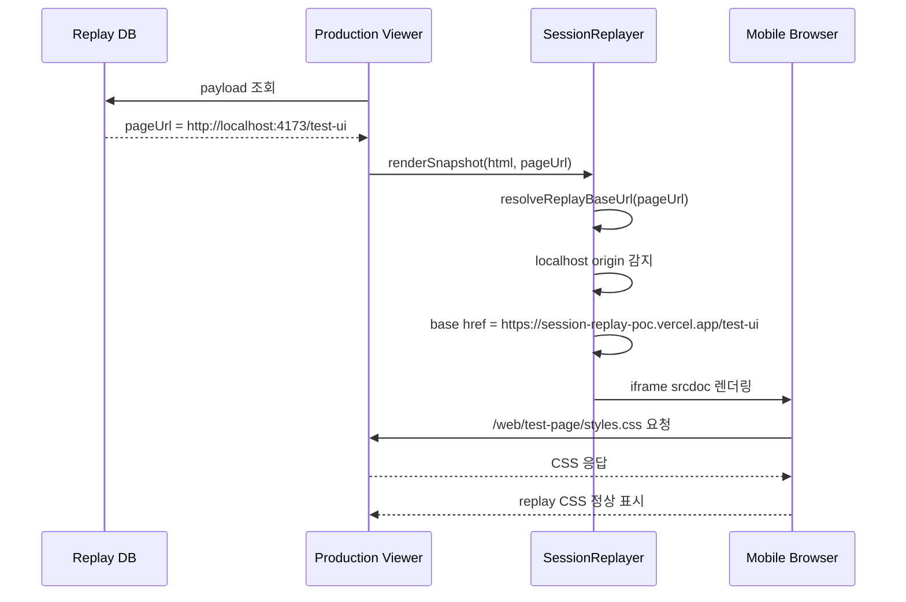
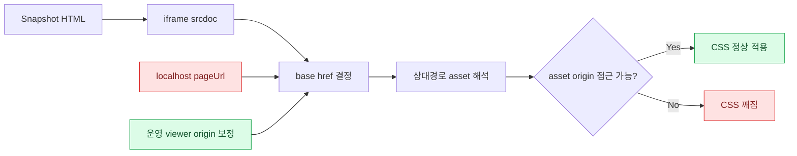

# Mobile Replay CSS Broken by Localhost Base URL Lesson Learned

작성일: 2026-06-29

## 1. 이슈가 된 원인

### 증상

모바일 환경에서 viewer로 세션 리플레이를 재생할 때, replay iframe 내부의 `test_ui` 화면 CSS가 깨져 보였다.

사용자가 본 현상:

- 세션 리플레이 화면에서 모바일 UI 레이아웃이 정상적으로 보이지 않음
- 운영 URL에서 viewer를 열었는데, replay되는 화면만 CSS가 적용되지 않은 것처럼 보임
- 직전에 우측 하단 세션 버튼/흰색 박스를 숨기는 작업을 했기 때문에, 해당 작업이 CSS를 깨뜨린 것처럼 보일 수 있었음

### 직접 원인

운영 viewer에서 로컬 환경에서 녹화한 세션을 재생하면서 CSS asset 기준 URL이 `localhost`로 잡힌 것이 원인이었다.

문제가 된 세션 예시:

```json
{
  "pageUrl": "http://localhost:4173/test-ui",
  "viewport": {
    "width": 2240,
    "height": 1054
  }
}
```

모바일 운영 viewer 주소:

```text
https://session-replay-poc.vercel.app/viewer
```

하지만 replay snapshot 내부 HTML에는 아래처럼 상대경로 CSS가 들어 있다.

```html
<link rel="stylesheet" href="/web/test-page/styles.css">
```

replayer는 snapshot을 iframe `srcdoc`으로 넣고, 원래 페이지 URL을 `<base href="...">`로 주입한다.

따라서 로컬에서 녹화한 세션은 replay iframe 내부에서 아래 기준으로 CSS를 찾게 된다.

```text
http://localhost:4173/web/test-page/styles.css
```

데스크톱 개발 PC에서는 이 경로가 우연히 살아 있을 수 있지만, 휴대폰에서 `localhost`는 휴대폰 자기 자신을 뜻한다.  
휴대폰에는 `localhost:4173` 서버가 없으므로 CSS를 가져오지 못하고, replay 화면이 깨진다.

### 헷갈릴 수 있었던 원인

직전에 viewer replay 시 우측 하단 파란 세션 버튼과 흰색 세션 팝업을 숨기는 작업을 했다.

처음에는 아래 selector가 너무 넓어서 레이아웃 일부까지 숨겼을 가능성을 의심했다.

```js
"[data-sr-block='true']"
"[data-sr-redacted='blocked']"
```

하지만 운영 DB의 최근 세션 payload를 확인한 결과, 모바일 세션 snapshot에는 CSS stylesheet가 상대경로로 남아 있었고, 로컬 세션은 `pageUrl`이 `localhost`로 저장되어 있었다.

즉, 핵심 원인은 숨김 selector가 아니라 `srcdoc + base href + localhost` 조합이었다.

### 원인이 된 포인트

| 포인트 | 현재 동작 | 문제 |
| --- | --- | --- |
| SDK snapshot | 원본 HTML을 저장 | CSS 링크는 상대경로 `/web/test-page/styles.css`로 남음 |
| 저장 세션 pageUrl | 로컬 테스트 시 `http://localhost:4173/test-ui` 저장 | 운영 viewer에서 asset base도 localhost가 됨 |
| Replayer | snapshot에 `<base href={pageUrl}>` 주입 | 상대경로 asset이 pageUrl origin 기준으로 로드됨 |
| 모바일 브라우저 | `localhost`는 휴대폰 자기 자신 | 개발 PC의 localhost 서버를 찾지 못함 |
| 결과 | CSS request 실패 | replay iframe 내부 UI 깨짐 |

## 2. 해결방향

### 기존 흐름



### 해결해야 하는 위치 표시

```mermaid
flowchart TD
  A[Replay payload] --> B[pageUrl 확인]
  B --> C{pageUrl origin이 localhost인가?}
  C -- No --> D[원래 pageUrl을 base href로 사용]
  C -- Yes --> E[현재 viewer origin으로 base URL 보정]
  E --> F[https://session-replay-poc.vercel.app/test-ui]
  D --> G[iframe srcdoc 렌더링]
  F --> G
  G --> H[/web/test-page/styles.css 정상 로드]
  H --> I[모바일 replay CSS 정상]

  classDef fix fill:#dcfce7,stroke:#16a34a,color:#14532d;
  classDef problem fill:#fee2e2,stroke:#dc2626,color:#7f1d1d;
  class E,F,H,I fix;
  class C problem;
```

### 어느 포인트가 원인이었는지

원인은 viewer의 iframe 크기나 모바일 CSS media query가 아니라, iframe 내부 문서가 참조하는 asset origin이었다.

특히 아래 조건이 함께 있을 때 문제가 발생한다.

1. 세션을 로컬 환경에서 녹화한다.
2. snapshot HTML의 CSS/JS 링크가 상대경로다.
3. 운영 viewer에서 해당 세션을 재생한다.
4. viewer가 저장된 `pageUrl`을 그대로 `<base href>`로 사용한다.
5. 모바일 브라우저에서 `localhost` asset 요청이 실패한다.

### 실제 해결

`src/replayer.js`에서 snapshot을 렌더링하기 전에 base URL을 보정했다.

수정 전:

```js
const sanitized = sanitizeDocumentHtml(rawHtml, baseUrl || window.location.href, {
  allowScripts: this.executePageScripts
});
```

수정 후:

```js
const replayBaseUrl = resolveReplayBaseUrl(baseUrl || window.location.href);
const sanitized = sanitizeDocumentHtml(rawHtml, replayBaseUrl, {
  allowScripts: this.executePageScripts
});
```

iframe 내부 iframe source 복원도 같은 보정 URL을 사용하도록 변경했다.

```js
restoreIframeSources(doc, iframeSummary, replayBaseUrl);
```

추가한 보정 로직:

```js
function resolveReplayBaseUrl(baseUrl) {
  try {
    const parsed = new URL(String(baseUrl || ""), window.location.href);
    if (isLocalDevelopmentOrigin(parsed)) {
      return new URL(parsed.pathname + parsed.search + parsed.hash, window.location.origin).href;
    }
    return parsed.href;
  } catch {
    return window.location.href;
  }
}

function isLocalDevelopmentOrigin(url) {
  const hostname = String(url.hostname || "").toLowerCase();
  return hostname === "localhost" || hostname === "127.0.0.1" || hostname === "0.0.0.0" || hostname === "::1";
}
```

### 같이 정리한 보완

우측 하단 세션 버튼/팝업 숨김 처리도 너무 넓게 잡지 않도록 줄였다.

처음 의심한 넓은 selector:

```js
"[data-sr-block='true']"
"[data-sr-redacted='blocked']"
```

최종 적용한 좁은 selector:

```js
const REPLAY_ONLY_HIDDEN_SELECTORS = [
  ".session-launcher",
  ".session-popover",
  "#session-popover-toggle",
  "#session-popover"
];
```

이렇게 하면 민감정보 마스킹 영역이나 다른 `data-sr-block` 요소까지 사라지는 부작용을 줄일 수 있다.

### 개선 후 흐름



## 3. 문제 원인 및 해결방향을 찾기 위해 필요한 개념 설명

### 개념 1. iframe `srcdoc`

정의:

`iframe.srcdoc`은 iframe 안에 별도의 HTML 문자열을 직접 넣어 렌더링하는 방식이다.

사용되는 용어:

- iframe
- srcdoc
- embedded document
- sandbox

예시:

```js
iframe.srcdoc = "<html><body>Hello</body></html>";
```

세션 리플레이에서는 저장된 snapshot HTML을 iframe 안에 넣어 원래 화면처럼 재현한다.

### 개념 2. `<base href>`

정의:

HTML 문서 안의 상대경로 URL을 어떤 기준 URL로 해석할지 지정하는 태그다.

사용되는 용어:

- base URL
- relative URL
- absolute URL
- origin

예시:

```html
<base href="https://session-replay-poc.vercel.app/test-ui">
<link rel="stylesheet" href="/web/test-page/styles.css">
```

위 경우 CSS는 아래 주소로 해석된다.

```text
https://session-replay-poc.vercel.app/web/test-page/styles.css
```

하지만 base href가 localhost라면 아래처럼 해석된다.

```text
http://localhost:4173/web/test-page/styles.css
```

모바일 브라우저에서는 이 경로가 실패한다.

### 개념 3. localhost

정의:

`localhost`는 항상 "현재 실행 중인 기기 자기 자신"을 의미한다.

사용되는 용어:

- localhost
- loopback address
- 127.0.0.1
- local development server

예시:

개발 PC에서:

```text
http://localhost:4173
```

는 개발 PC의 서버를 뜻한다.

휴대폰에서:

```text
http://localhost:4173
```

는 휴대폰 자기 자신을 뜻한다.  
휴대폰에서 같은 포트로 서버를 띄운 게 아니라면 요청은 실패한다.

### 개념 4. 상대경로 asset

정의:

도메인 없이 `/web/test-page/styles.css`처럼 작성된 CSS/JS/image 경로다.  
이 경로는 현재 문서의 origin 또는 `<base href>` 기준으로 해석된다.

사용되는 용어:

- asset
- stylesheet
- relative path
- absolute path
- origin

예시:

```html
<link rel="stylesheet" href="/web/test-page/styles.css">
```

현재 origin이 `https://session-replay-poc.vercel.app`이면:

```text
https://session-replay-poc.vercel.app/web/test-page/styles.css
```

base href가 `http://localhost:4173/test-ui`이면:

```text
http://localhost:4173/web/test-page/styles.css
```

### 개념 흐름도



## 4. 검증 내용

운영 DB의 최근 모바일 세션 payload를 확인했다.

모바일 세션 예시:

```json
{
  "pageUrl": "https://session-replay-poc.vercel.app/test-ui",
  "viewport": {
    "width": 360,
    "height": 403
  }
}
```

로컬 세션 예시:

```json
{
  "pageUrl": "http://localhost:4173/test-ui",
  "viewport": {
    "width": 2240,
    "height": 1054
  }
}
```

snapshot 내부 확인:

```json
{
  "sessionLauncher": 1,
  "sessionPopover": 4,
  "dataSrBlock": 2,
  "redactedBlocked": 2,
  "stylesheets": 1,
  "appSurface": 1
}
```

문법 검사:

```text
node --check src/replayer.js
```

결과:

```text
통과
```

운영 배포:

```text
https://session-replay-poc.vercel.app
```

배포 후 운영 `src/replayer.js` 확인 결과:

```json
{
  "hasBaseFix": true,
  "hasLocalFix": true,
  "hasBroadBlock": false,
  "hasBroadRedacted": false,
  "hasSessionHide": true
}
```

## 5. 재발 방지 메모

- replay viewer에서 snapshot을 `srcdoc`으로 렌더링할 때는 asset base URL을 항상 확인해야 한다.
- 로컬에서 녹화한 세션을 운영 viewer에서 재생할 수 있게 하려면 `localhost` origin 보정이 필요하다.
- `data-sr-block`은 개인정보/민감정보 마스킹 용도로도 쓰일 수 있으므로, viewer에서 일괄 `display:none` 처리하면 안 된다.
- replay에서 숨기고 싶은 제어 UI는 class/id처럼 명확한 selector로만 제한하는 편이 안전하다.
- 모바일에서 `localhost`는 개발 PC가 아니라 휴대폰 자기 자신이라는 점을 항상 고려해야 한다.
