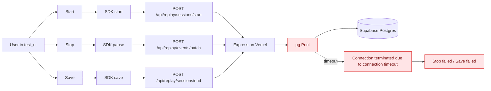
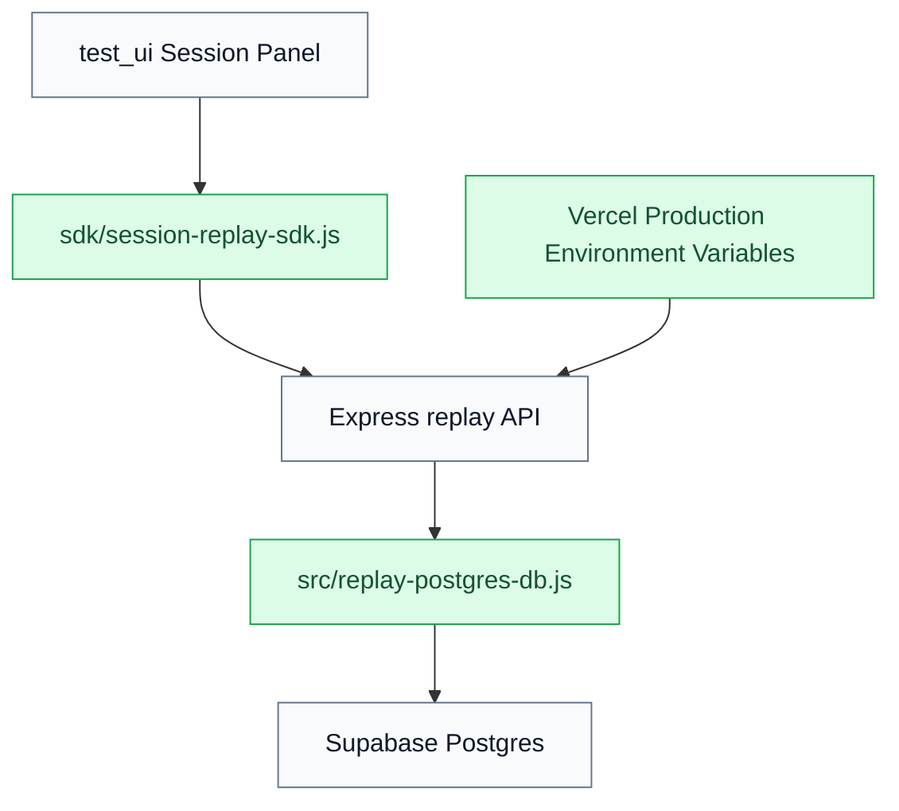
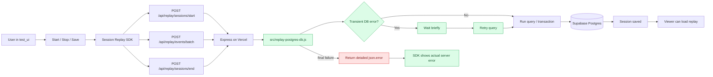
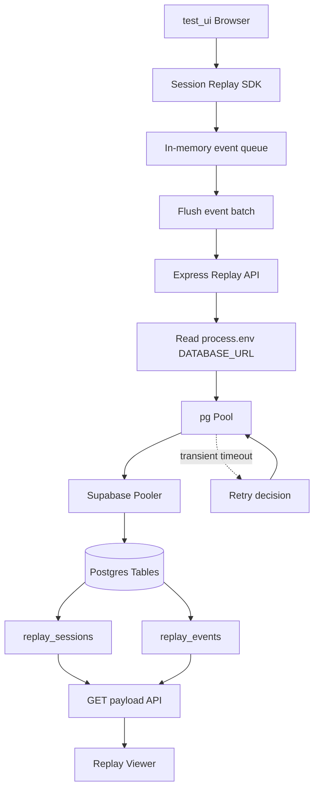
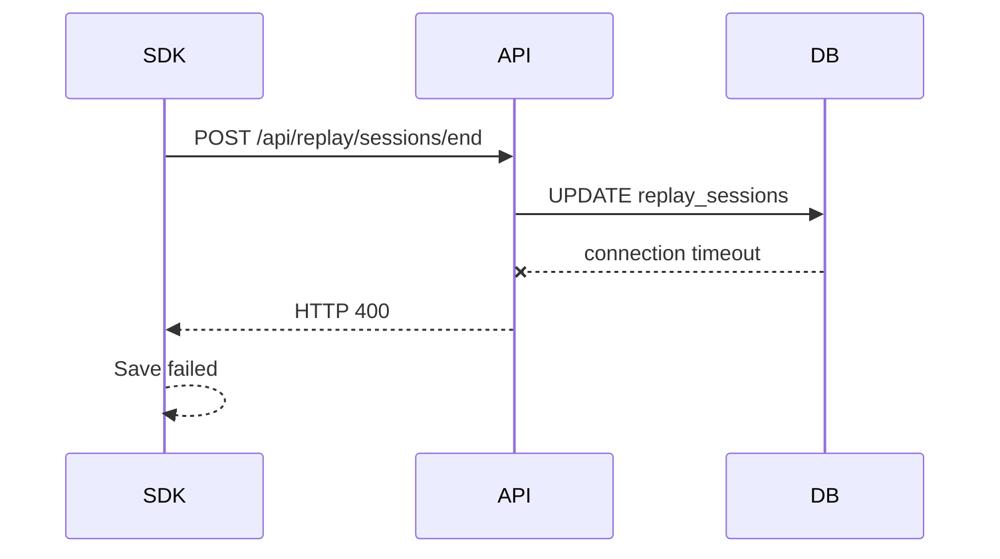
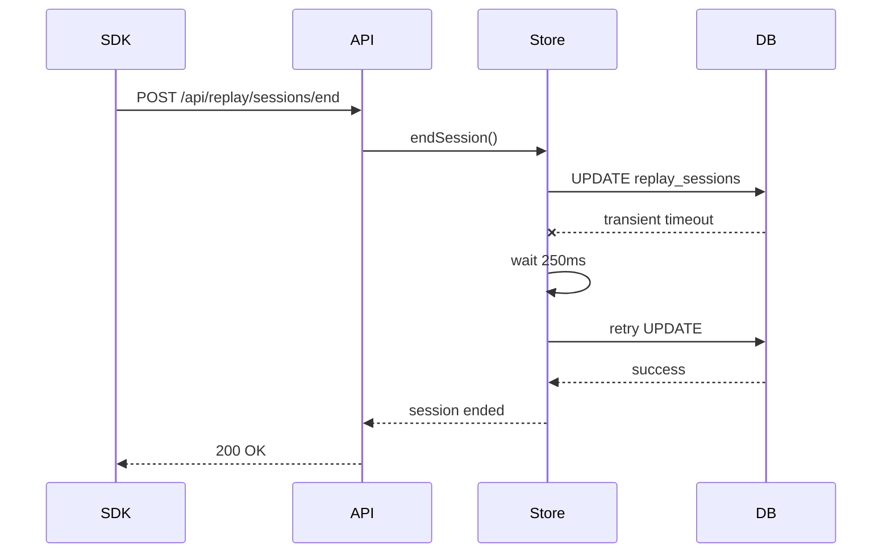
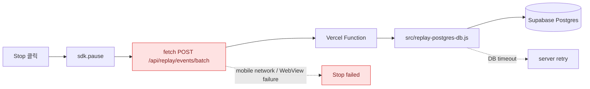
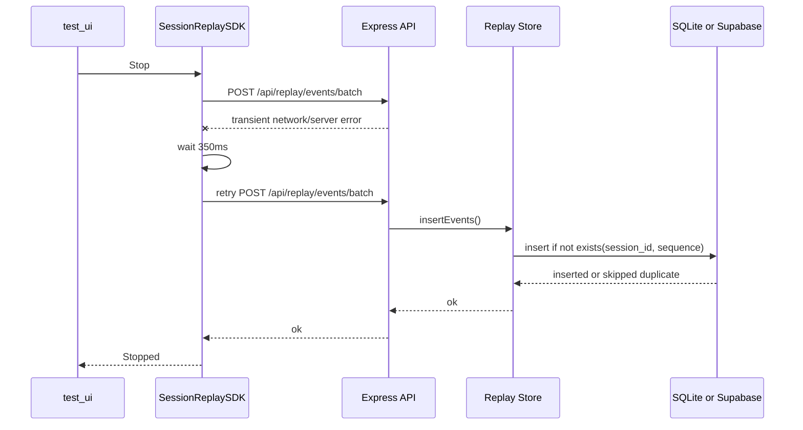
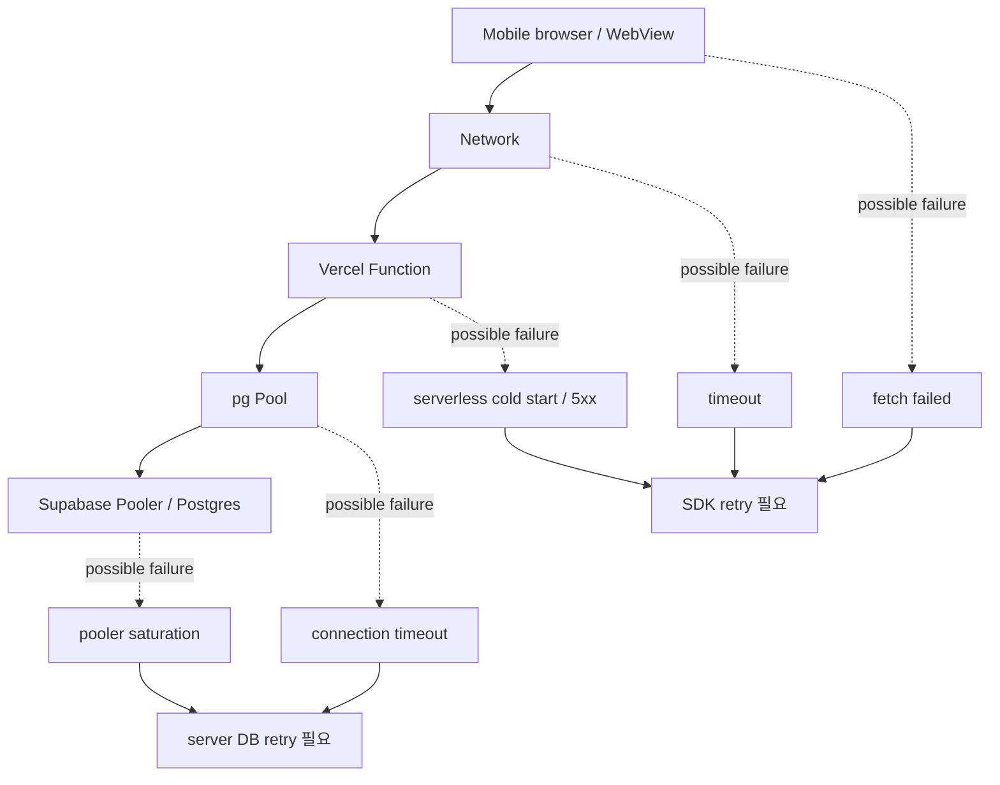

# Stop failed / Save failed DB Timeout Lesson Learned

작성일: 2026-06-29

## 1. 이슈가 된 원인

### 증상

`test_ui`에서 세션 녹화 후 `Stop` 또는 `Save`를 누르면 아래 현상이 반복 발생했다.

- `Stop failed`
- `Save failed`
- viewer에서 방금 저장한 세션이 보이지 않음
- 운영 API 조회 시 DB 연결 에러 발생

운영 API 확인 결과:

```text
GET /api/replay/sessions?limit=1
HTTP 500
{"ok":false,"error":"Connection terminated due to connection timeout"}
```

세션 시작 API도 동일 계열의 에러를 반환했다.

```text
POST /api/replay/sessions/start
HTTP 400
{"ok":false,"error":"Connection terminated due to connection timeout"}
```

### 직접 원인

Vercel Production 서버 함수가 Supabase Postgres에 연결하는 과정에서 connection timeout이 발생했다.

즉, 브라우저 UI 자체의 문제가 아니라 서버 저장 경로에서 DB 연결이 실패했다.

### 확인된 판단 근거

- 로컬 `.env`의 `DATABASE_URL`로는 Postgres `select now()`가 성공했다.
- Vercel Production에는 환경변수 이름이 존재했다.
- 하지만 운영 API에서는 DB 연결 timeout이 발생했다.
- Vercel Production 환경변수 재등록 및 재배포 후 API 조회가 정상화되었다.
- 이후 `start -> events/batch -> end -> payload` 운영 검증이 성공했다.

### 원인이 된 포인트

이번 이슈의 핵심 포인트는 아래 두 가지다.

1. Vercel Production 런타임에서 사용하는 DB 연결 설정이 정상적으로 동작하지 않았다.
2. Supabase pooler 또는 serverless 환경에서 순간적인 연결 timeout이 발생했을 때 애플리케이션 코드에 재시도 로직이 없었다.

추가로, SDK는 서버가 반환한 상세 에러 메시지를 숨기고 `HTTP 400`처럼 보여주고 있어 원인 파악이 늦어질 수 있었다.

## 2. 해결방향

### 기존 흐름

아래는 문제가 발생하던 기존 저장 흐름이다.



### 해결해야 하는 위치

해결 위치는 크게 3곳이었다.



수정한 위치:

- Vercel Production 환경변수
  - `DATABASE_URL`
  - `DATABASE_SSL`
  - `DATABASE_POOL_MAX`
- `src/replay-postgres-db.js`
  - DB query / transaction retry 추가
  - connection timeout 계열 에러를 transient error로 판단
- `sdk/session-replay-sdk.js`
  - 실패 시 서버가 내려준 `json.error`를 UI 로그에 표시

### 어느 포인트가 원인이었는지

| 포인트 | 문제 | 영향 |
| --- | --- | --- |
| Vercel Production DB env | 런타임 DB 연결이 timeout 발생 | 모든 세션 저장/조회 API 실패 가능 |
| Supabase pooler 연결 | serverless 환경에서 순간 connection timeout 가능 | Start, batch, end API가 간헐 실패 |
| 서버 저장 어댑터 | retry 없음 | 한 번의 timeout이 곧바로 API 실패로 전파 |
| SDK 에러 처리 | 상세 에러를 숨김 | UI에는 `Stop failed`, `Save failed`만 보임 |

### 실제 해결

1. 로컬 `.env`의 DB 연결이 정상인지 확인했다.
2. Vercel Production 환경변수의 DB 관련 값을 다시 등록했다.
3. Vercel Production을 재배포했다.
4. Postgres 저장소 코드에 재시도 로직을 추가했다.
5. SDK의 API 에러 메시지 파싱을 개선했다.
6. 운영 API에서 저장 전체 흐름을 검증했다.

검증된 흐름:

```text
POST /api/replay/sessions/start -> 200
POST /api/replay/events/batch -> 200
POST /api/replay/sessions/end -> 200
GET /api/replay/sessions/:id/payload -> 200
```

### 개선 후 흐름



## 3. 문제 원인 및 해결방향을 찾기 위해 필요한 개념 설명

### 개념 1. Serverless Runtime

정의:

Vercel 같은 배포 환경에서 요청이 들어올 때마다 서버 함수가 실행되는 구조다. 항상 같은 프로세스가 떠 있는 전통적인 WAS와 다르게, 함수 인스턴스가 새로 만들어지거나 재사용될 수 있다.

사용되는 용어:

- cold start
- warm instance
- serverless function
- runtime
- request lifecycle

예시:

사용자가 `/api/replay/sessions/end`를 호출하면 Vercel의 Node.js serverless function이 실행되고, 그 안에서 DB 연결 pool을 만들거나 재사용한다.

주의점:

serverless 환경에서는 DB 연결을 너무 많이 만들면 pooler timeout, connection limit, idle connection 문제가 발생할 수 있다.

### 개념 2. Environment Variables

정의:

애플리케이션 코드 밖에서 주입되는 설정값이다. DB URL, API key, model name처럼 환경마다 달라지는 값을 코드에 직접 쓰지 않기 위해 사용한다.

사용되는 용어:

- `.env`
- `process.env`
- production environment
- preview environment
- secret
- encrypted variable

예시:

```text
DATABASE_URL=postgresql://...
DATABASE_SSL=true
DATABASE_POOL_MAX=3
```

이번 이슈와의 연결:

로컬 `.env`의 DB 연결은 정상이었지만, Vercel Production 런타임에서는 DB 연결 timeout이 발생했다. 그래서 로컬 값과 운영 환경변수 상태를 분리해서 확인해야 했다.

### 개념 3. Database Connection Pool

정의:

DB 연결을 매 요청마다 새로 만들지 않고, 여러 요청에서 재사용하기 위해 관리하는 연결 묶음이다.

사용되는 용어:

- pool
- client
- max connections
- idle timeout
- connection timeout
- transaction

예시:

`pg.Pool`은 Supabase Postgres에 연결할 client를 관리한다. `max: 3`이면 한 서버 함수 인스턴스가 최대 3개의 DB 연결을 잡을 수 있다.

이번 이슈와의 연결:

Supabase pooler나 네트워크 경로에서 순간적으로 연결이 끊기면 `Connection terminated due to connection timeout`이 발생할 수 있다. 기존 코드는 이 에러를 한 번 만나면 바로 실패했다.

### 개념 4. Transient Error

정의:

일시적인 네트워크 문제나 DB pooler 상태 때문에 발생하는 실패다. 같은 요청을 잠시 뒤 다시 시도하면 성공할 수 있다.

사용되는 용어:

- retry
- backoff
- timeout
- `ECONNRESET`
- `ETIMEDOUT`
- transient failure

예시:

첫 번째 DB query는 timeout으로 실패하지만, 250ms 뒤 같은 query를 다시 보내면 성공하는 경우가 있다.

이번 개선:

`src/replay-postgres-db.js`에서 아래 계열 에러를 transient error로 보고 재시도한다.

- `connection terminated`
- `timeout`
- `terminating connection`
- `ETIMEDOUT`
- `ECONNRESET`
- `ECONNREFUSED`
- `53300`

### 개념 5. Session Replay Save Flow

정의:

브라우저에서 수집한 이벤트를 서버로 보내고, DB에 저장한 뒤 viewer에서 다시 읽어 재생하는 전체 흐름이다.

사용되는 용어:

- session
- event batch
- snapshot
- mutation
- end session
- payload
- viewer

예시:

1. `Start`: 세션 row 생성
2. 사용 행동 수집: click, input, scroll, mutation 등 queue에 저장
3. `Stop`: 수집 중지 및 queue flush
4. `Save`: 세션 종료 상태 저장
5. `Viewer`: 저장된 session + events를 payload로 재조합

### 개념 흐름도



### 개념 예시

#### 예시 1. DB env 문제인지 확인

로컬에서는 DB 연결이 되는지 먼저 확인한다.

```text
local .env DATABASE_URL -> select now() -> success
```

운영 API에서는 같은 DB 관련 기능이 실패하는지 확인한다.

```text
production /api/replay/sessions -> connection timeout
```

이 경우 로컬 코드 문제가 아니라 운영 런타임 설정 또는 운영 네트워크/DB 연결 문제일 가능성이 높다.

#### 예시 2. retry가 필요한 이유

retry가 없는 경우:



retry가 있는 경우:



#### 예시 3. 상세 에러 메시지의 중요성

기존 SDK:

```text
Save failed: HTTP 400
```

개선 SDK:

```text
Save failed: Connection terminated due to connection timeout
```

상세 에러가 보이면 문제 지점이 UI인지, API인지, DB인지 더 빨리 분리된다.

## 이번 이슈의 결론

이번 장애는 `test_ui` 버튼 동작 문제가 아니라 Vercel Production 서버 함수와 Supabase Postgres 사이의 DB 연결 timeout 문제였다.

단기 조치로 Vercel Production DB 환경변수를 재등록하고 재배포해 운영 API를 복구했다.

재발 방지를 위해 Postgres 저장소에 transient DB error retry를 추가했고, SDK가 서버 상세 에러를 표시하도록 개선했다.

향후 같은 문제가 발생하면 아래 순서로 확인한다.

1. 운영 API `GET /api/replay/sessions?limit=1` 응답 확인
2. 로컬 `.env` DB 연결 확인
3. Vercel Production env 등록 상태 확인
4. Vercel 재배포 여부 확인
5. DB timeout이면 retry 로그와 Supabase pooler 상태 확인

## 4. 추가 개선 내용

추가 개선일: 2026-06-29

### 다시 관찰된 현상

서버 DB retry를 적용한 뒤에도 모바일 테스트 중 `Stop failed`가 다시 보였다.

운영 확인 결과:

- `GET /api/replay/sessions?limit=5`는 `200 OK`
- 최신 세션은 최종적으로 `ended` 상태로 저장됨
- Vercel 최근 로그에는 `POST /api/replay/events/batch`, `POST /api/replay/sessions/end`가 info로 남았고 명확한 500 로그는 없음

즉, 이번에는 DB가 완전히 죽은 상태라기보다 Stop 시점의 batch flush 요청이 브라우저/WebView/네트워크/serverless 경계에서 순간 실패했을 가능성이 높다.

### 기존 개선의 한계

이전 개선은 서버에 요청이 도착한 이후의 DB timeout을 주로 방어했다.

하지만 Stop 동작은 아래 경로를 모두 통과해야 한다.



서버 retry는 `Store -> Supabase` 구간에 효과가 있지만, `SDK -> Vercel` 요청 자체가 실패하면 서버 retry까지 도달하지 못한다.

### 추가 원인 포인트

| 포인트 | 문제 | 필요한 개선 |
| --- | --- | --- |
| SDK fetch | POST 실패 시 즉시 에러 전파 | transient POST retry |
| events/batch 재시도 | 같은 batch를 다시 보내면 중복 저장 가능 | idempotent event insert |
| Stop UX | flush 실패 시 `Stop failed`만 보임 | 실제 error 표시와 재시도 가능성 확보 |

### 추가 해결 방향

1. SDK의 `postJson()`에 transient POST retry 추가
2. retry 대상
   - fetch/network error
   - `timeout`
   - `connection terminated`
   - HTTP `408`, `429`, `500`, `502`, `503`, `504`
3. retry 횟수
   - 최대 3회
   - `350ms * attempt` 대기
4. batch 재전송 중복 방지
   - `session_id + sequence` 기준으로 이미 저장된 이벤트는 insert skip
   - Postgres와 SQLite 모두 동일 정책 적용

### 개선 후 흐름



### 수정된 파일

- `sdk/session-replay-sdk.js`
  - POST 요청 재시도 추가
  - HTTP retryable status와 transient error message 판별 추가
- `src/replay-postgres-db.js`
  - `session_id + sequence` 기준 중복 이벤트 insert skip
  - 실제 insert된 row 수 반환
- `src/replay-db.js`
  - SQLite에서도 동일하게 중복 이벤트 insert skip
  - 실제 insert된 row 수 반환

### 이 개선이 중요한 이유

Stop/Save 안정성은 서버 DB retry만으로 충분하지 않다.

모바일 브라우저, 카카오 인앱 브라우저, Vercel serverless, Supabase pooler가 함께 있는 구조에서는 실패 지점이 여러 구간으로 나뉜다.



따라서 안정적인 세션 저장을 위해서는 두 계층의 retry가 함께 필요하다.

- SDK retry: API 요청 자체의 순간 실패 방어
- Server DB retry: DB 연결/쿼리 순간 실패 방어

그리고 retry가 안전하려면 events 저장은 idempotent해야 한다.
