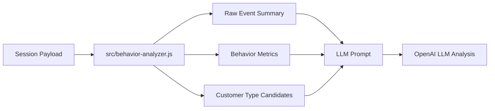

# LLM 분석 전 로컬 행동 분석 기준

## 목적

viewer의 `Local summary` 또는 LLM 분석 전 화면은 OpenAI API 결과가 아니라, 세션 replay payload를 브라우저에서 즉시 집계한 로컬 행동 분석 결과입니다.

이 단계의 목적은 최종 고객 유형을 확정하는 것이 아니라, LLM에게 넘기기 전의 정량 근거를 만드는 것입니다.

즉, viewer의 분석 흐름은 다음 순서입니다.



## 입력 데이터

로컬 분석은 replay payload의 `events` 배열만 사용합니다.

주요 이벤트 분류는 다음과 같습니다.

- `event`: 사용자의 직접 상호작용
- `mutation`: DOM 변경
- `snapshot`: 초기 화면 스냅샷
- `meta`: 화면/환경 메타 정보

`event` 내부에서는 `data.eventType`을 기준으로 클릭, 입력, 스크롤, 제출, 화면 이동 의도를 구분합니다.

## 기본 집계 항목

`src/behavior-analyzer.js`는 먼저 아래 값을 계산합니다.

- `totalEvents`: 전체 이벤트 수
- `interactionEvents`: `type === "event"` 이벤트 수
- `mutationEvents`: `type === "mutation"` 이벤트 수
- `durationMs`, `durationSec`: 세션 길이
- `byEventType`: click, input, scroll, submit 등 이벤트 타입별 수
- `uniqueTargets`: 상호작용한 고유 DOM target 수
- `maxScrollTop`: 가장 깊게 내려간 스크롤 위치
- `totalMouseDistance`: mousemove 이벤트 기반 이동 거리
- `rapidClickBursts`: 짧은 시간 안의 빠른 클릭 묶음 수
- `repeatedClickTargets`: 같은 target을 3회 이상 클릭한 target 수
- `navigationIntents`: 화면 이동 의도 이벤트 수
- `topInputTargets`: 입력이 많았던 상위 target
- `submits`: 제출 이벤트 수

## 정규화 점수

로컬 분석은 여러 원시 값을 0에서 1 사이 점수로 정규화합니다.

- `durationScore`: `durationMs / 90000`
- `clickScore`: 클릭 수 / 18
- `scrollDepthScore`: `maxScrollTop / 1800`
- `targetDiversityScore`: `uniqueTargets / 12`
- `mutationScore`: mutation 수 / 28
- `formScore`: input/change 수 / 8
- `completionScore`: submit이 있으면 1, 없으면 0
- `navigationScore`: navigation intent 수 / 3

각 값은 `0 <= score <= 1` 범위로 잘립니다.

## Behavior Metrics

viewer의 Behavior metrics는 아래 로컬 점수를 보여줍니다.

### Engagement

사용자가 세션에 얼마나 관여했는지 보는 지표입니다.

계산 기준:

- 체류 시간
- 클릭 수
- 스크롤 깊이
- 고유 target 다양성
- DOM 변화량

현재 가중치:

```text
durationScore 28%
clickScore 24%
scrollDepthScore 22%
targetDiversityScore 18%
mutationScore 8%
```

### Exploration

여러 화면/영역을 탐색했는지 보는 지표입니다.

계산 기준:

- 스크롤 깊이
- 고유 target 다양성
- 클릭 수
- 화면 이동 의도

현재 가중치:

```text
scrollDepthScore 34%
targetDiversityScore 30%
clickScore 20%
navigationScore 16%
```

### Goal Intent

금융 상품 가입, 이벤트 참여, 이체, 환전, 고객센터 검색처럼 특정 목적 행동으로 이어질 가능성을 보는 지표입니다.

기존에는 이 지표를 `Purchase Intent`로 표시했지만, 금융 앱에서는 이체/환전/상담처럼 구매가 아닌 목적 행동도 많습니다.

따라서 viewer 표시명은 `Goal Intent`로 사용합니다.

계산 기준:

- 입력 행동
- 제출 완료
- 화면 이동 의도
- 클릭 수
- DOM 변화량

현재 가중치:

```text
formScore 34%
completionScore 28%
navigationScore 14%
clickScore 14%
mutationScore 10%
```

### Friction

사용자가 화면에서 마찰을 겪었는지 보는 지표입니다.

계산 기준:

- 빠른 반복 클릭
- 같은 target 반복 클릭
- 입력은 많지만 제출이 없음
- 오래 머물렀지만 완료 행동이 없음

현재 가중치:

```text
frictionClickScore 44%
inputs >= 8 and submits == 0 24%
durationMs > 60000 and submits == 0 16%
repeatedClickTargets > 0 16%
```

### Form Intent

입력 의도가 있는지 보는 지표입니다.

계산 기준:

```text
formScore 72%
completionScore 28%
```

### Conversion

완료 행동이 있었는지 보는 지표입니다.

계산 기준:

```text
completionScore 76%
formScore 24%
```

### Bounce Risk

좌측 viewer 패널에는 표시하지 않지만, 내부 고객 유형 후보와 LLM prompt 근거에는 사용됩니다.

계산 기준:

- 세션 길이가 12초 미만
- interaction 이벤트가 8개 미만
- 스크롤 깊이가 250px 미만

submit이 있으면 bounce risk는 크게 낮아집니다.

## Behavior Signals

로컬 분석은 점수 외에도 boolean 신호를 만듭니다.

- `shortBounce`: 12초 미만이고 interaction 이벤트가 8개 미만
- `heavyExploration`: `maxScrollTop > 500`이고 mousemove가 30개 초과
- `formIntent`: input/change 이벤트가 4개 이상
- `completion`: submit 이벤트가 1개 이상
- `hesitation`: input/change 이벤트가 8개 이상이지만 submit 없음
- `frustration`: rapid click burst가 1개 이상

이 값들은 `labels` 생성에 사용됩니다.

## Labels

behavior signal 조합으로 다음 label을 만듭니다.

- `short_bounce`
- `exploration`
- `goal_completed`
- `goal_attempted_not_completed`
- `hesitation`
- `frustration_signal`
- `neutral`

label은 LLM 분석 전 요약과 prompt 근거로 사용됩니다.

## 로컬 고객 유형 후보

LLM 분석 전에는 화면 맥락 후보와 일반 행동 후보를 함께 점수화합니다.

현재는 화면 맥락을 먼저 보고, 그 다음 일반 행동 후보를 점수화합니다.

### 거래 실행형 고객

`transaction_executor`

기준:

- `view_state` 또는 클릭 텍스트에서 transfer/이체/송금 흐름 감지
- form intent 높음
- conversion 높음
- submit 완료 여부

예:

- 이체 화면 진입
- 계좌번호 또는 금액 입력
- `이체 확인` 버튼 클릭 또는 submit 발생

이 경우는 구매 의도가 아니라 거래 실행 의도로 해석합니다.

### 환전 실행형 고객

`exchange_execution_user`

기준:

- exchange/환전 화면 흐름 감지
- 통화 또는 환전 금액 입력
- 예상 금액 보기 또는 submit 발생

### 문제 해결 탐색 고객

`support_seeking_user`

기준:

- support/고객센터/FAQ/상담 흐름 감지
- 검색 또는 상담 관련 행동 발생

### 상품 가입 의도 고객

`product_application_intent_user`

기준:

- 상품몰, 상품목록, 상품 상세 흐름 감지
- 상품 관련 입력 또는 가입/신청 submit 발생

### 목적 행동 완료형 고객

`goal_directed_completer`

기준:

- goal intent 높음
- conversion 높음
- engagement 있음
- submit 완료

화면 맥락이 명확하지 않을 때 사용하는 일반 후보입니다.

### 비교 탐색형 고객

`comparison_explorer`

기준:

- exploration 높음
- engagement 높음
- conversion은 아직 낮음
- goal intent 일부 존재

### 고민 중인 입력 고객

`hesitant_form_user`

기준:

- form intent 높음
- conversion 낮음
- friction 존재
- engagement 존재

### 마찰을 겪는 고객

`frustrated_user`

기준:

- friction 높음
- engagement 존재
- rapid click burst 존재

### 저관여 이탈 위험 고객

`low_engagement_bouncer`

기준:

- bounce risk 높음
- engagement 낮음
- goal intent 낮음

## Reason Codes

고객 유형 후보의 근거로 다음 reason code가 붙습니다.

- `goal_intent_high`: goal intent score가 0.65 이상
- `exploration_high`: exploration score가 0.65 이상
- `friction_detected`: friction score가 0.55 이상
- `bounce_risk_high`: bounce risk score가 0.6 이상
- `goal_completed`: submit 이벤트가 있음
- `form_started_without_submit`: 입력은 했지만 submit 없음
- `transfer_flow`: 이체/송금 화면 맥락 감지
- `product_flow`: 상품몰/상품목록 화면 맥락 감지
- `neutral_behavior`: 강한 신호가 없음

## LLM 분석과의 관계

로컬 분석은 정해진 수식과 고정 후보를 사용합니다.

반면 LLM 분석은 로컬 분석 결과를 참고하되, 고정 후보에 갇히지 않고 세션에 맞는 고객 유형명을 새롭게 정의합니다.

현재 LLM prompt 방향은 다음과 같습니다.

- 정량 지표와 로컬 고객 유형 후보를 강한 근거로 사용할 것
- 하지만 raw event summary가 더 적절한 해석을 보여주면 로컬 후보를 override할 것
- 최종적으로 고객 유형명, 설명, 보조 특성, confidence, 근거를 JSON으로 반환할 것

## 해석 시 주의점

로컬 분석의 confidence는 통계적 확률이 아닙니다.

현재 수집된 이벤트 안에서 해당 고객 유형 후보가 얼마나 일관되게 나타나는지를 나타내는 휴리스틱 점수입니다.

따라서 viewer에서는 다음처럼 해석하는 것이 적절합니다.

- LLM 분석 전: 행동 지표 대시보드와 참고 분류
- LLM 분석 후: 지표와 이벤트 맥락을 종합해 표현한 고객 유형 정의
