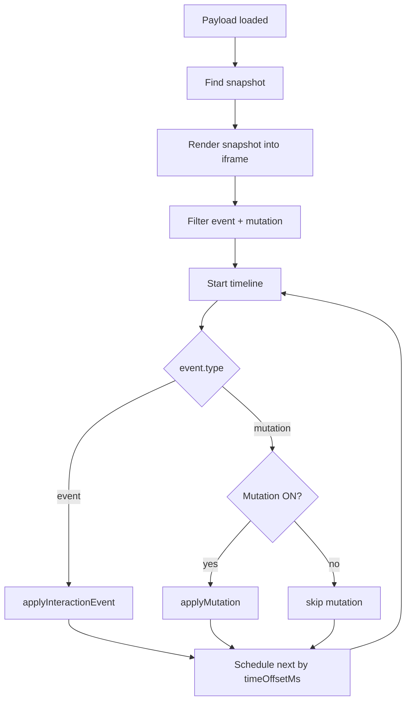

# Session Replay Event Composition

## 목적

이 문서는 저장된 replay events를 어떤 순서와 규칙으로 조합해서 하나의 재생 화면을 만드는지 설명합니다.

`session-replay-sdk-events-and-batches.md`가 이벤트를 저장하는 방식을 다루고, `session-replay-replayer-flow.md`가 `src/replayer.js`의 전체 재생 흐름을 다룬다면, 이 문서는 그 사이의 핵심 질문에 집중합니다.

> 여러 종류의 이벤트를 어떻게 섞어야 원본 사용자 세션처럼 보이는가?

현재 프로젝트의 replay는 단일 이벤트만 보고 화면을 재현하지 않습니다. 아래 요소를 조합합니다.

- `snapshot`: 시작 화면
- `event`: click, input, scroll, view_state, dialog 등 사용자/의미 이벤트
- `mutation`: DOM 변경 이벤트
- `timeOffsetMs`: 이벤트 사이 시간 간격
- `viewport`: 녹화 당시 화면 크기
- `sandbox/script mode`: snapshot 내부 script 실행 정책

## 핵심 결론

현재 replayer는 다음 원칙으로 이벤트를 조합합니다.

```text
snapshot으로 초기 화면을 만든다
  -> timeOffsetMs 순서로 event/mutation을 하나씩 적용한다
  -> interaction event는 사용자의 의도를 보여준다
  -> semantic event는 화면 상태를 명시적으로 맞춘다
  -> mutation은 DOM 결과를 보강하되 옵션으로 적용한다
  -> 충돌 위험이 있으면 mutation 또는 native click 중 하나를 줄인다
```

즉, replay는 “이벤트를 그대로 실행”하는 것이 아니라, 여러 이벤트의 역할을 나누어 화면을 합성하는 과정입니다.

## 1. 이벤트 조합에 필요한 개념

### Baseline State

Baseline state는 replay가 시작되는 기준 화면입니다.

현재는 `snapshot` 이벤트가 baseline입니다.

```js
{
  type: "snapshot",
  data: {
    html: "<!doctype html>...",
    url: "https://...",
    viewport: { width: 390, height: 844 },
    iframeSummary: []
  }
}
```

replayer는 이 snapshot을 iframe `srcdoc`에 넣고, 이후 이벤트를 이 화면 위에 덧씌웁니다.

### Delta Event

Delta event는 baseline 이후에 발생한 변화입니다.

현재 replay에서 delta 역할을 하는 것은 크게 두 종류입니다.

- `type: "event"`: 사용자의 행동 또는 의미 상태 변화
- `type: "mutation"`: DOM에 실제로 생긴 변경

### Timeline Order

Replay는 이벤트 배열 순서만 보는 것이 아니라 `timeOffsetMs`를 기준으로 이벤트 사이 간격을 재현합니다.

예:

```text
0ms    snapshot
500ms  click
900ms  mutation
1600ms scroll
2200ms view_state
```

이 간격이 있어야 replay가 단순 최종 상태 덤프가 아니라 “사용자가 어떤 흐름으로 움직였는지”를 보여줄 수 있습니다.

### Interaction Event

Interaction event는 사용자가 실제로 한 행동입니다.

예:

- click
- input/change
- submit
- scroll
- mousemove

이 이벤트는 사용자 의도와 행동 분석에 강합니다.

하지만 interaction event만으로는 화면 결과가 항상 복원되지는 않습니다. 예를 들어 원본 앱 script가 replay iframe에서 실행되지 않으면 click을 dispatch해도 화면이 바뀌지 않을 수 있습니다.

### Semantic Event

Semantic event는 화면 상태를 명시적으로 설명하는 이벤트입니다.

현재 프로젝트의 대표 예:

- `view_state`: 현재 어떤 SPA 화면인지
- `dialog_open`: dialog가 열렸는지
- `dialog_close`: dialog가 닫혔는지
- `navigation_intent`: 사용자가 링크 이동 의도를 보였는지

Semantic event는 “브라우저가 알아서 재현해주길 기대”하지 않고, replayer가 직접 상태를 맞추게 합니다.

### Mutation Event

Mutation event는 DOM 변경 결과입니다.

interaction event가 “사용자가 무엇을 했는가”라면, mutation event는 “그 결과 DOM이 어떻게 바뀌었는가”에 가깝습니다.

다만 mutation은 강력하지만 위험합니다.

- 정확히 적용되면 화면 재현력이 올라감
- 잘못 적용되면 전체 화면이 깨짐
- native click 결과와 중복 적용될 수 있음

그래서 현재는 Mutation ON/OFF를 viewer에서 선택할 수 있게 되어 있습니다.

### Native Replay

Native replay는 저장된 click/input 이벤트를 iframe 안의 실제 DOM event로 다시 dispatch하는 방식입니다.

예:

- pointerdown
- mousedown
- pointerup
- mouseup
- click
- input/change event

이 방식은 원본 페이지의 event handler를 다시 실행할 수 있지만, snapshot script mode와 mutation 적용 여부에 따라 결과가 달라질 수 있습니다.

## 2. 현재 이벤트 조합 순서

현재 `src/replayer.js` 기준 재생 순서는 다음과 같습니다.



중요한 점은 snapshot 자체는 timeline에서 반복 적용하지 않는다는 것입니다. snapshot은 시작점이고, timeline은 snapshot 이후의 변화만 다룹니다.

## 3. 이벤트 종류별 조합 방식

### Snapshot + Click

Click은 두 가지 역할을 합니다.

1. 사용자 행동을 시각적으로 보여줌
2. 필요하면 원본 DOM event를 다시 dispatch함

현재 click 적용:

```text
target 찾기
  -> pointer/ripple 표시
  -> target outline 표시
  -> Mutation OFF면 native click dispatch
  -> Mutation ON이면 native click 생략
```

Mutation OFF일 때 native click을 실행하는 이유:

- mutation을 적용하지 않으므로 click handler가 화면을 바꿔줄 가능성에 기대기 위해

Mutation ON일 때 native click을 끄는 이유:

- mutation이 이미 DOM 결과를 적용할 수 있음
- click handler까지 실행하면 같은 변화가 두 번 발생할 수 있음

### Snapshot + Input

Input은 값 복원과 event dispatch를 같이 합니다.

```text
target 찾기
  -> target.value = recorded value
  -> input/change event dispatch
```

현재 입력값은 SDK 단계에서 마스킹되어 저장됩니다. 따라서 replay에서 복원되는 값도 원문이 아니라 마스킹 값입니다.

이 조합은 다음 목적을 갖습니다.

- 사용자가 어느 필드에 입력했는지 보여줌
- 입력 흐름이 있었음을 행동 분석에 남김
- 원문 개인정보를 replay에 노출하지 않음

### Snapshot + Scroll

Scroll은 화면의 관심 위치를 복원합니다.

```text
document scroll이면 window.scrollTo
element scroll이면 target.scrollTop/scrollLeft 적용
```

Scroll은 mutation과 독립적으로 적용됩니다.

이유:

- DOM 구조가 같다면 scroll은 사용자의 시선 이동을 가장 직접적으로 보여줌
- scroll은 mutation처럼 DOM을 변경하지 않으므로 중복 적용 위험이 낮음

### Snapshot + View State

`view_state`는 현재 테스트 UI에서 매우 중요한 조합 이벤트입니다.

테스트 UI는 SPA처럼 여러 화면을 `.screen[data-view]`로 두고 active class를 바꿉니다.

replayer는 `view_state`를 만나면 다음을 직접 수행합니다.

```text
.screen[data-view] 중 screenName과 일치하는 것만 active
[data-screen] 버튼 active 상태 갱신
screen-title 갱신
scrollTop 복원
```

이 이벤트가 중요한 이유:

- click만으로 SPA 화면 전환이 재현되지 않을 수 있음
- mutation만으로 화면 전환을 맞추면 깨질 위험이 있음
- “현재 화면이 무엇인지”를 명시적으로 적용하면 안정적임

즉, `view_state`는 replay에서 화면 전환을 위한 앵커 이벤트입니다.

### Snapshot + Dialog Event

Dialog는 일반 DOM과 다르게 browser top layer 상태를 포함합니다.

그래서 dialog는 단순히 attribute mutation으로만 처리하지 않고 의미 이벤트로 조합합니다.

```text
dialog_open
  -> target.showModal()
  -> 실패하면 open attribute fallback

dialog_close
  -> target.close()
  -> 실패하면 open attribute remove
```

이 조합은 `<dialog>` popup replay gap을 막기 위한 방식입니다.

### Snapshot + Mutation

Mutation은 DOM 결과를 보강합니다.

현재 mutation 조합은 세 가지로 나뉩니다.

#### Attributes

```text
target 찾기
  -> attributeName 확인
  -> script 위험 attribute면 skip
  -> newValue가 null이면 removeAttribute
  -> 아니면 setAttribute
```

#### CharacterData

```text
target이 text node면 textContent 변경
target이 단순 text container면 textContent 변경
복잡한 element면 skip
```

#### ChildList

```text
target 검증
  -> removedNodes 제거 시도
  -> addedNodes append 시도
  -> patch로 변화가 생기면 종료
  -> 필요하면 제한된 innerHTML fallback
```

ChildList는 가장 위험하기 때문에 제한이 많습니다.

- `html`, `body`는 적용하지 않음
- 큰 구조 tag는 innerHTML fallback 금지
- 너무 큰 HTML은 적용하지 않음
- descendant가 너무 많으면 적용하지 않음
- nth-of-type 기반 selector와 큰 mutation 조합은 skip

## 4. 조합 시 충돌이 생기는 지점

### Click과 Mutation의 중복

가장 대표적인 충돌입니다.

원본 세션:

```text
사용자 click
  -> 앱 click handler 실행
  -> DOM mutation 발생
```

Replay에서 둘 다 강하게 적용하면:

```text
native click replay
  -> 앱 click handler 재실행
mutation replay
  -> 저장된 DOM 변경도 적용
```

결과적으로 UI가 두 번 열리거나, 리스트가 두 번 추가되거나, 화면 상태가 꼬일 수 있습니다.

현재 해결:

```js
replayNativeClicks: !this.applyMutationEvents
```

즉:

- Mutation OFF: native click으로 화면 변화를 시도
- Mutation ON: click은 시각화 위주, DOM 변화는 mutation에 맡김

### Snapshot script와 Replay event의 충돌

Script ON이면 snapshot 안의 JS가 다시 실행될 수 있습니다.

이때 replay event도 동시에 적용하면 원본 앱이 예상하지 않은 상태가 될 수 있습니다.

예:

- 앱 초기화 script가 DOM을 새로 그림
- replay mutation이 그 DOM을 다시 수정
- click handler가 재등록되거나 중복 실행됨

현재 해결:

- 기본은 Script OFF
- Script ON은 명시적으로 선택
- Script OFF일 때 inline handler와 `javascript:` URL 제거

### Selector 불안정성

SDK는 target을 CSS selector path로 저장합니다.

하지만 replay 중 DOM이 바뀌면 selector가 더 이상 같은 element를 가리키지 않을 수 있습니다.

특히 위험한 경우:

- `:nth-of-type()` 기반 path
- 큰 childList mutation 이후 DOM 순서 변경
- id 없는 반복 리스트

현재 해결:

- target을 찾지 못하면 해당 event skip
- 큰 mutation + nth-of-type 조합은 childList 적용 제한
- mutation 실패 하나가 전체 timeline을 중단하지 않도록 try/catch

### Mutation fallback의 과적용

`target.innerHTML = ...` fallback은 강력하지만, 너무 큰 영역에 쓰면 화면 전체가 바뀔 수 있습니다.

현재 해결:

- fallback 허용 tag 제한
- HTML byte 제한
- descendant 수 제한
- `[redacted]` HTML은 적용하지 않음

## 5. 실제 예시: 상품 상세 dialog replay

상품 목록에서 사용자가 상품 카드를 눌러 상세 dialog를 여는 상황을 예로 들 수 있습니다.

저장 이벤트는 대략 이렇게 구성됩니다.

```text
0ms    snapshot
800ms  click product card
820ms  dialog_open
850ms  mutation attributes/childList
1800ms scroll inside page
2600ms dialog_close
```

Replay 조합:

```text
1. snapshot으로 상품 목록 화면 렌더링
2. click event로 클릭 위치와 대상 표시
3. dialog_open으로 showModal 호출
4. Mutation ON이면 dialog 내부 DOM 변화 보강
5. scroll event 적용
6. dialog_close로 close 호출
```

여기서 핵심은 dialog를 mutation만으로 열려고 하지 않는 것입니다.

`dialog_open`은 브라우저 top layer 상태를 맞추는 의미 이벤트이고, mutation은 내부 DOM 보강 역할을 합니다.

## 6. 실제 예시: SPA 화면 전환 replay

홈 화면에서 상품몰 화면으로 이동하는 경우입니다.

저장 이벤트:

```text
0ms    snapshot home
700ms  click product menu
720ms  view_state screenName=products
760ms  mutation class/childList
```

Replay 조합:

```text
1. snapshot으로 home 렌더링
2. click으로 사용자가 상품몰 버튼을 눌렀음을 표시
3. view_state로 products 화면을 active 처리
4. Mutation ON이면 세부 DOM 변경을 보강
```

여기서 `view_state`는 화면 전환의 기준 이벤트입니다.

Mutation이 없어도 최소한 “어느 화면으로 이동했는지”는 복원됩니다.

## 7. 실제 예시: 입력 후 저장 replay

이체 화면에서 사용자가 금액을 입력하고 확인을 누르는 경우입니다.

저장 이벤트:

```text
0ms     snapshot
500ms   view_state transfer
1200ms  input amount value=******
1600ms  click confirm
1650ms  submit
1800ms  mutation result message
```

Replay 조합:

```text
1. snapshot 렌더링
2. view_state로 이체 화면 active
3. input event로 마스킹된 값 입력
4. click으로 확인 버튼 표시
5. submit event는 분석 근거로 남음
6. Mutation ON이면 결과 메시지 DOM 보강
```

현재 `submit`은 replayer에서 특별한 DOM 변화로 적용되지는 않습니다. 하지만 behavior analyzer에서는 conversion/goal intent 근거로 중요합니다.

## 8. 현재 구현의 조합 전략

현재 전략은 아래처럼 정리할 수 있습니다.

| 이벤트 종류 | replay 역할 | 적용 방식 | 위험도 |
| --- | --- | --- | --- |
| snapshot | 시작 화면 | iframe srcdoc | 중간 |
| click | 행동 시각화 / native 재실행 | pointer + optional native click | 중간 |
| input/change | 입력 상태 복원 | value 설정 + event dispatch | 낮음 |
| scroll | 시선 위치 복원 | scrollTop/scrollTo | 낮음 |
| view_state | SPA 화면 상태 복원 | active class/title/scroll 직접 적용 | 낮음 |
| dialog_open/close | popup 상태 복원 | showModal/close | 중간 |
| mutation attributes | DOM 속성 보강 | set/removeAttribute | 중간 |
| mutation characterData | 텍스트 보강 | 제한적 textContent | 중간 |
| mutation childList | DOM 구조 보강 | patch + 제한적 fallback | 높음 |
| mousemove | 움직임 시각화 | pointer path | 낮음 |

현재 구조는 “항상 완전한 DOM 재실행”보다 “깨지지 않는 replay + 중요한 행동 흐름 복원”에 더 가깝습니다.

## 9. 향후 발전 방향

### 이벤트 우선순위 체계

지금은 event와 mutation이 timeline 순서대로 적용됩니다.

향후에는 이벤트별 우선순위를 둘 수 있습니다.

예:

```text
view_state > dialog_open/close > input/scroll > click visual > mutation patch > mutation fallback
```

이렇게 하면 같은 시간대에 여러 이벤트가 몰릴 때 더 안정적인 결과를 만들 수 있습니다.

### 같은 tick 이벤트 묶음 처리

현재는 이벤트를 하나씩 적용합니다.

하지만 실제 브라우저에서는 click 직후 여러 mutation이 같은 frame 안에서 발생할 수 있습니다.

향후에는 가까운 `timeOffsetMs`를 가진 이벤트를 하나의 frame group으로 묶을 수 있습니다.

예:

```text
click at 1000ms
view_state at 1002ms
mutation at 1005ms
```

이를 하나의 group으로 보고:

```text
1. click visual
2. semantic state
3. mutation patch
4. render settle
```

순서로 적용하면 더 자연스러울 수 있습니다.

### Checkpoint 기반 replay

현재 replay는 시작 snapshot에서 끝까지 순차 적용합니다.

Seek 기능을 만들려면 중간 checkpoint가 필요합니다.

가능한 방식:

- N초마다 lightweight snapshot 저장
- 주요 view_state마다 checkpoint 저장
- mutation 적용 후 안정 상태를 checkpoint로 저장

### Node identity 강화

현재는 CSS selector path로 target을 찾습니다.

향후에는 snapshot 단계에서 node마다 replay id를 부여하고 mutation/event target을 replay id로 연결하면 더 안정적입니다.

예:

```html
<button data-sr-node-id="n_1024">이체</button>
```

이렇게 하면 리스트 순서가 바뀌어도 같은 element를 찾을 가능성이 높아집니다.

### Replay policy profile

목적에 따라 replay 조합 정책을 다르게 둘 수 있습니다.

예:

- `safe`: mutation 최소, native click 최소, semantic event 우선
- `visual`: pointer, scroll, view_state 중심
- `faithful`: mutation 적극 적용
- `debug`: 실패/skip 이벤트 표시

### Replay diagnostics

이벤트 조합 결과를 진단하기 위한 로그가 필요합니다.

예:

- 적용된 event 수
- skip된 event 수
- target not found 수
- mutation fallback 사용 횟수
- native click dispatch 수
- semantic event 적용 수
- replay 중 DOM error 수

이 정보가 있어야 replay 품질을 개선할 때 어느 이벤트 조합이 문제였는지 알 수 있습니다.

## 요약

현재 Session Replay의 재생은 단순히 저장된 이벤트를 다시 실행하는 방식이 아닙니다.

핵심은 이벤트의 역할을 나누고 조합하는 것입니다.

- `snapshot`은 시작 화면
- `click/input/scroll`은 사용자 행동 흐름
- `view_state/dialog`는 의미 있는 화면 상태
- `mutation`은 DOM 결과 보강
- `timeOffsetMs`는 이벤트 간 시간감
- `viewport`와 scale은 화면 크기 복원
- `sandbox/script mode`는 실행 안전성 제어

따라서 현재 replay는 다음 문장으로 정리할 수 있습니다.

> snapshot을 기준 화면으로 삼고, interaction event로 사용자 행동을 보여주며, semantic event로 화면 상태를 고정하고, mutation은 필요한 경우에만 DOM 결과를 보강하는 조합형 replay 방식이다.
