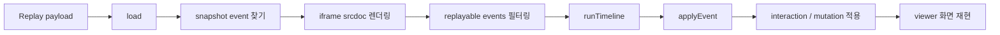
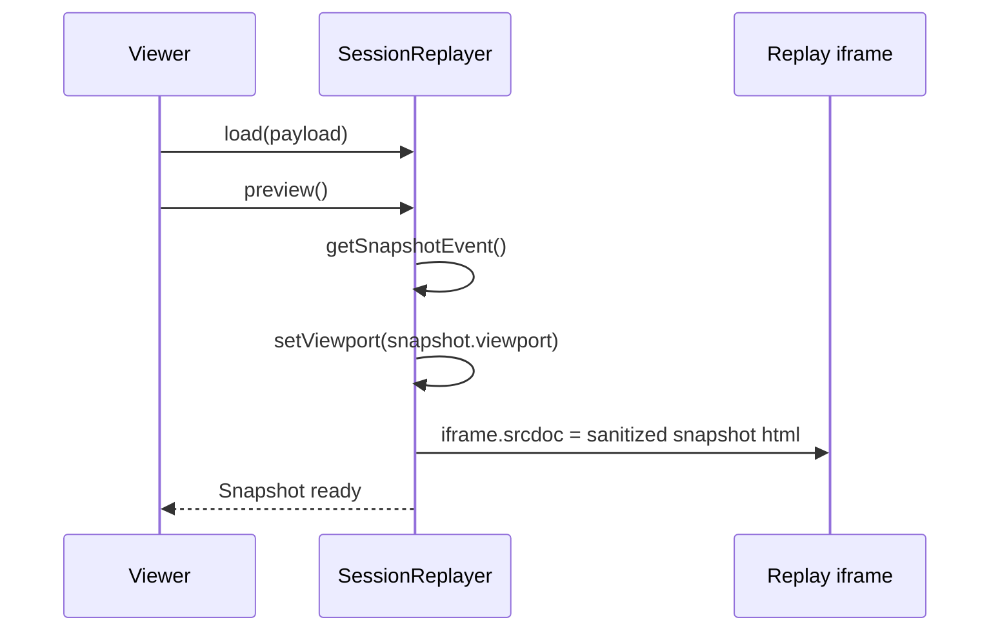
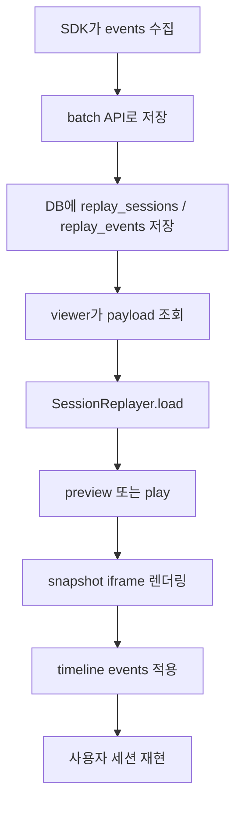

# Session Replay Replayer Flow

## 목적

이 문서는 `src/replayer.js`가 저장된 replay payload를 받아 실제 화면처럼 재생하는 방식을 정리합니다.

앞선 SDK 문서가 “events를 어떻게 만들고 batch로 저장하는가”를 설명한다면, 이 문서는 “저장된 events를 어떻게 다시 화면에 적용하는가”를 설명합니다.

현재 replayer의 핵심 흐름은 다음과 같습니다.



## 1. 필요 개념

### Replayer

`SessionReplayer`는 SDK가 저장한 세션 payload를 viewer iframe 안에서 재현하는 클래스입니다.

주요 책임:

- replay iframe 준비
- snapshot HTML 렌더링
- viewport 크기와 scale 맞추기
- event timeline 실행
- click/input/scroll/view_state/dialog 이벤트 적용
- mutation 적용 여부 제어
- script 실행 여부 제어

### Payload

replayer가 입력으로 받는 payload는 세션 메타데이터와 events 배열을 포함합니다.

`src/replayer.js`는 최소한 아래 조건을 기대합니다.

```js
{
  session: { ... },
  events: [
    { type: "snapshot", data: { html: "...", viewport: { width: 390, height: 844 } } },
    { type: "event", timeOffsetMs: 1200, data: { eventType: "click", target: "#..." } },
    { type: "mutation", timeOffsetMs: 1500, data: { mutationType: "childList", target: "#..." } }
  ]
}
```

### Snapshot

snapshot은 replay의 시작 화면입니다.

SDK가 녹화 시작 시점의 HTML을 저장하고, replayer는 그 HTML을 iframe의 `srcdoc`으로 넣습니다.

현재 replayer는 snapshot을 렌더링하기 전에 다음 처리를 합니다.

- `<base href="...">` 보정
- script 실행 모드가 OFF면 script 제거
- inline event handler 제거
- `javascript:` URL 제거
- replay 제어 UI 숨김
- iframe source 복원 또는 third-party placeholder 처리

### Timeline

timeline은 snapshot 이후 발생한 event/mutation을 `timeOffsetMs` 순서와 간격에 맞춰 적용하는 과정입니다.

`runTimeline()`은 현재 이벤트와 다음 이벤트의 시간 차이를 계산해 `setTimeout()`으로 다음 적용 시점을 예약합니다.

```js
const gapMs = Number(next.timeOffsetMs) - Number(current.timeOffsetMs);
const delay = Math.floor(gapMs / this.speed);
```

그래서 viewer의 0.5x, 1x, 2x 같은 재생 속도가 구현됩니다.

### Interaction Event

사용자 행동에 가까운 이벤트입니다.

현재 `applyInteractionEvent()`가 처리하는 주요 eventType:

- `click`
- `input`
- `change`
- `scroll`
- `view_state`
- `dialog_open`
- `dialog_close`
- `mousemove`

### Mutation Event

DOM 변경 이벤트입니다.

현재 `applyMutation()`은 다음 mutation type을 처리합니다.

- `childList`: node 추가/삭제
- `attributes`: attribute 변경
- `characterData`: 텍스트 변경

mutation은 replay 품질을 높일 수 있지만, 잘못 적용하면 화면이 깨질 수 있습니다. 그래서 viewer에서는 Mutation ON/OFF로 제어합니다.

### Script Mode

replay iframe 안에서 snapshot 내부 script를 실행할지 여부입니다.

현재 sandbox는 기본적으로 다음 권한을 줍니다.

```text
allow-same-origin allow-forms
```

`executePageScripts`가 true면 여기에 `allow-scripts`가 추가됩니다.

Script OFF는 더 안전하고 예측 가능합니다. Script ON은 원본 페이지의 동적 동작 복원 가능성이 있지만, 부작용도 커집니다.

## 2. 예시

### Snapshot 미리보기

viewer에서 세션을 선택한 뒤 preview를 실행하면 replayer는 snapshot만 렌더링합니다.

```js
replayer.load(payload);
replayer.preview();
```

내부 흐름:



이 단계에서는 click, scroll, mutation 같은 timeline event는 아직 적용하지 않습니다.

### 재생 시작

`play()`는 snapshot을 다시 렌더링한 뒤 replay 가능한 이벤트만 골라 timeline을 실행합니다.

```js
const replayEvents = payload.events.filter((event) => {
  return event.type === "event" || event.type === "mutation";
});
```

그 다음 각 이벤트를 `applyEvent()`로 넘깁니다.

### Click 이벤트 적용

click event가 들어오면 다음 일을 합니다.

```js
showClickPoint(doc, data);
markClicked(target);
replayNativeClick(doc, target, data);
```

결과:

- 빨간 pointer/ripple 표시
- 클릭 대상 outline 표시
- 필요한 경우 실제 pointer/mouse/click 이벤트 dispatch

단, Mutation ON일 때는 native click replay를 끕니다.

```js
replayNativeClicks: !this.applyMutationEvents
```

mutation으로 이미 DOM 변화가 재현되는데 native click까지 다시 실행하면 같은 변화가 중복 적용될 수 있기 때문입니다.

### Input 이벤트 적용

input/change 이벤트는 target을 찾은 뒤 값을 넣고 이벤트를 다시 dispatch합니다.

```js
target.value = data.value;
target.dispatchEvent(new Event(eventType, { bubbles: true, cancelable: true }));
```

현재 SDK가 입력값을 마스킹해서 저장하므로, replay에서 보이는 값도 원문이 아니라 `******` 같은 마스킹 값입니다.

### Scroll 이벤트 적용

scroll 이벤트는 문서 전체 스크롤과 특정 element 스크롤을 나눠 처리합니다.

```js
if (target === doc.documentElement || target === doc.body) {
  doc.defaultView.scrollTo(left, top);
} else {
  target.scrollTop = top;
  target.scrollLeft = left;
}
```

### View State 이벤트 적용

`view_state`는 SPA식 화면 전환을 재현하기 위한 의미 이벤트입니다.

현재 테스트 UI에서는 화면별로 `.screen[data-view]`가 있고, replayer는 해당 screen만 active 처리합니다.

```js
doc.querySelectorAll(".screen[data-view]").forEach((screen) => {
  screen.classList.toggle("active", screen.getAttribute("data-view") === screenName);
});
```

또한 상단 title과 scroll 위치도 복원합니다.

### Dialog 이벤트 적용

dialog popup은 단순 DOM mutation만으로는 브라우저 top layer 상태를 완전히 복원하기 어렵습니다.

그래서 replayer는 `dialog_open`, `dialog_close` 이벤트를 의미 이벤트로 처리합니다.

```js
if (eventType === "dialog_open") {
  target.showModal();
}

if (eventType === "dialog_close") {
  target.close();
}
```

실패하면 `open` attribute를 직접 조정하는 fallback을 사용합니다.

### Mutation 적용

Mutation ON 상태에서 mutation event가 들어오면 `applyMutation()`을 호출합니다.

예:

```js
applyMutation(doc, event.data, {
  allowScripts: this.executePageScripts
});
```

mutation 종류별 처리:

- `attributes`: attribute set/remove
- `characterData`: 텍스트 node 또는 단순 text container 갱신
- `childList`: removedNodes 제거, addedNodes 추가, 필요하면 제한된 innerHTML fallback

## 3. 현재 전체 replay 업무 흐름 중 적용 단계와 구현 방식

전체 세션 리플레이 업무를 기준으로 보면 `src/replayer.js`는 저장 이후 viewer 단계에 해당합니다.



### 현재 구현 방식

#### 1. 생성과 stage 구성

`new SessionReplayer(options)`는 iframe과 상태 콜백을 받습니다.

중요 옵션:

- `iframe`: replay를 렌더링할 iframe
- `stageEl`: iframe을 감싸는 viewer stage
- `applyMutationEvents`: mutation 적용 여부
- `executePageScripts`: snapshot script 실행 여부
- `onStatus`: viewer 상태 메시지 callback

생성 시 `mountStage()`가 실행되어 iframe을 `.sr-replay-canvas` 안에 넣고, stage overflow/정렬/배경을 설정합니다.

#### 2. sandbox 설정

`updateIframeSandbox()`는 iframe sandbox를 현재 script mode에 맞춥니다.

Script OFF:

```text
allow-same-origin allow-forms
```

Script ON:

```text
allow-same-origin allow-forms allow-scripts
```

#### 3. payload 로드

`load(payload)`는 payload 구조가 맞는지만 확인하고 내부 상태에 저장합니다.

```js
this.payload = payload;
this.currentIndex = 0;
```

실제 화면 렌더링은 `preview()` 또는 `play()`에서 수행합니다.

#### 4. snapshot 렌더링

`preview()`와 `play()` 모두 먼저 snapshot event를 찾습니다.

```js
this.payload.events.find((event) => event.type === "snapshot" && event.data && event.data.html);
```

그리고 `renderSnapshot()`이 다음 일을 합니다.

- 기록된 viewport로 replayer viewport 설정
- base URL 보정
- HTML sanitize
- iframe `srcdoc`에 삽입
- iframe load 후 iframe source 복원
- viewport scale 갱신

#### 5. timeline 실행

`play()`는 `event`와 `mutation` 타입만 replay 대상으로 필터링합니다.

`runTimeline()`은 `currentIndex`를 하나씩 증가시키며 `applyEvent()`를 호출합니다.

다음 이벤트까지의 delay는 기록된 `timeOffsetMs` 차이와 현재 `speed`로 계산합니다.

#### 6. event 적용

`applyEvent()`는 큰 분류만 판단합니다.

- `event.type === "mutation"`이면 `applyMutation()`
- `event.type === "event"`이면 `applyInteractionEvent()`

이 구조 덕분에 timeline 실행부는 단순하고, 실제 event별 동작은 helper 함수로 분리됩니다.

#### 7. viewport scaling

녹화 당시 viewport와 viewer stage 크기는 다를 수 있습니다.

`updateViewportScale()`은 녹화 viewport를 기준으로 iframe 크기를 잡고, stage 안에 들어가도록 `scale()`을 적용합니다.

```js
const scale = Math.min(stageWidth / viewportWidth, stageHeight / viewportHeight, 1);
```

scale은 1을 넘지 않게 제한되어 있습니다. 즉, 작은 화면을 억지로 확대하지 않고, 큰 화면만 축소합니다.

#### 8. pointer 좌표 매핑

click/mousemove 표시에는 좌표 보정이 필요합니다.

현재 `mapPointerPosition()`은 두 방식을 사용합니다.

- target relative metadata가 있으면 target 안의 비율 기준으로 좌표 계산
- 없으면 녹화 viewport 대비 현재 replay viewport 비율로 좌표 계산

이 방식은 화면 크기가 바뀌어도 클릭 표시가 대략 같은 위치에 보이도록 하기 위한 것입니다.

## 4. 그렇게 구현된 사유

### iframe으로 원본 화면을 격리하기 위해

replay 화면은 viewer 앱 자체와 분리되어야 합니다.

iframe을 쓰면 다음 장점이 있습니다.

- snapshot HTML을 viewer DOM과 분리 가능
- 원본 CSS가 viewer CSS를 오염시키지 않음
- viewer control과 replay 대상 화면을 구분 가능
- sandbox로 script 실행 권한 제어 가능

그래서 replayer는 snapshot을 iframe `srcdoc`에 넣는 방식을 사용합니다.

### snapshot을 먼저 렌더링하고 event를 적용하기 위해

세션 replay는 “초기 상태 + 이후 변화” 구조입니다.

처음부터 모든 DOM을 새로 만들기보다 snapshot으로 시작 화면을 만들고, 이후 event/mutation을 시간순으로 적용하면 replay가 단순해집니다.

현재 구조:

```text
snapshot html
  -> click/input/scroll/view_state
  -> optional mutation
```

### event와 mutation을 분리하기 위해

사용자 interaction과 DOM mutation은 성격이 다릅니다.

- interaction event: 사용자가 무엇을 했는지 설명
- mutation event: 그 결과 화면이 어떻게 바뀌었는지 설명

두 데이터를 모두 적용하면 재현력이 좋아질 수 있지만, 중복 적용 위험도 있습니다.

예를 들어 click을 native로 다시 실행하면서 mutation도 적용하면 버튼 클릭 결과가 두 번 발생할 수 있습니다.

그래서 현재는 Mutation ON일 때 native click replay를 끕니다.

### Mutation 적용을 보수적으로 제한하기 위해

mutation은 replay 품질을 높이는 핵심 데이터지만, 가장 위험한 데이터이기도 합니다.

특히 큰 container의 `innerHTML`을 통째로 바꾸면 전체 화면이 깨질 수 있습니다.

그래서 현재 구현은 다음 제한을 둡니다.

- `html`, `body`에는 childList mutation 적용 안 함
- 큰 mutation이면서 nth-of-type 기반 selector면 적용 안 함
- `main`, `section`, `form` 같은 큰 구조에는 innerHTML fallback 금지
- fallback HTML byte 길이 제한
- descendants 수 제한
- malformed mutation 하나가 전체 timeline을 중단하지 않도록 try/catch 처리

### script 실행을 기본적으로 제한하기 위해

저장된 snapshot 안의 script를 실행하면 원본 앱 동작을 일부 복원할 수 있습니다.

하지만 다음 위험이 있습니다.

- replay 중 네트워크 호출 발생
- 원본 앱 초기화 로직 재실행
- viewer와 충돌
- 보안상 예상하지 못한 script 실행

그래서 replayer는 Script OFF를 기본적으로 더 안전한 방향으로 두고, 필요할 때만 `allow-scripts`를 켤 수 있게 합니다.

### SPA 화면 전환은 의미 이벤트로 보강하기 위해

테스트 UI처럼 SPA 방식으로 화면이 바뀌는 경우, 단순 click만 replay해서는 화면 상태가 맞지 않을 수 있습니다.

그래서 SDK는 `view_state`를 남기고, replayer는 이를 명시적으로 적용합니다.

이 방식은 DOM mutation에만 의존하지 않고 “현재 어느 화면인가”를 직접 복원한다는 점에서 안정적입니다.

### dialog는 브라우저 상태까지 복원해야 하기 때문에

`<dialog>`는 단순히 `open` attribute만 있는 element가 아니라 browser top layer 상태를 포함합니다.

그래서 replayer는 dialog를 mutation으로만 처리하지 않고, `showModal()`, `show()`, `close()`를 직접 호출합니다.

이것이 이전 dialog popup replay gap을 해결하기 위한 핵심 방향입니다.

### base URL을 보정하기 위해

snapshot은 iframe `srcdoc`으로 들어갑니다.

이때 상대경로 CSS, 이미지, 링크가 원래 페이지 기준이 아니라 viewer 페이지 기준으로 해석될 수 있습니다.

그래서 replayer는 snapshot HTML에 `<base href="...">`를 보정합니다.

또한 localhost에서 녹화한 snapshot이 production viewer에서 깨지는 문제를 줄이기 위해 `resolveReplayBaseUrl()`에서 local origin을 현재 viewer origin으로 보정합니다.

## 5. 향후 발전 방향

### 1. Timeline seek 지원

현재 replayer는 처음부터 끝까지 순차 재생하는 구조입니다.

향후에는 특정 시간으로 이동하는 seek 기능이 필요합니다.

가능한 방향:

- 일정 간격으로 checkpoint snapshot 생성
- 가장 가까운 checkpoint까지 복원 후 이후 event만 적용
- timeline slider와 current time 표시 추가

### 2. Pause / Resume 고도화

현재 `stop()`은 replay를 중단하고 index를 0으로 되돌립니다.

향후에는 다음 상태를 분리할 수 있습니다.

- pause: 현재 index 유지
- resume: 현재 index부터 이어서 재생
- stop: 처음으로 리셋

### 3. Mutation 적용 신뢰도 개선

현재 mutation은 selector path와 제한적 patch/fallback에 의존합니다.

더 안정적으로 만들려면 SDK와 replayer 사이에 node id 체계를 둘 수 있습니다.

예:

- snapshot serialization 시 node마다 replay id 부여
- mutation target을 CSS selector 대신 replay id로 저장
- added/removed node의 위치 정보를 더 정교하게 저장
- sibling 기준 insertBefore 지원

### 4. Native click replay 정책 세분화

현재는 Mutation ON이면 native click replay를 끕니다.

향후에는 eventType이나 target별로 더 세밀하게 제어할 수 있습니다.

예:

- navigation/menu click은 `view_state`를 우선 적용
- 단순 button animation은 native click 허용
- form submit은 기본 동작 차단 후 시각적 표시만
- anchor navigation은 항상 preventDefault

### 5. Pointer 좌표 정확도 개선

현재 좌표 매핑은 viewport 비율 또는 target-relative 비율을 사용합니다.

향후 SDK가 click 당시 target rect 정보를 더 많이 저장하면 정확도를 높일 수 있습니다.

필요 데이터:

- `targetOffsetX`, `targetOffsetY`
- `targetWidth`, `targetHeight`
- `targetBoundingClientRect`
- scroll offset
- devicePixelRatio

현재 replayer는 target-relative 데이터를 읽는 코드가 이미 있으므로, SDK가 해당 데이터를 더 안정적으로 저장하면 바로 개선 여지가 있습니다.

### 6. Cross-origin iframe replay 전략 개선

현재 cross-origin iframe은 직접 DOM을 replay하지 않고 placeholder로 표시합니다.

향후 선택지는 다음과 같습니다.

- iframe src와 크기만 더 정확히 표시
- same-origin proxy snapshot 사용
- iframe 내부 SDK 별도 삽입 후 parent/child session 연결
- third-party frame은 개인정보/보안 정책상 계속 placeholder 유지

### 7. Replay diagnostics 추가

replayer가 어떤 event를 적용하지 못했는지 viewer에서 확인할 수 있으면 디버깅이 쉬워집니다.

예:

- target selector not found count
- skipped mutation count
- blocked script attribute count
- malformed mutation count
- applied event count
- current event index

이 정보는 replay 품질 QA와 “왜 화면이 원본과 다르게 보이는가”를 설명하는 데 도움이 됩니다.

### 8. Script mode 안전장치 강화

Script ON은 유용하지만 위험합니다.

향후에는 다음 안전장치를 둘 수 있습니다.

- 네트워크 요청 차단/로깅
- 특정 domain allowlist
- script 실행 전 사용자 경고
- replay iframe CSP 적용
- script mode별 replay 결과 차이 비교

### 9. Heatmap / analytics overlay와 통합

현재 click/mousemove는 pointer/ripple 중심입니다.

향후에는 같은 event stream을 사용해 heatmap overlay를 만들 수 있습니다.

예:

- click density
- scroll depth
- rage click 표시
- hesitation zone
- conversion step marker

## 요약

`src/replayer.js`는 저장된 replay payload를 소비하는 재생 엔진입니다.

현재 구조는 다음 원칙을 따릅니다.

- snapshot을 iframe `srcdoc`으로 먼저 복원한다.
- event/mutation만 timeline 대상으로 삼는다.
- `timeOffsetMs` 차이를 이용해 실제 시간 간격에 가깝게 재생한다.
- click/input/scroll/view_state/dialog는 의미 이벤트로 적용한다.
- mutation은 옵션으로 켜고, 보수적인 제한 안에서 적용한다.
- script 실행은 sandbox token으로 명시적으로 제어한다.
- viewer UI와 replay 대상 화면은 iframe으로 격리한다.

즉, SDK의 events/batches가 “사용자 행동을 저장 가능한 기록으로 만드는 단계”라면, replayer는 “그 기록을 다시 사용자가 볼 수 있는 화면 변화로 되돌리는 단계”입니다.
