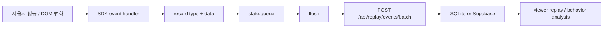
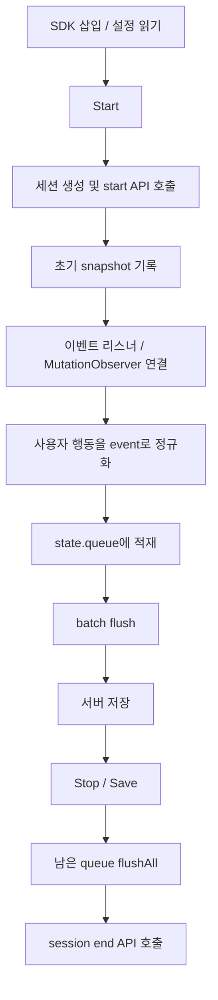

# Session Replay SDK Events and Batches

## 목적

이 문서는 `sdk/session-replay-sdk.js`에서 사용자 행동을 `event`로 만들고, 여러 이벤트를 `batch`로 묶어 서버에 저장하는 방식을 정리합니다.

현재 SDK의 핵심은 다음 흐름입니다.



## 1. 필요 개념

### Event

여기서 event는 사용자가 화면에서 한 행동이나 브라우저/DOM 상태 변화를 replay 가능한 데이터로 바꾼 단위입니다.

현재 SDK에서 큐에 들어가는 이벤트의 공통 형태는 다음과 같습니다.

```js
{
  id: 1,
  type: "event",
  at: 1710000000000,
  timeOffsetMs: 1200,
  data: {
    eventType: "click",
    target: "#transfer-button",
    x: 120,
    y: 240
  }
}
```

주요 필드 의미:

- `id`: SDK 세션 안에서 증가하는 순번
- `type`: 큰 분류. `snapshot`, `event`, `mutation`, `meta`
- `at`: 실제 발생 시각
- `timeOffsetMs`: 녹화 시작 이후 몇 ms 뒤 발생했는지
- `data`: replay와 분석에 필요한 상세 데이터

### Event Type

`type`은 저장 단위의 큰 성격이고, `data.eventType`은 실제 행동 종류입니다.

예:

- `type: "event"`, `eventType: "click"`
- `type: "event"`, `eventType: "input"`
- `type: "event"`, `eventType: "scroll"`
- `type: "event"`, `eventType: "view_state"`
- `type: "mutation"`, `eventType: "mutation_childList"`
- `type: "snapshot"`은 초기 화면 HTML
- `type: "meta"`는 녹화 시작/중지/저장 같은 SDK 내부 상태 기록

### Queue

`state.queue`는 아직 서버에 보내지 않은 이벤트를 임시로 담는 메모리 버퍼입니다.

이벤트가 발생할 때마다 바로 서버에 요청하지 않고, 먼저 큐에 쌓습니다. 큐는 다음 경우에 서버로 flush됩니다.

- 큐 길이가 `maxBatchSize` 이상이 됐을 때
- `collectIntervalMs` 주기 타이머가 돌 때
- 사용자가 `Stop`, `Save`를 눌렀을 때
- 페이지가 닫히거나 이동되는 `pagehide` 상황일 때

### Batch

Batch는 큐에 쌓인 이벤트 여러 개를 한 번의 API 요청으로 묶은 payload입니다.

현재 SDK는 최대 `config.maxBatchSize`개씩 잘라서 아래 API로 전송합니다.

```text
POST /api/replay/events/batch
```

batch payload에는 이벤트 배열뿐 아니라 세션 메타데이터, privacy 설정, redaction 통계, dropped event 수까지 같이 포함됩니다.

### Flush

`flush()`는 큐에서 이벤트 일부를 꺼내 batch API로 보내는 함수입니다.

현재 구현은 다음 특성을 갖습니다.

- 큐가 비어 있으면 아무것도 하지 않음
- `maxBatchSize`만큼만 꺼내 전송
- 전송 실패 시 꺼냈던 이벤트를 다시 큐 앞쪽에 붙임
- 일시적 네트워크/서버 오류는 `postJson()` 내부에서 최대 3회 재시도

`flushAll()`은 큐가 빌 때까지 `flush()`를 반복합니다. `pause()`와 `save()`에서 남은 이벤트를 모두 저장하기 위해 사용합니다.

## 2. 예시

### 클릭 이벤트

사용자가 버튼을 클릭하면 `handleClick()`이 실행됩니다.

SDK는 block 대상인지 확인한 뒤, 아래 정보를 기록합니다.

```js
record("event", {
  eventType: "click",
  target: getNodePath(event.target),
  x: event.clientX,
  y: event.clientY,
  viewportWidth: window.innerWidth,
  viewportHeight: window.innerHeight,
  button: event.button,
  text: getMaskedText(event.target)
});
```

이 데이터는 viewer에서 클릭 위치 표시, 클릭 대상 표시, 행동 분석의 클릭 수 계산에 사용됩니다.

### 입력 이벤트

사용자가 input이나 textarea에 입력하면 `handleInputLike()`가 실행됩니다.

현재 기본값은 `maskAllInputs: true`이므로 실제 입력값은 저장하지 않고 `*`로 저장합니다.

```js
record("event", {
  eventType: "input",
  target: getNodePath(event.target),
  value: "******"
});
```

입력 원문은 저장하지 않지만, 사용자가 입력했다는 사실과 대략적인 길이는 남습니다.

### 스크롤 이벤트

스크롤은 너무 자주 발생하기 때문에 120ms debounce를 둡니다.

```js
record("event", {
  eventType: "scroll",
  target: getNodePath(target),
  scrollTop: target.scrollTop,
  scrollLeft: target.scrollLeft
});
```

이 데이터는 replay에서 스크롤 위치 복원, 행동 분석에서 exploration이나 engagement 계산에 사용됩니다.

### Mutation 이벤트

DOM이 바뀌면 `MutationObserver`가 mutation을 감지합니다.

```js
record("mutation", {
  eventType: "mutation_childList",
  mutationType: "childList",
  target: getNodePath(mutation.target),
  addedNodes: [...],
  removedNodes: [...]
});
```

mutation은 클릭만으로 설명되지 않는 화면 변화를 replay하기 위한 보조 데이터입니다. 다만 너무 강하게 적용하면 replay 화면이 깨질 수 있어서 viewer에는 Mutation ON/OFF 개념이 있습니다.

### Batch 전송 예시

큐에 이벤트가 쌓이면 `flush()`가 다음 형태로 서버에 보냅니다.

```js
{
  sessionId: "...",
  projectId: "finance-demo",
  userId: "local-tester",
  sessionName: "이체 화면 테스트",
  pageUrl: location.href,
  userAgent: navigator.userAgent,
  viewport: { width: 390, height: 844 },
  startedAt: 1710000000000,
  recordingConfig: {
    privacy: {
      maskAllInputs: true,
      blockSelectors: ["..."],
      maskTextSelectors: ["..."]
    },
    limits: {
      maxEvents: 20000,
      maxBatchSize: 80,
      collectIntervalMs: 5000
    },
    enabledEvents: {
      click: true,
      input: true,
      scroll: true,
      mutation: true
    }
  },
  redactionStats: {
    maskedInputEvents: 3,
    blockedNodeEvents: 1
  },
  droppedEventCount: 0,
  events: [...]
}
```

서버는 이 batch를 받아 `replay_events`에 이벤트를 저장하고, `replay_sessions`에는 최신 session metadata를 반영합니다.

## 3. 현재 전체 SDK 업무 흐름 중 적용 단계와 구현 방식

현재 전체 SDK 업무 흐름을 단계로 나누면 다음과 같습니다.



events와 batches는 이 중 `F`, `G`, `H`, `K` 단계에 해당합니다.

### 현재 구현 방식

#### 1. 설정 읽기

SDK는 script tag의 data attribute 또는 `configure()` 호출로 설정을 받습니다.

중요 설정:

- `collectIntervalMs`: 주기적 flush 간격. 기본 5000ms
- `maxBatchSize`: 한 번에 보낼 이벤트 수. 기본 80
- `maxEvents`: 큐에 유지할 최대 이벤트 수. 기본 20000
- `enabledEvents`: 수집할 이벤트 종류
- `maskAllInputs`, `blockSelectors`, `maskTextSelectors`: privacy 설정

#### 2. start 시점

`start()`가 호출되면 새 session id를 만들고 `/api/replay/sessions/start`를 호출합니다.

그 다음 초기 snapshot을 `record("snapshot", ...)`으로 큐에 넣고, `record("meta", { action: "recording_started" })`도 남깁니다.

이후 이벤트 리스너, history patch, dialog patch, MutationObserver, 주기적 flush timer를 켭니다.

#### 3. 이벤트 수집

브라우저 이벤트 핸들러는 각기 다른 원본 이벤트를 SDK 내부의 공통 event 형태로 바꿉니다.

- `handleClick()`: click, navigation_intent
- `handleInputLike()`: input, change
- `handleSubmit()`: submit
- `handleScroll()`: scroll
- `handleMouseMove()`: mousemove
- `handleNavigation()`: hashchange, popstate, visibilitychange
- `patchHistory()`: history_pushstate, history_replacestate
- `patchDialogMethods()`: dialog_open
- `handleDialogClose()`: dialog_close
- `attachMutationObserver()`: mutation
- `track()`: 앱 코드에서 직접 남기는 custom event 또는 `view_state`

모든 이벤트는 최종적으로 `record()`를 통과합니다.

#### 4. record 표준화

`record()`는 다음 일을 합니다.

- 녹화 중이 아니면 일반 이벤트는 무시
- disabled event면 무시
- 큐가 `maxEvents`를 넘으면 저장하지 않고 `droppedEventCount` 증가
- 순번, 발생 시각, 시작 이후 offset을 붙임
- `state.queue`에 push
- 큐가 `maxBatchSize` 이상이면 즉시 `flush()`

즉, `record()`는 SDK 내부의 event gateway입니다.

#### 5. batch flush

`flush()`는 큐 앞쪽에서 최대 `maxBatchSize`개를 잘라 batch로 보냅니다.

전송 대상:

```text
POST /api/replay/events/batch
```

전송 실패 시에는 잘라낸 이벤트를 다시 큐 앞쪽에 붙입니다.

```js
state.queue = events.concat(state.queue).slice(0, config.maxEvents);
```

그래서 일시적 서버 오류가 있어도 이벤트가 바로 사라지지 않습니다.

#### 6. save 시점

`save()`는 먼저 `pause()`를 통해 리스너를 제거하고 남은 이벤트를 flush합니다.

그 뒤 저장 meta event를 다시 남기고 `flushAll()`을 수행한 다음 `/api/replay/sessions/end`를 호출해 세션을 ended 상태로 바꿉니다.

## 4. 그렇게 구현된 사유

### 매 이벤트마다 서버 호출하지 않기 위해

click, input, scroll, mutation은 짧은 시간에 많이 발생합니다.

모든 이벤트마다 API를 호출하면 다음 문제가 생깁니다.

- 네트워크 요청 수가 과도하게 증가
- 사용자 페이지 성능 저하
- 서버와 DB write 부하 증가
- 모바일 네트워크에서 저장 실패 가능성 증가

그래서 이벤트는 먼저 메모리 큐에 쌓고, 일정 개수나 일정 시간마다 batch로 저장합니다.

### replay 시간축을 유지하기 위해

replay는 단순히 이벤트 목록만 필요한 것이 아니라 “언제 발생했는지”가 중요합니다.

그래서 SDK는 모든 이벤트에 `at`과 `timeOffsetMs`를 붙입니다.

viewer는 이 시간 정보를 기준으로 snapshot 이후 click, input, scroll, mutation, view_state를 순서대로 적용할 수 있습니다.

### 네트워크 실패에 견디기 위해

운영 환경에서는 Vercel, Supabase, 모바일 브라우저 네트워크 상황 때문에 일시적 실패가 생길 수 있습니다.

현재 구현은 두 겹으로 방어합니다.

- `postJson()`에서 retryable status나 timeout 계열 메시지는 최대 3회 재시도
- `flush()` 실패 시 batch 이벤트를 다시 queue 앞쪽에 복원

이 구조 덕분에 순간적인 실패가 곧바로 데이터 유실로 이어지지 않습니다.

### 개인정보 보호를 저장 전 단계에서 처리하기 위해

SDK는 서버로 보내기 전에 입력값, 민감 텍스트, block 영역을 먼저 처리합니다.

이유는 서버나 DB에 원문 민감정보가 들어간 뒤에 지우는 것보다, 애초에 브라우저 SDK 단계에서 저장하지 않는 것이 안전하기 때문입니다.

따라서 event 생성 단계에서 다음을 적용합니다.

- input/change 값 마스킹
- block selector 내부 이벤트 생략
- mask selector 텍스트 redacted
- snapshot sanitize
- mutation value redaction
- redactionStats 집계

### viewer와 행동 분석이 같은 payload를 쓰게 하기 위해

저장된 batch event는 두 가지 목적에 동시에 쓰입니다.

- replay viewer에서 화면 재현
- behavior analyzer와 LLM prompt에서 고객 행동 분석

따라서 SDK는 단순 replay용 좌표만 저장하지 않고, target path, text, eventType, navigation intent, view_state, submit 여부 같은 분석 근거도 함께 저장합니다.

### Stop과 Save를 분리하기 위해

현재 UX에서는 `Stop`은 녹화를 멈추는 단계이고, `Save`는 세션을 최종 종료해서 viewer에서 볼 수 있게 하는 단계입니다.

이 때문에 SDK도 다음처럼 동작합니다.

- `pause()`: 리스너 제거, 남은 queue flush, session은 아직 ended 아님
- `save()`: 마지막 meta event 저장, `flushAll()`, `/sessions/end` 호출
- `stop()`: 현재는 `save()` alias

문서상 UX에서는 Stop/Save를 나눠 설명하지만, SDK API의 `stop()`은 저장까지 수행하는 alias로 남아 있습니다.

## 5. 향후 발전 방향

### 1. Batch 압축 또는 payload 최적화

mutation과 snapshot은 payload가 커질 수 있습니다.

향후에는 다음 개선을 고려할 수 있습니다.

- batch payload gzip 전송
- mutation event 중복 제거
- 동일 target의 연속 characterData mutation 병합
- scroll/mousemove 샘플링 고도화
- 큰 `targetInnerHTML` 대신 patch 중심 저장

### 2. Offline queue / localStorage backup

현재 queue는 메모리에만 있습니다.

페이지가 갑자기 종료되거나 브라우저가 kill되면 sendBeacon이 실패한 일부 이벤트는 유실될 수 있습니다.

향후에는 다음 구조를 고려할 수 있습니다.

- IndexedDB에 임시 queue 저장
- 다음 방문 시 미전송 batch 재전송
- session heartbeat와 batch ack 기반으로 저장 완료 구간 추적

### 3. Batch ack와 sequence 기반 중복 방지

현재 이벤트에는 session 내부 sequence가 있습니다.

이 값을 서버 저장 단계에서 더 적극적으로 사용하면 다음이 가능합니다.

- 같은 sequence 중복 저장 방지
- batch 재시도 시 idempotent insert
- viewer에서 누락 sequence 감지
- 저장 품질 지표 제공

### 4. Event schema versioning

현재 SDK 버전은 `version: "1.0.0-sdk"`로 노출되지만, 각 event payload의 schema version은 별도로 없습니다.

향후 replay 호환성을 위해 다음을 추가할 수 있습니다.

```js
{
  schemaVersion: 1,
  sdkVersion: "1.0.0-sdk",
  ...
}
```

이렇게 하면 viewer가 예전 SDK에서 저장한 payload와 새 SDK payload를 다르게 처리할 수 있습니다.

### 5. Privacy redaction 강화

현재 privacy는 input masking, block selector, mask selector 중심입니다.

금융권 사용을 생각하면 다음 보강이 필요합니다.

- URL query parameter redaction
- selector path의 id/name/aria-label PII redaction
- 전화번호, 이메일, 계좌번호, 카드번호 패턴 masking
- select 값 masking 옵션
- redaction preview/debug mode

### 6. 이벤트 우선순위와 backpressure

현재 `maxEvents`를 넘으면 새 이벤트를 drop하고 `droppedEventCount`만 증가시킵니다.

향후에는 이벤트 중요도에 따라 다르게 처리할 수 있습니다.

예:

- snapshot, submit, navigation, view_state는 우선 보존
- mousemove, scroll은 먼저 drop 또는 샘플링
- mutation은 큰 payload부터 축소

이렇게 하면 이벤트 폭주 상황에서도 replay와 분석에 중요한 신호를 더 잘 보존할 수 있습니다.

### 7. Remote control SDK와 batch 상태 연결

`session-replay-deploy-sdk.js`와 `/sdk-control`이 확장되면 관리 화면에서 batch 상태를 볼 수 있으면 좋습니다.

예:

- 현재 queue size
- 마지막 flush 성공 시각
- 마지막 flush 실패 이유
- dropped event count
- redactionStats
- 현재 session id와 저장 상태

이 정보가 있으면 외부 사이트 삽입 테스트 중 “녹화는 됐는데 저장이 안 됨” 같은 문제를 더 빨리 진단할 수 있습니다.

## 요약

현재 `session-replay-sdk.js`의 events/batches 구조는 다음 원칙을 따릅니다.

- 모든 사용자 행동과 DOM 변화를 `record()`를 통해 표준 이벤트로 만든다.
- 이벤트는 즉시 서버에 보내지 않고 `state.queue`에 모은다.
- 큐가 일정 크기가 되거나 일정 시간이 지나면 batch로 저장한다.
- 실패한 batch는 queue에 되돌리고, 일시적 오류는 재시도한다.
- 입력값과 민감 영역은 SDK 단계에서 먼저 마스킹한다.
- 저장된 event payload는 replay와 고객 행동 분석의 공통 원천 데이터가 된다.

즉, events는 “무엇이 일어났는지”를 남기는 단위이고, batches는 “그 기록을 안정적으로 서버에 저장하는 운반 단위”입니다.
