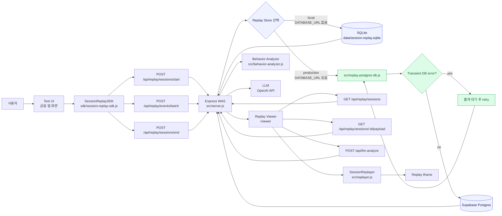
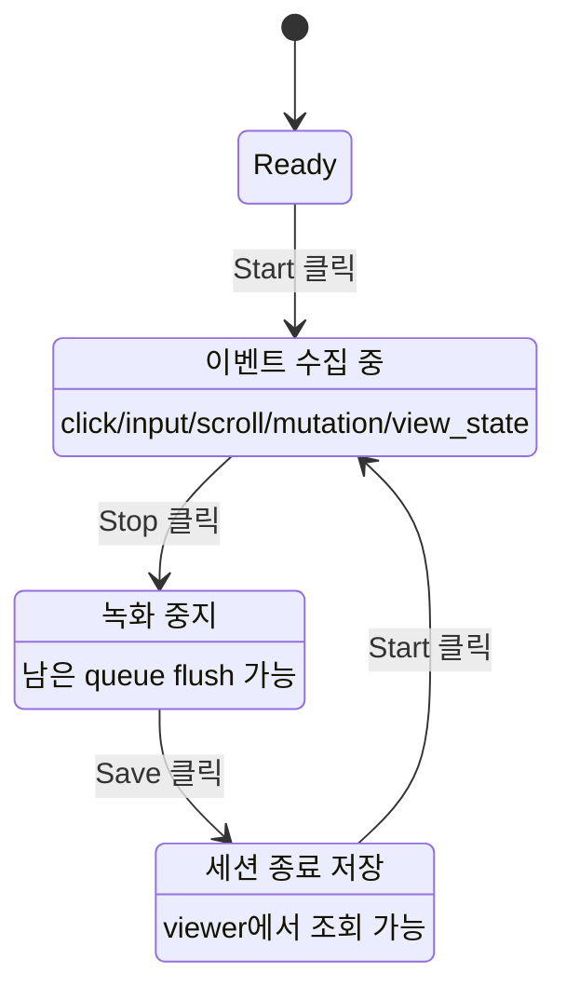
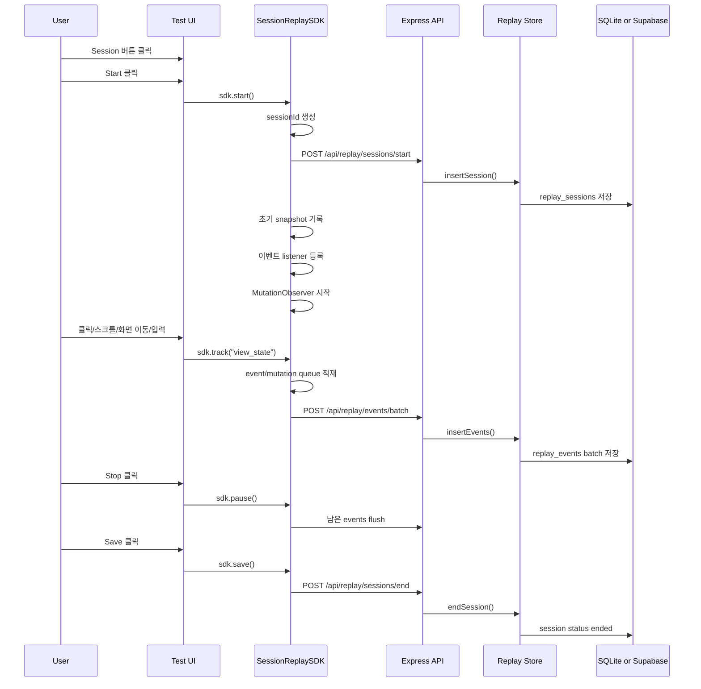
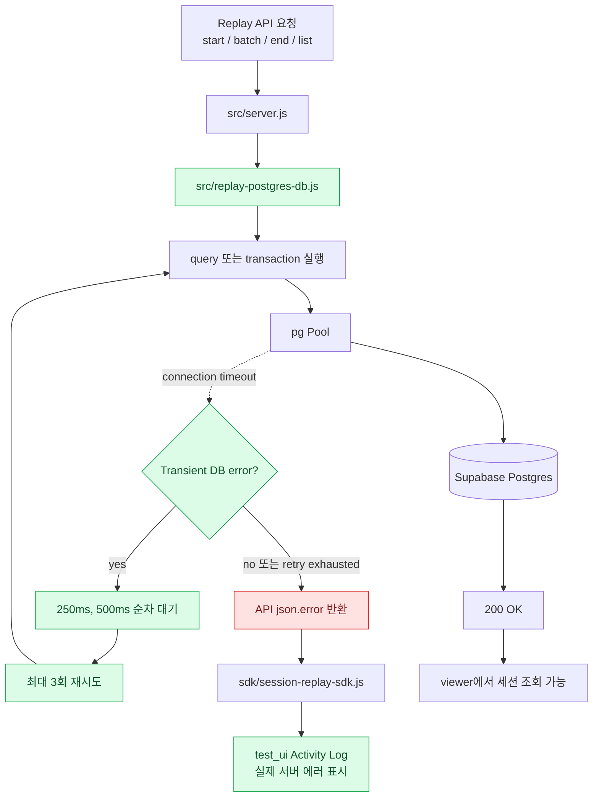
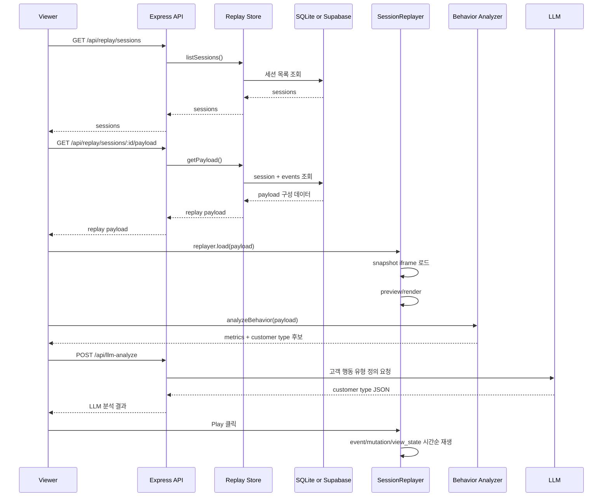
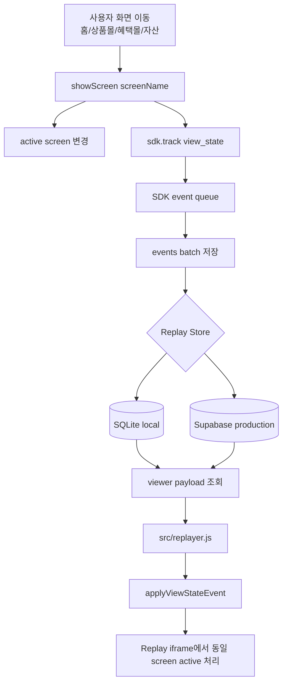
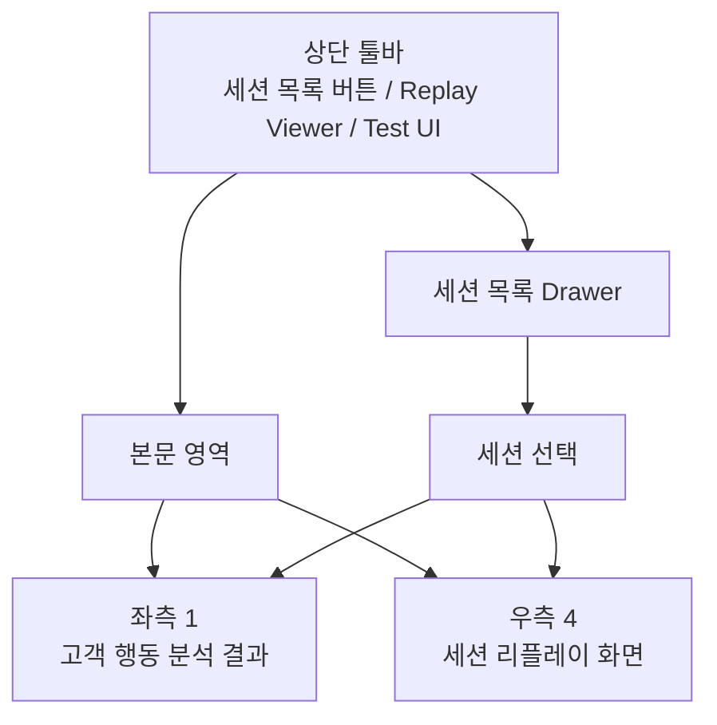

# Session Replay Runtime Mermaid

이 문서는 현재 `test_ui + SDK + Express WAS + SQLite/Supabase + viewer`가 어떻게 동작하는지 Mermaid 다이어그램으로 정리한 문서입니다.

현재 운영 기준:

- 로컬 개발: `DATABASE_URL`이 없으면 SQLite 사용
- Vercel Production: `DATABASE_URL`이 있으면 Supabase Postgres 사용
- DB 연결 timeout 같은 일시 장애는 `src/replay-postgres-db.js`에서 재시도
- SDK는 저장 실패 시 서버가 내려준 실제 `json.error`를 사용자 활동 로그에 표시

## 전체 아키텍처

## Test UI 녹화 흐름

## SDK 내부 동작

## 운영 저장 안정화 흐름

`Stop failed`, `Save failed` 장애 이후 운영 소스에는 DB 연결 timeout 방어 흐름이 추가되었습니다.

## Viewer 재생/분석 흐름

## 화면 전환 Replay

## Viewer 현재 UI 배치

## 요약

현재 구조의 핵심은 다음과 같습니다.

- `test_ui`는 금융 앱 형태의 테스트 화면입니다.
- `SessionReplaySDK`는 테스트 화면의 행동을 수집합니다.
- SDK는 WAS 서버에 세션 시작, 이벤트 batch, 세션 종료를 전송합니다.
- WAS는 로컬에서는 SQLite, 운영에서는 Supabase Postgres에 세션과 이벤트를 저장합니다.
- 운영 Postgres 저장소는 connection timeout 계열 에러를 최대 3회 재시도합니다.
- viewer는 저장소에서 payload를 조회해 `SessionReplayer`로 재생합니다.
- viewer는 같은 payload를 `behavior-analyzer.js`와 LLM 분석에 사용해 고객 행동 유형을 표시합니다.
