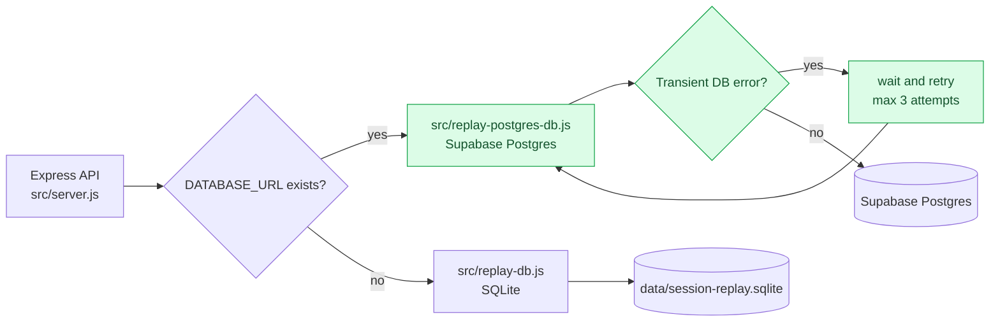
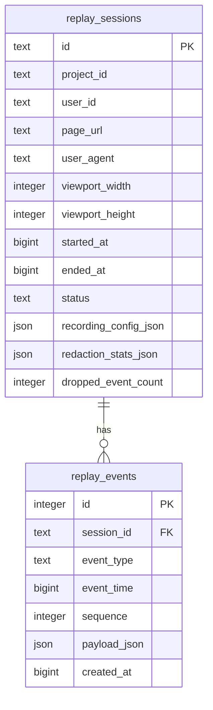
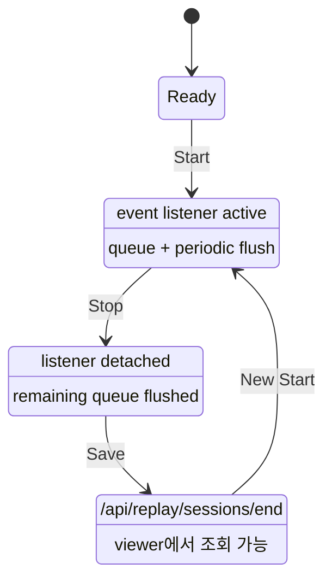
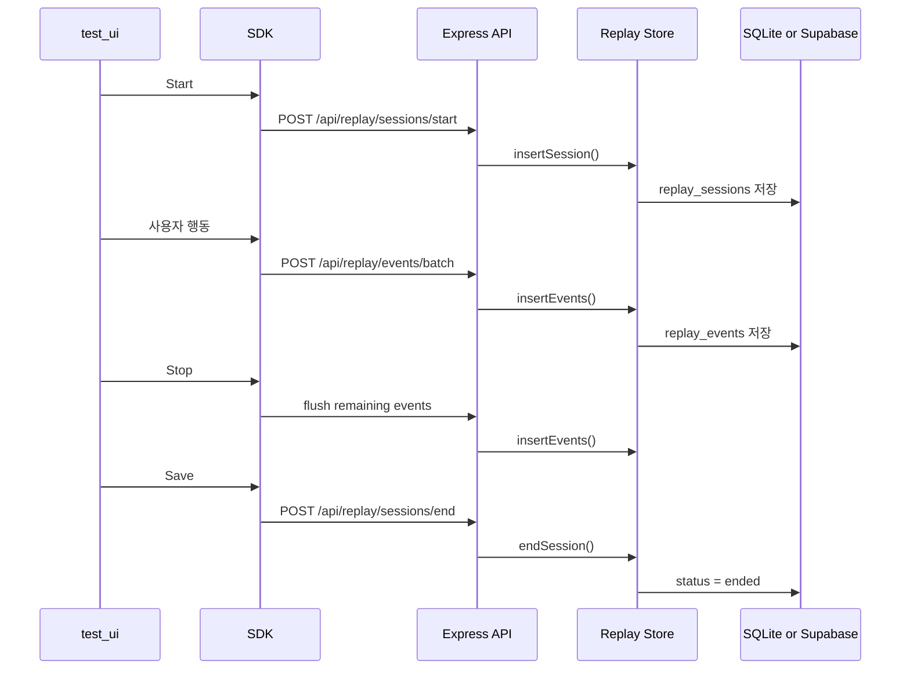
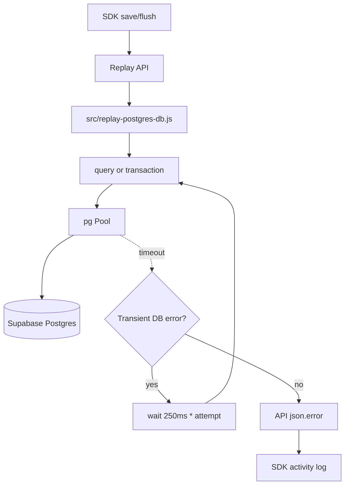
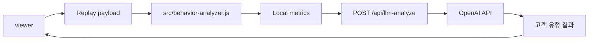

# Session Replay Test Environment Workflow

## 목적

현재까지 작성한 `Test/session-replay-snippet` 버전들을 실제 서비스형 구조에서 검증할 수 있도록 테스트 환경을 만든다.

최종 목표는 단순 브라우저 Snippet 실행을 넘어, 특정 화면에 태깅 SDK처럼 스크립트를 삽입하고, 수집된 세션 리플레이 데이터를 WAS 서버를 통해 DB에 적재한 뒤, 재생/분석할 수 있는 구조를 만드는 것이다.

현재 구현 기준:

- 테스트 UI: 금융권 모바일 앱 형태
- SDK: `sdk/session-replay-sdk.js`
- WAS: Express `src/server.js`
- 로컬 저장소: SQLite
- 운영 저장소: Supabase Postgres
- 배포: Vercel Production
- Viewer: 세션 리플레이 재생 + 고객 행동 분석 + LLM 분석

## 전체 진행 단계

1. 테스트용 프론트 UI 구축
2. 세션 리플레이 태깅 SDK 구조 설계
3. WAS 서버 API 설계 및 구현
4. SQLite/Supabase DB 스키마 설계 및 적재
5. 수집 데이터 조회/재생 흐름 연결
6. 고객 행동 분석 및 LLM 분석 연결
7. 운영 배포 및 장애 대응 흐름 정리

## 1. 테스트용 프론트 UI 구축

초기에는 `https://www.apple.com/kr/iphone/`의 화면 밀도와 스크롤 흐름을 참고했다.

현재 테스트 UI는 금융권 모바일 앱 형태로 개편했다.

구성 화면:

- 홈
- 전체 계좌
- 빠른 이체
- 상품몰
- 상품목록
- 혜택몰
- 이벤트 상세
- 자산/소비
- 카드
- 환전
- 고객센터

리플레이 검증 포인트:

- 클릭 이벤트가 실제 UI 상태 변화를 일으키는지
- 메뉴 이동이 replay에서 동일하게 재현되는지
- 이체 입력/submit이 masking 정책을 지키면서 기록되는지
- 스크롤 위치와 viewport scaling이 안정적인지
- DOM mutation이 과도하게 적용되어 화면이 깨지지 않는지
- 모바일 화면에서 session control과 viewer layout이 사용 가능한지

## 2. 태깅 SDK 구조

대상 페이지에 아래와 같은 방식으로 SDK를 삽입한다.

```html
<script
  src="/sdk/session-replay-sdk.js"
  data-project-id="finance-demo"
  data-user-id="local-tester"
  data-auto-start="false"
></script>
```

SDK 역할:

- 세션 ID 생성 및 유지
- 원하는 순간부터 `Start`
- 녹화 중지 `Stop`
- 저장 완료 `Save`
- 초기 snapshot 수집
- click/input/change/submit/scroll/navigation/mutation 이벤트 수집
- 이벤트 선택 수집
- privacy 설정 적용
  - input masking
  - block/mask selector
  - redaction 통계
- 일정 주기 또는 이벤트 개수 기준으로 서버에 batch 전송
- 네트워크 실패 시 in-memory queue 유지
- 서버 실패 시 `json.error` 상세 메시지를 UI activity log에 노출

## 3. WAS 서버 구조

SDK에서 전송한 세션 데이터를 받아 저장소에 저장하고, 이후 조회/재생/분석할 수 있는 API를 제공한다.

저장소 선택 흐름:



주요 API:

```text
POST   /api/replay/sessions/start
POST   /api/replay/events/batch
POST   /api/replay/sessions/end
GET    /api/replay/sessions
GET    /api/replay/sessions/:sessionId
GET    /api/replay/sessions/:sessionId/events
GET    /api/replay/sessions/:sessionId/payload
DELETE /api/replay/sessions/:sessionId
DELETE /api/replay/sessions
POST   /api/replay/sessions/delete-all
POST   /api/llm-analyze
```

API 역할:

- 세션 시작 기록
- 이벤트 batch 저장
- 세션 종료 상태 업데이트
- 세션 목록 조회
- 특정 세션 메타데이터 조회
- 특정 세션 이벤트 타임라인 조회
- replay payload 구성
- 세션 삭제 및 전체 삭제
- LLM 고객 행동 분석

## 4. DB 설계

초기 구현은 SQLite로 단순성과 검증 편의성을 우선했다.

현재 운영 구현은 동일한 논리 스키마를 SQLite와 Supabase Postgres에서 사용한다.

- 로컬 DB: SQLite
- 운영 DB: Supabase Postgres
- SQLite 이벤트 payload: JSON 문자열 저장
- Postgres 이벤트 payload: JSONB 저장
- 조회 성능이 필요한 필드는 컬럼으로 분리

핵심 테이블:



저장 데이터:

- `snapshot`
- `event`
- `mutation`
- `navigation`
- `view_state`
- `meta`
- `recordingConfig`
- `redactionStats`
- `droppedEventCount`

## 5. 수집 및 저장 흐름

명시적 녹화 상태:



운영 저장 sequence:



DB timeout 대응 위치:



## 6. 재생 및 분석 흐름

재생 흐름:

1. 세션 목록에서 replay 대상 선택
2. 세션 payload 조회
3. snapshot을 replay iframe에 로드
4. event/mutation/navigation/view_state를 시간 순서대로 적용
5. 클릭 포인터, 입력값, 스크롤, DOM 변경 결과 검증

분석 흐름:



## 7. 현재 프로젝트 구조

```text
SessionReplay/
  sdk/
    session-replay-sdk.js
  src/
    server.js
    replay-db.js
    replay-postgres-db.js
    replayer.js
    recorder.js
    behavior-analyzer.js
  web/
    test-page/
      index.html
      styles.css
      app.js
    replay-viewer/
      index.html
      styles.css
      viewer.js
  history/
    lession learned/
      stop-save-failed-db-timeout.md
  work_concept/
  workflow/
```

## 8. 테스트 흐름

### 로컬 테스트

1. `npm run dev` 실행
2. `http://localhost:4173/test-ui` 접속
3. 우측 `Session` 버튼 클릭
4. 추적 이벤트 선택
5. `Start`
6. 홈/이체/상품몰/혜택몰/자산/카드/환전 화면 이동
7. 입력, submit, 스크롤 수행
8. `Stop`
9. `Save`
10. `http://localhost:4173/viewer` 접속
11. SQLite에 저장된 세션 선택
12. `Play` 실행 후 snapshot/event/mutation 재생 확인

### 운영 테스트

1. `https://session-replay-poc.vercel.app/test-ui` 접속
2. 우측 `Session` 버튼 클릭
3. `Start`
4. 휴대폰에서 금융 앱 화면 행동 수행
5. `Stop`
6. `Save`
7. `https://session-replay-poc.vercel.app/viewer` 접속
8. Supabase에 저장된 세션 선택
9. `Play` 실행
10. Local summary 또는 LLM 분석 실행

## 9. 주의 사항

- Apple 페이지는 참고용이며 디자인/브랜드/애셋을 직접 복제하지 않는다.
- 테스트 UI는 세션 리플레이 검증 목적에 맞춰 자체 제작한다.
- 로컬 DB는 SQLite로 단순하게 확인한다.
- 운영 DB는 Supabase Postgres를 사용한다.
- SDK는 대상 페이지에 삽입되는 코드이므로 전역 오염과 성능 부담을 최소화한다.
- 수집 payload는 개인정보 마스킹을 기본값으로 둔다.
- replay iframe의 script 실행 여부는 보안과 재현성 사이에서 명확히 토글 가능해야 한다.
- Vercel Production에서 DB 환경변수를 바꾸면 반드시 재배포해야 한다.
- `Stop failed` 또는 `Save failed` 발생 시 API와 DB 연결을 먼저 확인한다.

## 10. 장애 대응 참고

`Stop failed`, `Save failed`가 발생하면 아래 문서를 먼저 확인한다.

- `history/lession learned/stop-save-failed-db-timeout.md`
- `workflow/supabase-session-replay-storage.md`
- `workflow/vercel-deployment-guide.md`
