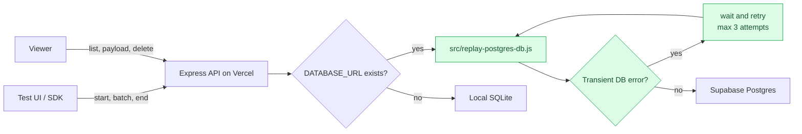
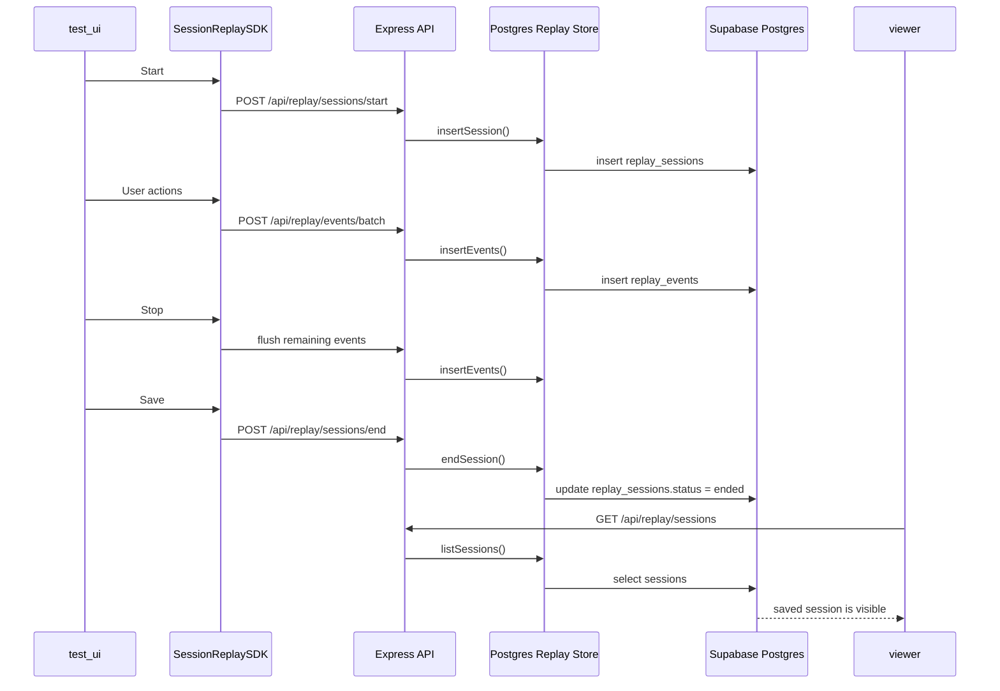
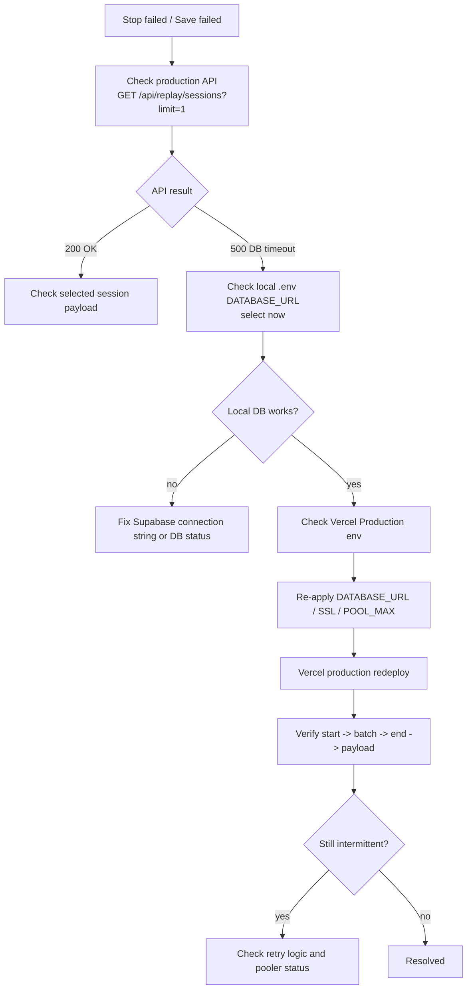
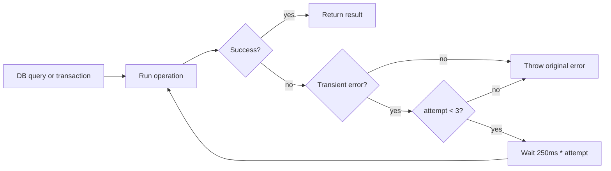

# Supabase Session Replay Storage

## Why this is needed

Vercel serverless functions do not share a durable local SQLite file across all invocations. A mobile device can successfully call the recording APIs, but the viewer may read from a different function instance or an empty `/tmp` database.

For shared mobile and desktop testing, replay sessions should be stored in an external database. This project now supports Supabase Postgres when `DATABASE_URL` is set.

Current production URL:

- `https://session-replay-poc.vercel.app/test-ui`
- `https://session-replay-poc.vercel.app/viewer`

## Runtime Behavior



## Production Save Flow



## Supabase Connection

Use the Supabase dashboard connection string:

1. Open the Supabase project dashboard.
2. Go to `Connect`.
3. Choose the Shared Pooler connection string.
4. For Vercel/serverless, prefer Transaction mode on port `6543`.
5. Copy the full connection string and set it as `DATABASE_URL` in Vercel.

Do not expose this value in browser code. It belongs only in the server environment.

## Vercel Environment Variables

Required for persistent replay storage:

```bash
DATABASE_URL=postgresql://...
DATABASE_SSL=true
DATABASE_POOL_MAX=3
```

Optional LLM analysis:

```bash
OPENAI_API_KEY=...
OPENAI_MODEL=gpt-4o-mini
```

## Schema

The server creates the schema automatically on first connection, but the same SQL can be run manually in the Supabase SQL editor if needed.

```sql
create table if not exists replay_sessions (
  id text primary key,
  project_id text not null,
  user_id text,
  page_url text,
  user_agent text,
  viewport_width integer,
  viewport_height integer,
  started_at bigint not null,
  ended_at bigint,
  status text not null,
  recording_config_json jsonb,
  redaction_stats_json jsonb,
  dropped_event_count integer default 0
);

create table if not exists replay_events (
  id bigserial primary key,
  session_id text not null references replay_sessions(id) on delete cascade,
  event_type text not null,
  event_time bigint not null,
  sequence integer not null,
  payload_json jsonb not null,
  created_at bigint not null
);

create index if not exists idx_replay_events_session_sequence
on replay_events(session_id, sequence);

create index if not exists idx_replay_sessions_started_at
on replay_sessions(started_at desc);

alter table replay_sessions enable row level security;
alter table replay_events enable row level security;
```

## DB Timeout Lesson

Observed issue:

```text
Stop failed
Save failed
GET /api/replay/sessions?limit=1 -> 500
Connection terminated due to connection timeout
```

Root cause:

- Vercel Production function could not reliably connect to Supabase Postgres.
- The original server code did not retry transient pooler/connection errors.
- The SDK only showed generic HTTP status errors, which made the real DB cause harder to see.

Fix:

- Re-applied Vercel Production DB env values:
  - `DATABASE_URL`
  - `DATABASE_SSL`
  - `DATABASE_POOL_MAX`
- Redeployed Vercel Production so functions could read the new values.
- Added retry handling in `src/replay-postgres-db.js`.
- Improved SDK error parsing in `sdk/session-replay-sdk.js`.

Detailed lesson learned:

- `history/lession learned/stop-save-failed-db-timeout.md`

## Timeout Diagnosis Flow



## Retry Policy in Current Source

`src/replay-postgres-db.js` treats the following as transient DB errors:

- message contains `connection terminated`
- message contains `timeout`
- message contains `terminating connection`
- code is `ETIMEDOUT`
- code is `ECONNRESET`
- code is `ECONNREFUSED`
- code is `53300`

Retry behavior:



## Test Checklist

1. Deploy after setting `DATABASE_URL`.
2. Open `/test-ui` on a phone.
3. Start recording.
4. Interact with the UI.
5. Stop and save.
6. Open `/viewer` on desktop.
7. Confirm the saved mobile session appears in the left session list.
8. Confirm `GET /api/replay/sessions?limit=1` returns `200`.
9. Confirm `GET /api/replay/sessions/:id/payload` returns the saved events.
