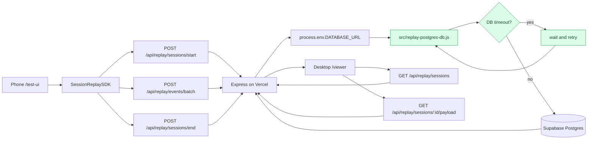

# Vercel Deployment Guide

## 목적

현재 Session Replay 테스트 환경을 Vercel에 배포하기 위한 가이드입니다.

이 프로젝트는 Express WAS, SDK 정적 파일, 테스트 UI, viewer를 하나의 Node.js 서버에서 제공합니다.

저장소는 환경에 따라 달라집니다.

- 로컬 개발: `DATABASE_URL`이 없으면 SQLite 사용
- Vercel Production: `DATABASE_URL`이 있으면 Supabase Postgres 사용

## 현재 배포 준비 상태

Vercel 공식 문서 기준으로 Express 앱은 `src/server.js` 같은 server entrypoint를 감지해 Vercel Function으로 실행할 수 있습니다.

현재 프로젝트는 다음을 반영했습니다.

- `src/server.js` 유지
- `package.json`에 Node 22 engine 명시
- `vercel.json`에 Function `includeFiles` 설정 추가
- `/test-ui`, `/viewer` 명시 라우트 유지
- `/sdk/:file`, `/web/:section/:file`, `/src/:file` 명시 asset 라우트 추가
- `express.static(projectRoot)` 제거
- Vercel 환경에서 `DATABASE_URL`이 없으면 SQLite DB 경로를 `/tmp/session-replay.sqlite`로 사용
- Vercel Production에서는 Supabase Postgres 연결을 위해 `DATABASE_URL` 사용
- Supabase pooler timeout에 대비해 `src/replay-postgres-db.js`에서 DB query/transaction retry 적용
- `OPENAI_API_KEY`가 없어도 서버는 시작하고, LLM 분석 API 호출 시에만 오류를 반환하도록 처리

## 중요한 제약

### SQLite는 Vercel에서 영구 저장소가 아님

Vercel 배포에서 `DATABASE_URL`이 없으면 SQLite를 `/tmp/session-replay.sqlite`에 저장하도록 분기합니다.

이 방식은 데모/프리뷰 확인용입니다.

주의:

- Function 인스턴스가 재시작되면 데이터가 사라질 수 있음
- 배포가 새로 이루어지면 데이터가 유지되지 않을 수 있음
- 여러 인스턴스로 스케일되면 세션 데이터가 분산될 수 있음

운영형으로 가려면 SQLite 파일 저장 대신 외부 DB를 사용해야 합니다.

현재 운영 배포는 Supabase Postgres를 사용합니다.

외부 DB 후보:

- Supabase Postgres
- Vercel Postgres 또는 Neon Postgres
- Turso/libSQL
- Upstash Redis/KV 계열

## 환경 변수

Vercel Project Settings > Environment Variables에 아래 값을 설정합니다.

### 운영 저장소

휴대폰에서 저장한 세션을 데스크톱 viewer에서 안정적으로 보려면 Production에 아래 값을 등록해야 합니다.

```text
DATABASE_URL=postgresql://...
DATABASE_SSL=true
DATABASE_POOL_MAX=3
```

`DATABASE_URL`은 브라우저 코드에 노출하면 안 됩니다. Vercel 서버 환경변수로만 관리합니다.

### LLM 분석

LLM 분석을 사용하지 않으면 없어도 viewer와 replay는 동작합니다.

```text
OPENAI_API_KEY=...
OPENAI_MODEL=gpt-4o-mini
```

### 로컬/프리뷰 선택

```text
SESSION_REPLAY_DB_PATH=/tmp/session-replay.sqlite
```

`SESSION_REPLAY_DB_PATH`는 지정하지 않아도 Vercel 환경에서는 자동으로 `/tmp/session-replay.sqlite`를 사용합니다.

## 배포 방법

### Git 연동 방식

1. GitHub에 현재 프로젝트 push
2. Vercel에서 New Project
3. GitHub repository import
4. Framework Preset은 감지값 또는 Other
5. Build Command는 비워두거나 기본값 사용
6. Output Directory는 비워둠
7. Environment Variables 설정
8. Deploy

### Vercel CLI 방식

```bash
npm install -g vercel
vercel login
vercel
vercel --prod
```

로컬에서 Vercel 방식으로 확인하려면:

```bash
vercel dev
```

## 배포 후 확인 URL

배포 도메인이 `https://your-project.vercel.app`라고 하면:

- `https://your-project.vercel.app/test-ui`
- `https://your-project.vercel.app/viewer`
- `https://your-project.vercel.app/api/replay/sessions`

현재 CLI 배포 URL:

- Production alias: `https://session-replay-poc.vercel.app`
- Latest deployment는 `npx vercel --prod --yes` 실행 결과의 `Production` URL을 확인합니다.

## 배포 후 테스트 시나리오

1. `/test-ui` 접속
2. 우측 `Session` 버튼 클릭
3. 추적 이벤트 선택
4. `Start` 클릭
5. 홈/상품몰/혜택몰/자산 화면 이동
6. 상품 상세/이벤트 상세 등 클릭
7. `Stop` 클릭
8. `Save` 클릭
9. `/viewer` 접속
10. `세션 목록` 클릭
11. 저장된 세션 선택
12. 리플레이 화면에서 `Play`
13. `Local summary` 또는 `Analyze with LLM` 실행

## 현재 로컬 검증 결과

포트 `4174`에서 변경된 서버를 실행해 확인했습니다.

- `/test-ui`: 200
- `/web/test-page/styles.css`: 200
- `/sdk/session-replay-sdk.js`: 200
- `/src/replayer.js`: 200
- `/api/replay/sessions?limit=1`: 200
- `/src/server.js`: 404

내부 서버 파일은 공개되지 않고, 브라우저에서 필요한 asset만 명시적으로 서빙됩니다.

Vercel production 배포 후 추가 확인:

- `/test-ui`: 200
- `/viewer`: 200
- `/api/replay/sessions?limit=1`: 200
- `/sdk/session-replay-sdk.js`: 200
- `/web/test-page/styles.css`: 200
- `/src/replayer.js`: 200

## 운영 저장 흐름



## Stop failed / Save failed 대응

증상:

```text
Stop failed
Save failed
Connection terminated due to connection timeout
```

우선 확인:

```bash
curl -s 'https://session-replay-poc.vercel.app/api/replay/sessions?limit=1'
```

정상:

```text
{"ok":true,"sessions":[...]}
```

DB timeout이면 다음을 확인합니다.

1. 로컬 `.env`의 `DATABASE_URL`로 DB 연결이 되는지 확인
2. Vercel Production 환경변수에 `DATABASE_URL`, `DATABASE_SSL`, `DATABASE_POOL_MAX`가 등록되어 있는지 확인
3. 환경변수를 재등록했다면 Production 재배포
4. `start -> batch -> end -> payload` API 흐름 검증

관련 기록:

- `history/lession learned/stop-save-failed-db-timeout.md`

## 향후 운영 배포 전환 작업

1. Supabase 저장소 운영 모니터링 추가
2. 대량 이벤트 저장 시 multi-row batch insert 최적화
3. viewer 목록 pagination 추가
4. LLM 호출 rate limit 또는 queue 추가
5. 인증/프로젝트별 접근 제어 추가
6. retry 실패 횟수와 DB 에러 로그를 viewer/admin에서 확인 가능하게 개선
